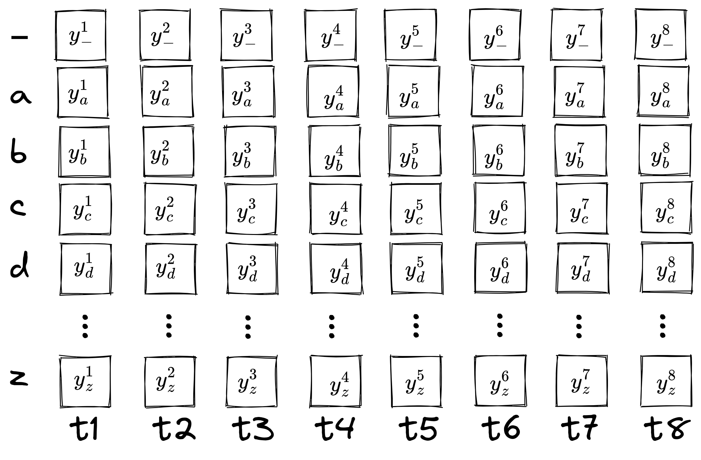
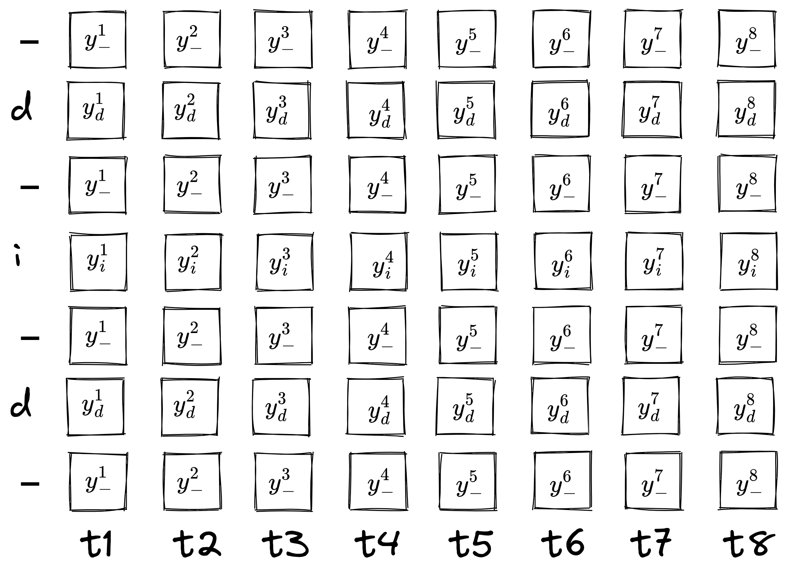
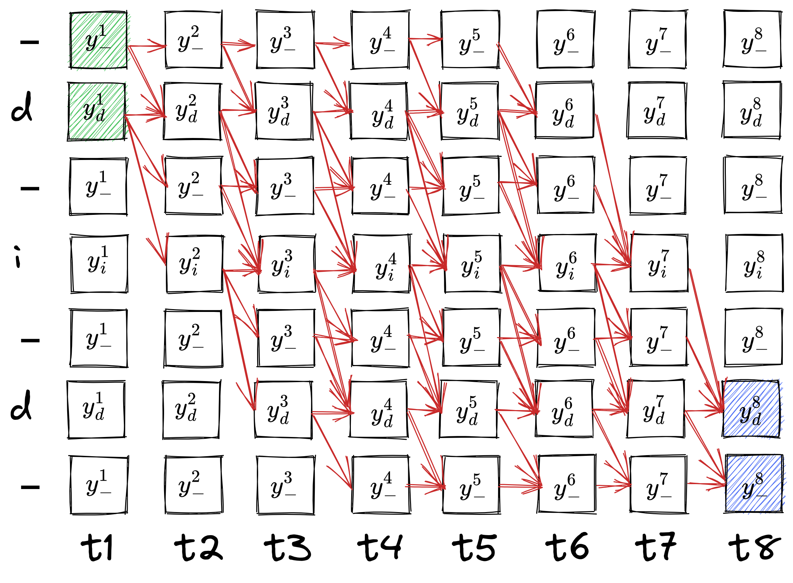
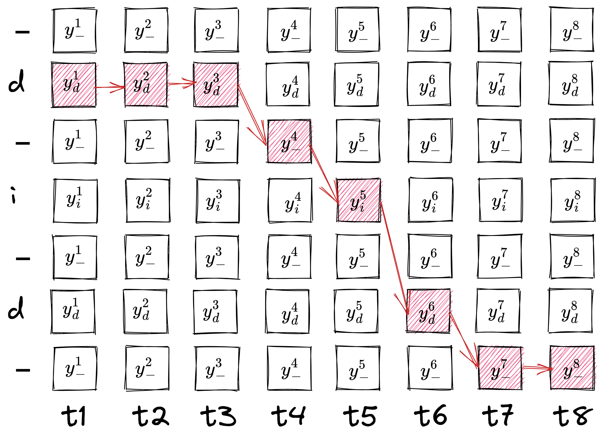
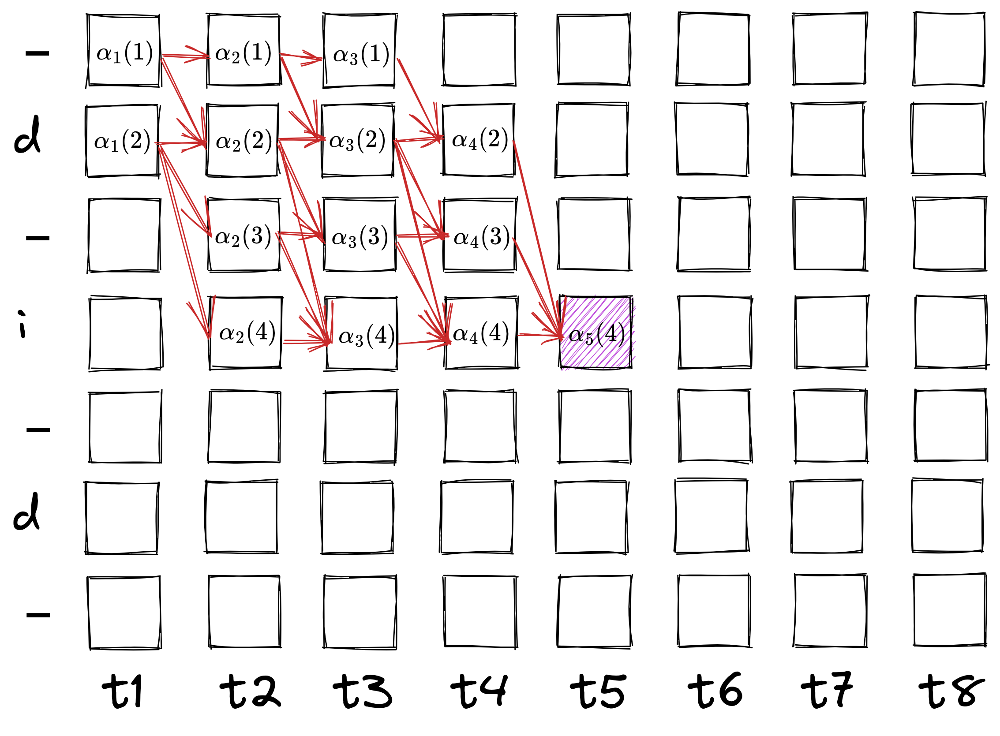
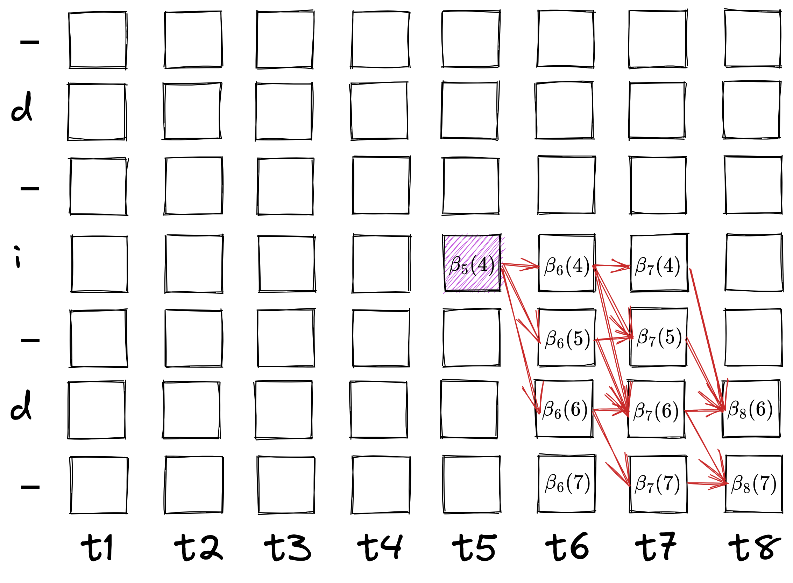
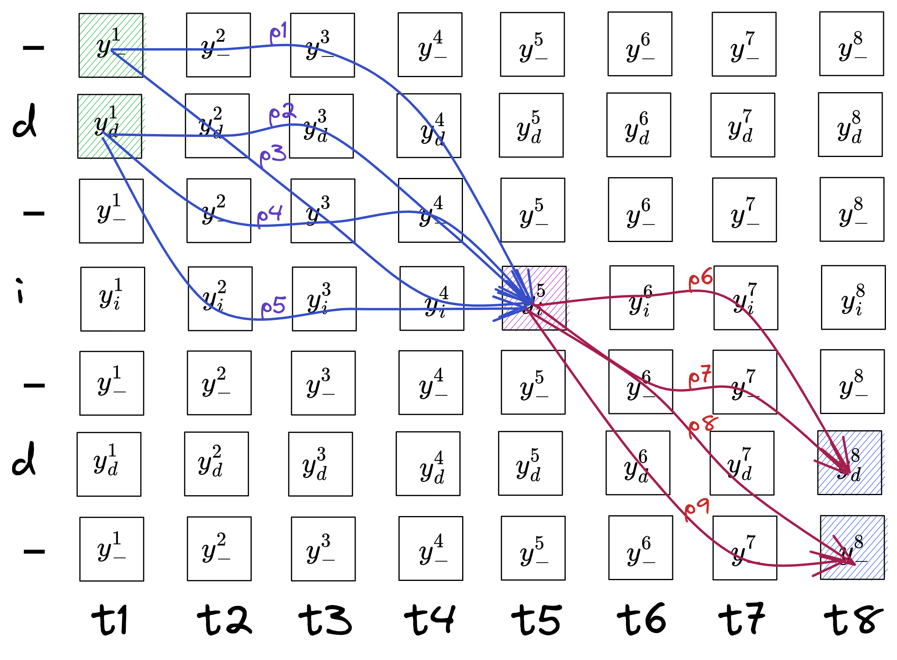

# Connectionist Temporal Classification

Let's start with defining the problem.
We want to compute the loss of a time-series output with a target of different length.

We start by defining an alphabet $A$ where all the possible "letters" our data labels can have, e.g. $A$ can be all the alphanumeric letters of the English language or the phonemes of a certain language.

We define a training unit as $(\mathbf{x}, \mathbf{z})$ where $\mathbf{x}$ is the input (can be an image, audio) and $\mathbf{z}$ is the target sequence of letters from $A$.

We pass our input $\mathbf{x}$ through our network $(\mathcal{N}_w)$ to produce our output, $U$, a sequence of vectors for $T$ timesteps. The timesteps $T$ must be greater than or equal to length of $\mathbf{z}$. Each vector in the sequence is of size **one** more than length of $A$, i.e. $\dim{U} = (\lvert A \rvert +1) \times T$.

Why one extra for the size of vectors? That is because we add a special "letter" in our alphabet, called *blank,* which helps us in various places. So we alter our alphabet to be $A^\prime = A \cup \{\textit{blank}\}$. So, $\dim{U} = \lvert A^\prime \rvert \times T$.

A CTC network has a softmax output layer with number of units equal to $\lvert A^\prime \rvert$.

$$
Y = \text{softmax}(U, \text{axis}=2)
$$

Together these outputs define the probabilities of all possible ways of aligning all possible label sequences. The total probability of any one label sequence can be found by summing the probabilities of its different alignments.

$$
\begin{equation}
p(\mathbf{l} \mid \mathbf{x}) = \sum_{\pi \in \Pi(\mathbf{l})} p(\pi\mid \mathbf{x})
\end{equation}
$$

where $\Pi(\mathbf{l})$ is the set of all possible alignments of $\mathbf{l}$.

The probability of an alignment is just the product of its "letters" at corresponding times.

$$
\begin{equation}
p(\pi|\mathbf{x}) = \prod_{t=1}^T y_{\pi_t}^t
\end{equation}
$$

## Inference

Now with this probability matrix $Y$ we have multiple ways of selecting a path through the time to choose as output. A simple way is to choose the "letter" at each timestep which has the highest probability. This is called *greedy decoding.*

Next we define a many-to-one mapping $\mathcal{B}$ to condense our output. We do this by simply removing all consecutive repeating letters and then removing all *blanks*. e.g.:

$\mathcal{B}(a\text{-}ab\text{-}) = \mathcal{B}(\text{-}aa\text{-}ab) = ab$

$-$ denotes the *blank* letter.

If we use this mapping, then eq. 1 can be re-written as:

$$
\begin{equation}
p(\mathbf{l}\mid \mathbf{x}) = \sum_{\pi \in \mathcal{B}^{-1}(\mathbf{l})} p(\pi \mid \mathbf{x})
\end{equation}
$$

which means $\Pi$ in eq. 1 equals $\mathcal{B}^{-1}$.

There are other ways to decode a probability matrix as greedy decoding does not guarantee the most probable label. Will cover that sometime else.

## Training

For sample $(\mathbf{x}, \mathbf{z})$, we want to maximize the likelihood, $p(\mathbf{z} \mid \mathbf{x})$ and as is common, we instead minimize the negative log-likelihood, i.e. $-\log{p(\mathbf{z} \mid \mathbf{x})}$.

Regardless, we need to compute $p(\mathbf{z} \mid \mathbf{x})$ and from eq. 3, we want to compute

$$
\sum_{\pi \in \mathcal{B}^{-1}(\mathbf{l})} p(\pi \mid \mathbf{x})
$$

At first it seems very problematic as there can be many paths corresponding to a labelling. But we can utilize dynamic programming and compute it similar to the Viterbi algorithm. We call it **the CTC Forward-Backward Algorithm**.

### The CTC Forward-Backward Algorithm

The key idea is that "the sum over paths corresponding to a labelling can be broken down into an iterative sum over paths corresponding to prefixes of that labelling."

Let's take an example.
We have an image reading "did", and we have passed it through the network and we have the probability matrix for this sample $Y$.
Let's assume our alphabet is the English alphabet, and we output for 8 timesteps. The probability matrix looks like:

The sum of each column is equal to 1.

Now for any output seq, the probability of that sequence is just the product of the probability of individual letters at corresponding timesteps, e.g. $p(\text{-aabbcza} \mid \mathbf{x}) = y_{\_}^1 y_a^2 y_a^3 y_b^4 y_b^5 y_c^6 y_z^7 y_a^8$. This shrinks to `abcza` and this alignment contributes that probability to this label.

Now onto our problem: we need to sum the probabilities of all possible alignments (in 8 timesteps!) of the sequence "did". There are many alignments for this, such as "dddddiid", "dddiiidd", "diiiiiid" and many more. So if we make a regular-expression-ish form for our possible alignments, we can say like, the first "d" has to be at least once and can be at max 6 times, so let's write that as:

`d{1,6}`

Now the next part is tricky, "i" has to be at least once, but at max it depends on what the sequence length before it is — we will denote that as "sl", so "i" can be at max 7-sl, that becomes

`i{1, 7-sl}`

and then the last "d" also can be at least once at max whatever the remaining length is left, which is 8-sl,

`d{1, 8-sl}`

More generally, we can say a character can occur at least once and at maximum total length − length of letters after it − length of letters before it, which means

`d{1, 8-2-sl} i{1, 8-1-sl} d{1, 8-0-sl}`

But we haven't included blanks yet. Blanks are a bit tricky, they are used conditionally. If two same letters repeat consecutively in the label, a blank has to be placed between them there. They act as any other label, where they can occur a min of one time and a max of total length − num letters before − num letters after. But in other cases they may occur or not, so there the min can be zero as well. It can be like this:

`-{0, 8-3-sl} d{1, 8-2-sl} -{0, 8-2-sl} i{1, 8-1-sl} -{0, 8-1-sl} d{1, 8-0-sl} -{0, 8-0-sl}`

Since we know the order of labels is going to be `-d-i-d-`, we can pull the rows of these letters from probability matrix and stack them in this order.

All the possible alignments can now be shown as a directed graph, like:

We have to start from blank or "d" at $t_1$ (highlighted in green) and end at blank or "d" at $t_8$ (highlighted in blue).

Let's consider a single path in this graph:

The path reads, "ddd-id--" and $\mathcal{B}(\text{ddd-id--}) = \text{did}$.
The probability of this path $p(\text{ddd-id--} \mid \mathbf{x}) = y_d^1 y_d^2 y_d^3 y_{\_}^4 y_{i}^5 y_d^6 y_\_^7 y_\_^8$.

Now to compute the sum of probabilities for all possible paths we introduce another quantity, $\alpha_t(s)$ called the **forward variable**.
The idea is to recursively compute the sum of probabilities of all paths from starting positions to the node at $t$ time and $s^{\text{th}}$ "letter" in the graph.

It is denoted as:

$$
\begin{equation}
\alpha_t(s) = \sum_{\pi : \mathcal{B}(\pi_{1:t})=\mathbf{l}_{1:s}} \prod_{t^\prime = 1}^t y_{\pi_{t^\prime}}^{t^\prime}
\end{equation}
$$

It can also be read as the sum of probabilities of all paths till time $t$ that lead to shrinking of label $\mathbf{l}^\prime$ to its $s^{\text{th}}$ index. $\mathbf{l}^\prime$ is the label with blanks added in between every letter and at the beginning and at the end. If $\mathbf{l} = \text{did} \implies \mathbf{l}^\prime = \text{-d-i-d-}$.
So basically

$$
\begin{align*}
\alpha_1(1) &= y_\_^1\\
\alpha_1(2) &= y_d^1
\end{align*}
$$

Because the probabilities of all paths leading up to the initial values is their own probabilities. But $\alpha_2(2)$ is the probability of all paths that lead to letter "first d" at time 2. That is possible from 2 ways, "-d" and "dd". So,

$$
\begin{align*}
\alpha_2(2) &= y_\_^1 y_d^2 + y_d^1 y_d^2\\
&= \left(y_\_^1 + y_d^1\right) y_d^2\\
&= \left(\alpha_1(1) + \alpha_1(2)\right) y_{\mathbf{l}^\prime_2}^2
\end{align*}
$$

Let's compute $\alpha_3(2)$. All the paths that lead to "d" at timestep 3 are: "--d", "-dd", "ddd", all of which shrink to "d" (which is the point). The probability of all these paths is the sum of probabilities of each path, i.e.

$$
\begin{align*}
\alpha_3(2) &= y_\_^1 y_\_^2 y_d^3 + y_\_^1 y_d^2 y_d^3 + y_d^1 y_d^2 y_d^3\\
&= (y_\_^1 y_\_^2 + y_\_^1 y_d^2 + y_d^1 y_d^2) y_d^3 \\
&= \left(\alpha_2(1) + \alpha_2(2)\right) y_d^3
\end{align*}
$$

For a symbol $s$ at time $t$, if $\mathbf{l}_s^\prime$ is not *blank*, or it has not repeated (i.e., $\mathbf{l}^\prime_{s-2} \neq \mathbf{l}^\prime_s$), its paths can come from the blank above it ($s-1$) or another symbol before the *blank* ($s-2$) or its own symbol $s$. But if $s$ is a blank or is a repeating symbol then it has to come from either itself, $s$, or the symbol above it $s-1$.

Now we can define the recursion of $\alpha_t(s)$ like:

$$
\begin{equation}
\alpha_t(s) =
\begin{cases}
\left(\alpha_{t-1}(s) + \alpha_{t-1}(s-1)\right) y_{\mathbf{l}^\prime_s}^t
& \text{if }\mathbf{l}^\prime_s = b \text{ or }\mathbf{l}^\prime_s = \mathbf{l}^\prime_{s-2}
\\
\left(\alpha_{t-1}(s) + \alpha_{t-1}(s-1) + \alpha_{t-1}(s-2)\right) y_{\mathbf{l}^\prime_s}^t & \text{otherwise}
\end{cases}
\end{equation}
$$

Another way of writing eq. 5, which is a bit helpful later:

$$
\begin{equation}
\alpha_t(s) = \overline{\alpha}_t(s) y_{\mathbf{l}^\prime_s}^t
\end{equation}
$$

$$
\text{where} \quad
\overline{\alpha}_t(s)=
\begin{cases}
\alpha_{t-1}(s) + \alpha_{t-1}(s-1)
& \text{if }\mathbf{l}^\prime_s = b \text{ or }\mathbf{l}^\prime_s = \mathbf{l}^\prime_{s-2}
\\
\alpha_{t-1}(s) + \alpha_{t-1}(s-1) + \alpha_{t-1}(s-2) & \text{otherwise}
\end{cases}
$$

All the alphas coming in are summed up and multiplied by its own probability. We can clearly see that $\alpha_t(s)$ represents the probability of all paths that end up at that certain point. So the probability of the whole sequence is the sum of probabilities of all paths that end at the last "d" or last *blank*, so

$$
\begin{equation}
p(\mathbf{l} \mid \mathbf{x}) = \alpha_T(\lvert\mathbf{l}^\prime\rvert) + \alpha_T(\lvert\mathbf{l}^\prime\rvert - 1)
\end{equation}
$$

Now similarly, we define a **backward variable**, $\beta_t(s)$ which computes the probability of all the paths that start from $(t, s)$ to the end.

$$
\begin{equation}
\beta_t(s) = \sum_{\pi:\mathcal{B}(\pi_{t:T})=\mathbf{l}_{s:\lvert\mathbf{l}\rvert}}
\prod_{t^\prime=t}^T y_{\pi_{t^\prime}}^{t^\prime}
\end{equation}
$$

We can clearly see:

$$
\begin{align*}
\beta_T(\lvert \mathbf{l}^\prime\rvert) &= y^T_\_\\
\beta_T(\lvert\mathbf{l}^\prime\rvert-1) &= y^T_{\lvert\mathbf{l}\rvert}
\end{align*}
$$

Now the recursive equation can be written as:

$$
\begin{equation}
\beta_t(s) = \overline{\beta}_t(s) y_{\mathbf{l}^\prime_s}^t
\end{equation}
$$

$$
\text{where} \quad
\overline{\beta}_t(s) =
\begin{cases}
\beta_{t+1}(s) + \beta_{t+1}(s+1) & \text{if }\mathbf{l}^\prime_s = b \text{ or }\mathbf{l}^\prime_s = \mathbf{l}^\prime_{s-2}
\\
\beta_{t+1}(s) + \beta_{t+1}(s+1) + \beta_{t+1}(s+2) & \text{otherwise}
\end{cases}
$$

Here we compute betas in the opposite direction (from all the nodes it can transition to) but they are summed up the same way as alphas and then multiplied with current probability.

Since $\beta_t(s)$ is the probability of all paths from that point to the end, the probability of the whole label is the sum of betas of "-" and "d" at first time.

$$
\begin{equation}
p(\mathbf{l} \mid \mathbf{x}) = \beta_1(1) + \beta_1(2)
\end{equation}
$$

Now let's look at why we computed both forward and backward variables (even though only one was sufficient to compute the total probability). We have the total probability directly in terms of last and first time steps. We would like to have a handy term for each time step, to compute the gradient easily.
So let's look at what $\alpha_t(s)$ and $\beta_t(s)$ represent.

If $p_i$ is the product of all the symbols along its path, then $\alpha_t(s) = p_1 + p_2 + p_3 + p_4 + p_5$ and $\beta_t(s) = p_6 + p_7 + p_8 + p_9$.
Note we have not shown all possible paths, this is just for demonstration purposes.
Now what would be the probability of all paths **going through $(s, t)$?**

It would be:

$$
\sum_{\pi \in \mathcal{B}^{-1}(\mathbf{l}):\pi_t=\mathbf{l}^\prime_s} p(\pi \mid \mathbf{x}) = \frac{p_1 p_6 + p_1 p_7 + p_1 p_8 + p_1 p_9 + p_2 p_6 + \dots + p_5 p_9}{y^t_{\mathbf{l}^\prime_s}}
$$

We divide by $y^t_{\mathbf{l}^\prime_s}$ because both paths in the product include it so divide once.
Continuing,

$$
\begin{align*}
\sum_{\pi \in \mathcal{B}^{-1}(\mathbf{l}):\pi_t=\mathbf{l}^\prime_s} p(\pi \mid \mathbf{x}) &= \frac{p_1(p_6 + p_7 + p_8 + p_9) + \dots + p_5(p_6 + p_7 + p_8 + p_9)}{y^t_{\mathbf{l}^\prime_s}}\\
&= \frac{\left(p_1 + p_2 + p_3 + p_4 + p_5\right)\left(p_6 + p_7 + p_8 + p_9\right)}{y^t_{\mathbf{l}^\prime_s}}\\
\implies \sum_{\pi \in \mathcal{B}^{-1}(\mathbf{l}):\pi_t=\mathbf{l}^\prime_s} p(\pi \mid \mathbf{x}) &= \frac{\alpha_t(s)\beta_t(s)}{y^t_{\mathbf{l}^\prime_s}}
\end{align*}
$$

If we do this for all symbols at a timestep, we will get all possible paths, i.e.:

$$
\begin{equation}
\begin{aligned}
\sum_{\pi \in \mathcal{B}^{-1}(\mathbf{l})} p(\pi \mid \mathbf{x}) &= \sum_{s=1}^{\lvert \mathbf{l}^\prime \rvert} \frac{\alpha_t(s) \beta_t(s)}{y^t_{\mathbf{l}^\prime_s}}\\
\implies p(\mathbf{l} \mid \mathbf{x}) &= \sum_{s=1}^{\lvert \mathbf{l}^\prime \rvert} \frac{\alpha_t(s) \beta_t(s)}{y^t_{\mathbf{l}^\prime_s}}
\end{aligned}
\end{equation}
$$

This is the probability of a label in terms of a timestep $t$.

### Loss

For a training set $S$, we want to maximize the log probabilities of all the correct classifications in the training set. This means minimizing the objective function:

$$
\begin{equation}
O(S, \mathcal{N}_w) = - \sum_{\{\mathbf{x}, \mathbf{l}\} \in S} \ln(p(\mathbf{l}\mid \mathbf{x}))
\end{equation}
$$

For a gradient-descent approach, we need to differentiate it with respect to network outputs. Since the training samples are independent, we can consider them separately:

$$
\begin{equation}
\begin{aligned}
\frac{\partial}{\partial y^t_k}O(\{(\mathbf{x}, \mathbf{l})\}, \mathcal{N}_w)  &= - \frac{\partial}{\partial y^t_k}  \ln(p(\mathbf{l} \mid \mathbf{x})) \\
&= -\frac{1}{p(\mathbf{l} \mid \mathbf{x})}\frac{\partial}{\partial y^t_k} p(\mathbf{l} \mid \mathbf{x})
\end{aligned}
\end{equation}
$$

Let's compute $\frac{\partial}{\partial y^t_k} p(\mathbf{l} \mid \mathbf{x})$. Noting that the same label (or blank) may be repeated several times for a single labelling $\mathbf{l}$, we define the set of positions where label $k$ occurs as $lab(\mathbf{l}, k) = \{s : \mathbf{l}^\prime_s = k\}$, which may be empty.

$$
\begin{equation}
\begin{aligned}
\frac{\partial}{\partial y^t_k}p(\mathbf{l} \mid \mathbf{x}) &= \frac{\partial}{\partial y^t_k} \sum_{s=1}^{\lvert \mathbf{l}^\prime \rvert} \frac{\alpha_t(s) \beta_t(s)}{y^t_{\mathbf{l}^\prime_s}} \\
&= \sum_{s \in lab(\mathbf{l}, k)} \frac{\partial}{\partial y^t_k} \frac{\alpha_t(s) \beta_t(s)}{y^t_{\mathbf{l}^\prime_s}} \\
&= \sum_{s \in lab(\mathbf{l}, k)} \frac{\partial}{\partial y^t_k} \frac{\alpha_t(s) \beta_t(s)}{y^t_k} \\
&= \sum_{s \in lab(\mathbf{l}, k)} \frac{\partial}{\partial y^t_k} \frac{\overline{\alpha}_t(s) \overline{\beta}_t(s) (y^t_k)^2}{y^t_k} \\
&= \sum_{s \in lab(\mathbf{l}, k)} \frac{\partial}{\partial y^t_k} \overline{\alpha}_t(s) \overline{\beta}_t(s) (y^t_k) \\
&= \sum_{s \in lab(\mathbf{l}, k)} \overline{\alpha}_t(s) \overline{\beta}_t(s) \quad (\because \overline{\alpha}_t(s) \overline{\beta}_t(s) \text{ is constant.}) \\
&= \sum_{s \in lab(\mathbf{l}, k)} \frac{\alpha_t(s) \beta_t(s)}{(y^t_k)^2}\\
&= \frac{1}{(y^t_k)^2}\sum_{s \in lab(\mathbf{l}, k)}\alpha_t(s) \beta_t(s)
\end{aligned}
\end{equation}
$$

Plugging back in:

$$
\begin{equation}
\frac{\partial}{\partial y^t_k}O(\{(\mathbf{x}, \mathbf{l})\}, \mathcal{N}_w) = -\frac{1}{p(\mathbf{l} \mid \mathbf{x})}\frac{1}{(y^t_k)^2}\sum_{s \in lab(\mathbf{l}, k)}\alpha_t(s) \beta_t(s)
\end{equation}
$$

Now, let's try to find the derivative w.r.t. unnormalized outputs $u_t^k$.

We know that $y^t_k$ is the softmaxed output of $u^t_k$ at each timestep, i.e.:

$$
\begin{equation}
y^t_k = \frac{e^{u^t_k}}{\sum_{k^\prime \in A^\prime}e^{u^t_{k^\prime}}}
\end{equation}
$$

and

$$
\begin{equation}
\frac{\partial y^t_k}{\partial u^t_{k^\prime}} =
\begin{cases}
y^t_k - (y^t_k)^2 & \text{if }k^\prime = k \\
-y^t_k y^t_{k^\prime} & \text{otherwise}
\end{cases}
\end{equation}
$$

So,

$$
\begin{equation}
\begin{aligned}
\frac{\partial}{\partial u^t_k}O(\{(\mathbf{x}, \mathbf{l})\}, \mathcal{N}_w) &= \sum_{k^\prime \in A^\prime}  \frac{\partial O(\{(\mathbf{x}, \mathbf{l})\}, \mathcal{N}_w)}{\partial y^t_{k^\prime}} \frac{\partial y^t_{k^\prime}}{\partial u^t_{k}}\\
&= \frac{\partial O}{\partial y^t_{k}} \frac{\partial y^t_{k}}{\partial u^t_{k}} + \sum_{k^\prime \in A^\prime-\{k\}}  \frac{\partial O}{\partial y^t_{k^\prime}} \frac{\partial y^t_{k^\prime}}{\partial u^t_{k}}\\
&= \frac{\partial O}{\partial y^t_{k}} (y^t_k - (y^t_k)^2) + \sum_{k^\prime \in A^\prime-\{k\}}  \frac{\partial O}{\partial y^t_{k^\prime}} (-y^t_{k^\prime} y^t_k)\\
&= \frac{\partial O}{\partial y^t_{k}} y^t_k  - \sum_{k^\prime \in A^\prime}  \frac{\partial O}{\partial y^t_{k^\prime}} (y^t_{k^\prime} y^t_k)\\
&= \frac{\partial O}{\partial y^t_{k}} y^t_k  - \sum_{k^\prime \in A^\prime} (y^t_{k^\prime} y^t_k) \frac{-1}{p(\mathbf{l} \mid \mathbf{x}) (y^t_{k^\prime})^2} \sum_{s \in lab(\mathbf{l}, k^\prime)} \alpha_t(s) \beta_t(s)\\
&= \frac{\partial O}{\partial y^t_{k}} y^t_k  + \frac{y^t_k}{p(\mathbf{l} \mid \mathbf{x})} \sum_{k^\prime \in A^\prime}  \frac{1}{ y^t_{k^\prime}} \sum_{s \in lab(\mathbf{l}, k^\prime)} \alpha_t(s) \beta_t(s)\\
&= \frac{\partial O}{\partial y^t_{k}} y^t_k  + \frac{y^t_k}{p(\mathbf{l} \mid \mathbf{x})} \sum_{s=1}^{\lvert \mathbf{l}^\prime \rvert} \frac{\alpha_t(s) \beta_t(s)}{y^t_{\mathbf{l}^\prime_s}}\\
&= \frac{\partial O}{\partial y^t_{k}} y^t_k  + \frac{y^t_k}{p(\mathbf{l} \mid \mathbf{x})} p(\mathbf{l} \mid \mathbf{x})\\
&= \frac{-1}{p(\mathbf{l} \mid \mathbf{x})}\frac{1}{y^t_k}\sum_{s \in lab(\mathbf{l}, k)}\alpha_t(s) \beta_t(s)   + y^t_k\\
&= y^t_k - \frac{1}{y^t_k Z_t} \sum_{s \in lab(\mathbf{l}, k)} \alpha_t(s)\beta_t(s)
\end{aligned}
\end{equation}
$$

where

$$
Z_t = \sum_{s=1}^{\lvert\mathbf{l}^\prime\rvert} \frac{\alpha_t(s) \beta_t(s)}{y^t_{\mathbf{l}^\prime_s}}
$$

In the above equation, we performed:

$$
\sum_{k^\prime \in A^\prime}  \frac{1}{ y^t_{k^\prime}} \sum_{s \in lab(\mathbf{l}, k^\prime)} \alpha_t(s) \beta_t(s)
= \sum_{s=1}^{\lvert \mathbf{l}^\prime \rvert} \frac{\alpha_t(s) \beta_t(s)}{y^t_{\mathbf{l}^\prime_s}}
$$

This statement is true because $\alpha \beta$ is zero for any symbol not part of the label.

Eq. 19 is the error signal.
