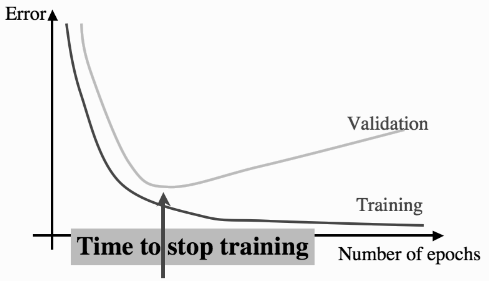

[← Multi-Layer Perceptron](index.md)

# 3 Improvements for the network

## 3.1 Introduction

As you can see, the network takes a lot of time to train. Sometimes the network may not converge at all even after a lot of iterations. It is because the error get's stuck at a local minima. Since we update the weights from all the examples at the same time, the error follows the direction of the steepest gradient. But the steepest gradrient may lead to a local minima and so no number of iterations will help it overcome that minima. These are problems with the gradient descent algorithm and hence apply to every model that uses it not just the MLP. Now there are ways around it:

##### 1. Changing Learning Rate:

If the local minima has a small "width", then a higher learning rate may just jump over it. However it makes the network unstable.

##### 2. Multiple models with random initialization:

We train the same model multiple times with different starting points and maybe from any other starting point the steepest gradient is towards global minima. This is very effective for small models. But some larger models take weeks to train, which have hundreds of millions of datapoints and we cannot afford to train multiple models.


##### 3. Mini-Batch and Stochastic Gradient Descent:

The algorithm we have implemented is called a Batch Gradient Descent. We update the weights for every example at the same time. But sometimes the dataset is too large to perform matrix operations and so we use small random batches of data from the large dataset and update weights for them. We keep on doing this until all the data is utilized and then start another iteration again. It is called **Mini-Batch Gradient Descent**. Now at each weight update i.e at every step of gradient descent isn't towards the steepest gradient of error for all examples but for just this mini-batch that we used. The downside is it may not take the *best* steps towards the minima but will eventually reach there after taking a "longer road". The upside is it may sometimes not get stuck at a local minima as it may not have the steepest gradient for that training batch. Since it can avoid a local minima, we often use it in a dataset where complete batch gradient descent can be used as well. The number of examples used in a batch is called batch size. If the batch size is one,i.e if we update weight after every example, it is called **Stochastic Gradient Descent**. Remember, bigger the batch size, better steps it will take to minima and smaller the batch size, more deviated the path and so higher chances of avoiding local minima. There is a middle ground we need to find to make the training better.
Remember it may also cause to deviate from the global minimum and reach a local minimum.

## 3.2 SGD and Mini-Batch Implementation

Let's do a batch implementation of MLP and let's also include a regression version.


```python
class MLP_batch:
    def init_weights(self,layer_sizes,random_state):
        #save weights in a list of matrices
        np.random.seed(random_state)
        self.weights = [np.random.rand(layer_sizes[l-1]+1,layer_sizes[l])*(2/np.sqrt(layer_sizes[l-1]))-(1/np.sqrt(layer_sizes[l-1])) for l in range(1,len(layer_sizes))]
    def sigmoid(self,x):
        return 1/(1+np.exp(-x)) # keep beta = 1
    
    def forward(self,A_0,is_regression,weights=None):
        self.outputs=[]
        A_l = A_0
        self.outputs.append(A_0)
        if weights is None:
            weights = self.weights
        for weight in weights:
            A_lbias = np.concatenate(((-np.ones((A_l.shape[0],1)),A_l)),axis=1) # add bias to input data
            H_l = np.matmul(A_lbias,weight) # compute the summation
            A_l = self.sigmoid(H_l) # compute the activation
            self.outputs.append(A_l)
        if is_regression:
            A_l = H_l
            self.outputs.pop()
            self.outputs.append(A_l)
        return A_l # return the final output
            
    def backward(self,T, learning_rate,is_regression,batch_size):
        A_L = self.outputs[-1]
        if is_regression:
            delta_L = A_L-T
        else:
            delta_L = (A_L-T)*(A_L*(1-A_L)) # beta = 0
        delta_l_next = delta_L
        
        for i in range(len(self.weights)-1,-1,-1):
#             print(i)
            A_l = self.outputs[i]
            #compute error for previous layer
            delta_l = A_l*(1-A_l)*(np.matmul(delta_l_next,np.transpose(self.weights[i][1:,:])))
#             A_0 A_1 A_2
#             W_1 W_2
#             0   1    2
            # add bias output to output matrix
            A_lbias = np.concatenate(((-np.ones((A_l.shape[0],1)),A_l)),axis=1)
            #update weights using the next errors
            self.weights[i] = self.weights[i]- (1/batch_size)*(learning_rate*(np.matmul(np.transpose(A_lbias),delta_l_next)))
            # change the next errors for next layer
            delta_l_next = delta_l
            
        
            
            
    
    def train(self,input_data,input_target, epochs,layer_sizes=(100,), 
              learning_rate=0.01,batch_size=None,is_regression=False,random_state=0,verbose=0, save_weights=False):
        
        
        X = np.array(input_data)
        Target = np.array(input_target)
        layer_sizes=list(layer_sizes)
        layer_sizes.insert(0,X.shape[1])
        n_outputs = np.unique(Target).shape[0] if np.unique(Target).shape[0]  != 2 and not is_regression else 1
        layer_sizes.append(n_outputs)
        
        
        self.init_weights(layer_sizes, random_state=random_state)
        if save_weights:
            self.saved_weights = [self.weights.copy()]
            
        if batch_size is None:
            batch_size=X.shape[0]
        for e in range(epochs):
            
                
            
    
            # shuffle the input so we don't train on same sequences
            idx = np.arange(0,Target.shape[0])
            np.random.shuffle(idx)
            X=X[idx]
            Target=Target[idx]
            
            b=0
            while b<X.shape[0]:
                A_0=X[b:b+batch_size,:]
                T=Target[b:b+batch_size,:]
                A_L = self.forward(A_0,is_regression)
                if e%((epochs//10)+1) == 0 and verbose:
                    print("epoch:",e)
                    print(f"Error: {np.sum((A_L-T)**2)/T.shape[0]}")
                    print(f"out: {A_L}")
    #                 print("weights",*self.weights,sep='\n',end='\n\n')
                self.backward(T,learning_rate,is_regression,batch_size)


                if save_weights:
                    self.saved_weights.append(self.weights.copy())

                b=b+batch_size
        print(f"Error: {np.sum((A_L-T)**2)/T.shape[0]}")
        
    def predict(self,input_data,weights=None):
        output = self.forward(np.array(input_data),weights)
        #since this output is a realnumber(between 0 & 1)
        # we will have a threshold to predict its class for now 0.5
        output = (output>0.5)*1
        return output
    
    def confmat(self,input_data,targets):
        '''returns the confusion matrix for binary classification'''
        outputs = self.predict(np.array(input_data))
        T = np.array(targets).reshape(outputs.shape)
        tp = ((T==1)&(outputs==1)).sum()
        tn = ((T==0)&(outputs==0)).sum()
        fp = ((T==0)&(outputs==1)).sum()
        fn = ((T==1)&(outputs==0)).sum()
        return np.array([[tp,fp],
                        [fn,tn]])

```

Let's make a simple regression dataset that has just one feature and it's target is a simple linear function to clear things.


```python
np.random.seed(364)
X = np.random.random((12000,1))
T = 25*X+7.8
```

Let's now try different forms of gradient descent on it. Also set the random state so we have the same starting points. We will also check the training time for the same number of epochs along with the error.

##### 3.2.2 Results


```python
#Batch Gradient Descent(Full Dataset)
batch_model=MLP_batch()
%time batch_model.train(X,T,layer_sizes=(),epochs=80,is_regression=True,learning_rate=1,random_state=0)
```

    Error: 0.0004875391124500146
    CPU times: user 138 ms, sys: 47 µs, total: 138 ms
    Wall time: 81.9 ms


```python
mini_batch1024 = MLP_batch()
%time mini_batch1024.train(X,T,layer_sizes=(),epochs=80,is_regression=True,learning_rate=1,random_state=0,batch_size=1024)
```

    Error: 1.834208786827062e-29
    CPU times: user 197 ms, sys: 0 ns, total: 197 ms
    Wall time: 100 ms


```python
mini_batch64 = MLP_batch()
%time mini_batch64.train(X,T,layer_sizes=(),epochs=80,is_regression=True,learning_rate=1,random_state=0,batch_size=64)
```

    Error: 4.0429121392576855e-30
    CPU times: user 611 ms, sys: 3.93 ms, total: 615 ms
    Wall time: 614 ms


```python
# for SGD, we will set batch_size=1
SGD = MLP_batch()
%time SGD.train(X,T,layer_sizes=(),epochs=80,is_regression=True,learning_rate=1,random_state=0,batch_size=1)
```

    Error: 0.0
    CPU times: user 30.8 s, sys: 347 ms, total: 31.2 s
    Wall time: 30.7 s


As you can see, SGD performed the best while taking a lot of time to train. Both of these because it made much more weight updates than any of them. For equal number of weight updates, the batch version should perform best.

Now let's try keeping the weight updates to be same, the best way is to let SGD go over the dataset atleast once. So that is a 12000 weight updates.


```python
#Batch Gradient Descent(Full Dataset)
batch_model=MLP_batch()
%time batch_model.train(X,T,layer_sizes=(),epochs=12000,is_regression=True,learning_rate=1e-2,random_state=0)
```

    Error: 3.255002724680526e-06
    CPU times: user 13.6 s, sys: 90.9 ms, total: 13.7 s
    Wall time: 6.87 s


```python
mini_batch1024 = MLP_batch()
%time mini_batch1024.train(X,T,layer_sizes=(),epochs=1024,is_regression=True,learning_rate=1e-2,random_state=0,batch_size=1024)
```

    Error: 3.2897801810988825e-06
    CPU times: user 2.34 s, sys: 15.8 ms, total: 2.35 s
    Wall time: 1.18 s


```python
mini_batch64 = MLP_batch()
%time mini_batch64.train(X,T,layer_sizes=(),epochs=64,is_regression=True,learning_rate=1e-2,random_state=0,batch_size=64)
```

    Error: 3.473449823532693e-06
    CPU times: user 515 ms, sys: 25 µs, total: 515 ms
    Wall time: 512 ms


```python
# for SGD, we will set batch_size=1
SGD = MLP_batch()
%time SGD.train(X,T,layer_sizes=(),epochs=1,is_regression=True,learning_rate=1e-2,random_state=0,batch_size=1)
```

    Error: 6.853664577305198e-06
    CPU times: user 480 ms, sys: 40.5 ms, total: 521 ms
    Wall time: 464 ms


As you can see the opposite has happened, the batch version has done great but in most time and SGD has done worst in least time. But the mini batch of 1024 examples has done acceptable in very small time. We could prefer this model over both the models. It is the middle ground we need to find and depends on what can we spare, time or cost? It also depends on the type of dataset we are using. That stuff is for trial and error, atleast for now.

## 3.3 Visualization

Now let's see how the weights are updated. But before that let's project out data error in a chart. Let's see how the error varies as with the weight. We will plot the weights on x and y axis and error on z axis.


```python
def compute_multiple_error(X,T,xx,yy):
    print("computing error")
    e = (T[0]-(xx*X[0]-yy))**2
    for i in range(1,len(X)):
        if (i+1)%1000==0:
            print(f"{i+1}/{len(X)} done")
        e = e+(T[i]-(xx*X[i]-yy))**2
    return (1/T.shape[0])*e
    
```


```python
xx,yy = np.meshgrid(np.linspace(-5,35,1000),np.linspace(-30,5,1000))
err = compute_multiple_error(X,T,xx,yy)
```

    computing error
    1000/12000 done
    2000/12000 done
    3000/12000 done
    4000/12000 done
    5000/12000 done
    6000/12000 done
    7000/12000 done
    8000/12000 done
    9000/12000 done
    10000/12000 done
    11000/12000 done
    12000/12000 done


```python
fig = go.Figure()
fig.add_trace(go.Surface(x=xx,y=yy,z=err))
fig.update_layout(
        scene = {
            "xaxis": {"title": "Weight 1"},
            "zaxis": {"title": "Error"},
            "yaxis": {"title": "Weight 2"}
        })
fig.show()
```


As you can see, this surface has a minimum. A 3D graph looks clumsy, let's use contours of this 3D plot. However plotly doesn't support uneven labels, we will use the logarithm of error to make the plots have regular contours.


```python
fig = go.Figure(data=
                [go.Contour(
                    x=xx[0],
                    y=yy[:,0],
                    z=np.log1p(err),
                    contours_coloring='lines',
                    line_width=2,
                    showscale=False,
                )
                ],
                layout=dict(xaxis_title="Weight 1",
                           yaxis_title=" Weight 2",
                           width=915, height=800,),
                
               )
fig.add_trace(go.Scatter(x=[25],y=[-7.8],marker=dict(symbol="x", size=10)))
fig.show()
```


These are the contour lines and the cross(x) sign is the minimum of the error, we want our models to descend to that point. Let's see how each model does it. Each line has zero gradient(i.e they lie on the same level) and the perpendicular direction at each line is the steepest gradient.


```python
batch_model=MLP_batch()
batch_model.train(X,T,layer_sizes=(),epochs=150,is_regression=True,learning_rate=1,random_state=0,save_weights=True)

mini_batch1024 = MLP_batch()
mini_batch1024.train(X,T,layer_sizes=(),epochs=100,is_regression=True,learning_rate=1,random_state=0,
                     batch_size=1024,save_weights=True)
mini_batch64 = MLP_batch()
mini_batch64.train(X,T,layer_sizes=(),epochs=1,is_regression=True,learning_rate=1,random_state=0,
                     batch_size=64,save_weights=True)


SGD = MLP_batch()
SGD.train(X,T,layer_sizes=(),epochs=1,is_regression=True,learning_rate=1,random_state=0,batch_size=1,save_weights=True)
```

    Error: 3.796053431101478e-08
    Error: 1.8660418967252465e-29
    Error: 2.1144567049716302e-10
    Error: 0.0


```python
weights=[np.concatenate([i[0] for i in m.saved_weights],axis=1) for m in (batch_model,mini_batch1024,mini_batch64,SGD)]
```

Let's now draw every weight update


```python
fig = go.Figure()

fig.add_trace(go.Contour(x=xx[0], y=yy[:,0], z=np.log1p(err), autocontour=False, 
                         line_width=2, showscale=False,contours_coloring='lines', 
                        ),
             )
fig.add_trace(go.Scatter(x=[25],y=[-7.8],mode="markers",marker=dict(symbol="x", size=10, color="red"),
                         name="Minimum"),)

for p,name,color,opacity in zip(range(4),
                        ['Full Batch','1024','64','1(SGD)'],
                        ['Blue',"Cyan","Green","Magenta"],
                        [1,0.8,0.8,0.8]):
    fig.add_trace(go.Scatter(x=weights[p][1,:],y=weights[p][0,:],name=name,opacity=opacity,
                             mode="lines+markers",line=dict(color=color, width=2)),)


fig.update_layout(legend=dict(x=0.8, y=1),height=800,width=915)

fig.show()

```


As you can see, the bigger the batch size, the better the weight updates are. Also look the full batch version took steps which were perpendicular to the contour line at every point(i.e the steepest gradient). But we cannot always afford to use full dataset at one time. And besides, this random-looking update might help us to deviate from local minima. Still we can use a few more tricks to make it faster and better.

## 3.4 The Momentum

While using the Mini-Batch or Stochastic Gradient Descent, we use certain ways to keep the weights on track and not deviate too much. One of them is called picking up the momentum. Since in SGD or MBD, each weight update is based upon just the examples we are considering, the weights are change according to just that batch and does not consider the whole dataset and make training longer, especially when there is no local minima and traing set is very large. 

The idea is to not just update the weights from the current batch's \\(\Delta w\\), but from the previous batch as well.
So, we update the weight of any layer \\(l\\), iteration \\(t\\) as: 

$$ w^{(l,t)}_{pq} \leftarrow w^{(l,t-1)}_{pq} - \Delta w^{(l,t)}_{pq}\tag{90} $$


where,

$$ \Delta w^{(l,t)}_{pq} = \eta \delta^{(l)}_qa^{(l-1)}_p + \alpha \Delta w^{(l,t-1)}_{pq}\tag{91} $$

and 

1. \\(w^{(l,t)}_{pq}\\) is the weight of layer \\(l\\) of iteration \\(t\\).
2. \\(\alpha\\) is the weightage for the previous weight update. \\(0.9\\) is a good number.

Note: *iteration* means a weight update and not an epoch.

However that method is effective as it can be, but we will need to tune learning rate again and it has different impact. The current weight has a weight of \\(\eta\\) while the previous weight updates have \\(\alpha\\) weight. Earlier all of it had weight of \\(\eta\\). So the proposition here is to assign a weight of \\(1-\alpha\\) to the current update and \\(\alpha\\) to previous ones so to make a total weight of unity and then we use the learning rate all over it.

Like:

$$ \Delta w^{(l,t)}_{pq} = \eta \big((1-\alpha)\delta ^{(l)}_qa^{(l-1)}_p + \alpha \Delta w^{(l,t-1)}_{pq}\big) \tag{92} $$

It can be easily done by:

```python
delta_w = (1-momentum)*(1/batch_size)*(np.matmul(np.transpose(A_lbias),delta_l_next)) + momentum*delta_w
weight = weight - learning_rate*delta_w
```

Let's try to write it up. We need just a few changes in the code.


```python
class MLP_momentum:
    def init_weights(self,layer_sizes,random_state):
        #save weights in a list of matrices
        np.random.seed(random_state)
        self.weights = [np.random.rand(layer_sizes[l-1]+1,layer_sizes[l])*(2/np.sqrt(layer_sizes[l-1]))-(1/np.sqrt(layer_sizes[l-1])) for l in range(1,len(layer_sizes))]
    def sigmoid(self,x):
        return 1/(1+np.exp(-x)) # keep beta = 1
    
    def forward(self,A_0,is_regression,weights=None):
        self.outputs=[]
        A_l = A_0
        self.outputs.append(A_0)
        if weights is None:
            weights = self.weights
        for weight in weights:
            A_lbias = np.concatenate(((-np.ones((A_l.shape[0],1)),A_l)),axis=1) # add bias to input data
            H_l = np.matmul(A_lbias,weight) # compute the summation
            A_l = self.sigmoid(H_l) # compute the activation
            self.outputs.append(A_l)
        if is_regression:
            A_l = H_l
            self.outputs.pop()
            self.outputs.append(A_l)
        return A_l # return the final output
            
    def backward(self,T, learning_rate,is_regression,batch_size,momentum,delta_w):
        A_L = self.outputs[-1]
        if is_regression:
            delta_L = A_L-T
        else:
            delta_L = (A_L-T)*(A_L*(1-A_L)) # beta = 0
        delta_l_next = delta_L
        
        for i in range(len(self.weights)-1,-1,-1):
#             print(i)
            A_l = self.outputs[i]
            #compute error for previous layer
            delta_l = A_l*(1-A_l)*(np.matmul(delta_l_next,np.transpose(self.weights[i][1:,:])))
#             A_0 A_1 A_2
#             W_1 W_2
#             0   1    2
            # add bias output to output matrix
            A_lbias = np.concatenate(((-np.ones((A_l.shape[0],1)),A_l)),axis=1)
        
            # compute delta_w
            delta_w[i] = (1-momentum)*(1/batch_size)*(np.matmul(np.transpose(A_lbias),delta_l_next)) + momentum*delta_w[i]
            
            
            #update weights using the next errors
            self.weights[i] = self.weights[i] - learning_rate*delta_w[i]
            # change the next errors for next layer
            delta_l_next = delta_l
        return delta_w
            
        
            
            
    
    def train(self, input_data, input_target, epochs, layer_sizes=(100,), 
              learning_rate=0.01, batch_size=None, is_regression=False,
              momentum=0.9, random_state=0,verbose=0, save_weights=False,warm_start=False):
        
        
        X = np.array(input_data)
        Target = np.array(input_target)
        layer_sizes=list(layer_sizes)
        layer_sizes.insert(0,X.shape[1])
        n_outputs = Target.shape[1]
        layer_sizes.append(n_outputs)
        
        if not warm_start:
            self.init_weights(layer_sizes, random_state=random_state)
        if save_weights:
            self.saved_weights = [self.weights.copy()]
            
        if batch_size is None:
            batch_size=X.shape[0]
        
        # initialize delta_w to be zero for every layer
        delta_w = [0*i for i in self.weights].copy()
        for e in range(epochs):
            
                
            
    
            # shuffle the input so we don't train on same sequences
            idx = np.arange(0,Target.shape[0])
            np.random.shuffle(idx)
            X=X[idx]
            Target=Target[idx]
            
            b=0
            while b<X.shape[0]:
                A_0=X[b:b+batch_size,:]
                T=Target[b:b+batch_size,:]
                A_L = self.forward(A_0,is_regression)
                if e%((epochs//10)+1) == 0 and verbose:
                    print("epoch:",e)
                    print(f"Error: {np.sum((A_L-T)**2)/T.shape[0]}")
#                     print(f"out: {A_L}")
    #                 print("weights",*self.weights,sep='\n',end='\n\n')
                delta_w = self.backward(T,learning_rate,is_regression,batch_size,momentum,delta_w)
                

                if save_weights:
                    self.saved_weights.append(self.weights.copy())
                b=b+batch_size
        return np.sum((A_L-T)**2)/T.shape[0]
        
    def predict(self,input_data,weights=None):
        output = self.forward(np.array(input_data),weights)
        #since this output is a realnumber(between 0 & 1)
        # we will have a threshold to predict its class for now 0.5
        output = (output>0.5)*1
        return output
    
    def confmat(self,input_data,targets):
        '''returns the confusion matrix for binary classification'''
        outputs = self.predict(np.array(input_data))
        T = np.array(targets).reshape(outputs.shape)
        tp = ((T==1)&(outputs==1)).sum()
        tn = ((T==0)&(outputs==0)).sum()
        fp = ((T==0)&(outputs==1)).sum()
        fn = ((T==1)&(outputs==0)).sum()
        return np.array([[tp,fp],
                        [fn,tn]])

```


```python
SGD = MLP_momentum()
SGD.train(X,T,layer_sizes=(),epochs=1,is_regression=True,learning_rate=1,random_state=0,
          batch_size=1,save_weights=True,momentum=0)
SGD_mom = MLP_momentum()
SGD_mom.train(X,T,layer_sizes=(),epochs=1,is_regression=True,learning_rate=
              1,random_state=0,
          batch_size=1,save_weights=True,momentum=0.8)
```


    0.0


```python
weights=[np.concatenate([i[0] for i in m.saved_weights],axis=1) for m in (SGD,SGD_mom)]
```

Let's now draw every weight update


```python
fig = go.Figure()

fig.add_trace(go.Contour(x=xx[0], y=yy[:,0], z=np.log1p(err), autocontour=False, 
                         line_width=2, showscale=False,contours_coloring='lines', 
                        ),
             )
fig.add_trace(go.Scatter(x=[25],y=[-7.8],mode="markers",marker=dict(symbol="x", size=10, color="red"),
                         name="Minimum"),)

for p,name,color in zip(range(2),
                        ['Without Momentum(SGD)','With Momentum(SGD)'],
                        ['Blue',"Red",],
                               ):
    fig.add_trace(go.Scatter(x=weights[p][1,:],y=weights[p][0,:],name=name,opacity=opacity,
                             mode="lines+markers",
                             line=dict(color=color, width=2)),
                 )
                 


fig.update_layout(legend=dict(x=0.8, y=1),height=800,width=915,xaxis_title="Weight 1", yaxis_title="Weight 2",
                 title="Contour Plot of Error")

fig.show()

```


As you can see, the updates are much more smooth for SGD. This also makes it possible to use smaller learning rate and thus making it more stable. Let's now see for a complete batch and see something different.


```python
batch_model=MLP_momentum()
batch_model.train(X,T,layer_sizes=(),epochs=150,is_regression=True,learning_rate=1,
                  random_state=0,save_weights=True,momentum=0)

batch_model_mom=MLP_momentum()
batch_model_mom.train(X,T,layer_sizes=(),epochs=150,is_regression=True,learning_rate=1,
                      random_state=0,save_weights=True,momentum=0.9)

```


    3.8757600362031304e-05


```python
weights=[np.concatenate([i[0] for i in m.saved_weights],axis=1) for m in (batch_model,batch_model_mom)]
```


```python
fig = go.Figure()

fig.add_trace(go.Contour(x=xx[0], y=yy[:,0], z=np.log1p(err), autocontour=False, 
                         line_width=2, showscale=False,contours_coloring='lines', 
                        ),
             )
fig.add_trace(go.Scatter(x=[25],y=[-7.8],mode="markers",marker=dict(symbol="x", size=10, color="red"),
                         name="Minimum"),)

for p,name,color in zip(range(2),
                        ['Without Momentum(Batch)','With Momentum(Batch)'],
                        ['Blue',"Red",],
                               ):
    fig.add_trace(go.Scatter(x=weights[p][1,:],y=weights[p][0,:],name=name,opacity=opacity,
                             mode="lines+markers",
                             line=dict(color=color, width=2)),
                 )
                 


fig.update_layout(legend=dict(x=0.8, y=1),height=800,width=915,xaxis_title="Weight 1", yaxis_title="Weight 2",
                 title="Contour Plot of Error")

fig.show()
```


Here are a few important points to note:
1. The step size increases as we go along the right gradient but decreases and eventually stops and changes once we are not moving along the gradient as if the weights cannot stop and have a certain *momentum* like a block of mass.

2. If we use the complete dataset as the batch, then, without momentum, it will take the best steps along the steepest gradient to the minima(local or global). But with momentum, it wanders off a little. It may even reach the minimum(local ot global) and yet go past it a bit(like a ball with momentum would). If it was a local minima, it may just cross the barrier and move to global minima. If it was a global minima, then it would oscillate a little and eventually stop.

3. For mini batch, it will depend on the batch size. If the batch size is too small, then it will act as it does for SGD,(i.e smoothen the weight updates) and if the batch size is too big, then it will act as it does for complete batch(i.e, deviate and move past minima). The batch size will decide the degree of it.

Our XOR data has probably a local minima(or a saddle point) which does not allow all the models to converge at the global minimum. Some initializations get stuck at a local minima. Here is one. try changing the epochs and learning rates, it is still very hard to get a very low error score. So we can improve it by the momentum. With the right momentum and the correct learning rate, we can get past this minima and get a lower score in very few epochs.


```python
simple_model = MLP()
simple_model.train(XOR_inp,XOR_target,30001,layer_sizes=(2,),learning_rate=5, random_state=365)
```

    Error: 0.1250841346167755


```python
mom_model = MLP_momentum()
mom_model.train(XOR_inp,XOR_target,30001,layer_sizes=(2,),learning_rate=5, random_state=365,momentum=0.9)
```


    3.434487809294881e-05


Another thing we try is called **Weight Decay**. The argument goes as small weights try to keep the outputs in the linear middle part of the sigmoid which change faster than at the end points(because of the gradient). It is done by multiplying all the weights by a small constant \\(\epsilon\\) after each iteraton. It makes the network simpler and  may improve the results, but it can also sometimes make the learning significantly worse. Choosing \\(\epsilon\\) is done experimentally.

We will discuss more optimizations in detail later on.

## 3.5 Misc

##### 3.5.1 Amount of Training Data

Since there are many parameters(weights) to look for, there actually should be sufficient data to learn that. The amont of data actually depends on the problem, but a rule of thumb is to use **data 10 times the number of weights**. 

##### 3.5.2 Number of Hidden layers and Nodes

These are two important decisions needed to be made to get a good result. How many hidden layers to use and how many nodes in each layer? Although there is no theory for number of nodes but according to **Universal Approximation Theorem**, just one hidden layer will do just fine. A combination of sigmoid layers can approxiamte to any function with the sufficient number of nodes. However that one layer might need a lot of hidden nodes, so two hidden layers are usually used to be safe. The two hidden layer systemwill work for most of the problems but there are always exceptions.

We will talk more about the **Universal Approximation Theorem** later on.

##### 3.5.2 When to Stop Training?

This is also an important factor deciding the results. We do not want to overfit the data nor to we want to underfit it. So it is better to use a validation data to check. We will continue to train untill both the training and validation error are reducing. At the point the validation error starts increasing, we stop the training.



This technique is called **early stopping**.

# 4 MLP in Practice

Let's see some examples how MLP can be used. 

### 4.1 A Regression Problem

Let's try fitting a sine wave with a small noise as well.


```python
np.random.seed(479)
X = np.linspace(0,1,100).reshape(-1,1)
T = np.sin(2*np.pi*X) + np.cos(4*np.pi*X)+np.random.randn(100,1)*0.4
```


```python
# plot the data
fig = go.Figure(go.Scatter(x=X.squeeze(),y=T.squeeze(), mode="markers"),
                layout=dict(xaxis_title="Input", yaxis_title="Target Values")
               )
fig.show()
```


Let's now train an MLP on this data. But before that we will normalize the data and split it into training validation and test data in the ratio 4:1:1.


```python
X =(X-X.mean(axis=0))/X.var(axis=0)
T =(T-T.mean(axis=0))/T.var(axis=0)
```


```python
idx = np.arange(X.shape[0])
np.random.shuffle(idx)
X=X[idx,:]
T=T[idx,:]
train = X[:2*(X.shape[0]//3),:]
test = X[2*(X.shape[0]//3):2*(X.shape[0]//3)+(X.shape[0]//6):,:]
val = X[2*(X.shape[0]//3)+(X.shape[0]//6):,:]
traintarget = T[:2*(X.shape[0]//3),:]
testtarget = T[2*(X.shape[0]//3):2*(X.shape[0]//3)+(X.shape[0]//6):,:]
valtarget = T[2*(X.shape[0]//3)+(X.shape[0]//6):,:]
```


```python
# plot the data
fig = go.Figure(data=[go.Scatter(x=train.squeeze(),y=traintarget.squeeze(),mode="markers", name="training set"),
                     go.Scatter(x=val.squeeze(),y=valtarget.squeeze(),mode="markers",name="validation set")],
                layout=dict(xaxis_title="Input", yaxis_title="Target Values")
               )
fig.show()
```


To start with, we will use one hidden layer, with 3 nodes and learning rate of 0.25 for 101 epochs and see what the output is.


```python
m = MLP_momentum()
m.train(train,traintarget,101,layer_sizes=(3,),learning_rate=0.25,is_regression=True,momentum=0.9,verbose=True,random_state=200)
```

    epoch: 0
    Error: 0.9954347804927682
    epoch: 11
    Error: 0.695684508117699
    epoch: 22
    Error: 0.6610644383959196
    epoch: 33
    Error: 0.6622483713072506
    epoch: 44
    Error: 0.652190286530414
    epoch: 55
    Error: 0.646344230816324
    epoch: 66
    Error: 0.6426767619901053
    epoch: 77
    Error: 0.63862336612565
    epoch: 88
    Error: 0.6343649929165276
    epoch: 99
    Error: 0.6300130633180782


    0.6296088646689288


As we can see, the error is decreasing, now we have to figure out a couple of things. First figure out the early stopping. We will keep track of last two validation errors after every 10 epochs to make sure the validation error actually increases(when it does!) and do not stop the program prematurely.


```python
train_error=[]
val_error=[]
m = MLP_momentum()
m.train(train,traintarget,100,layer_sizes=(5,),learning_rate=0.25,is_regression=True,momentum=0.9)
old_val_error1 = np.infty
old_val_error2 = np.infty
new_error = (1/val.shape[0])*np.sum((m.forward(val,is_regression=True)-valtarget)**2)
val_error.append(new_error)
train_error.append((1/train.shape[0])*np.sum((m.forward(train,is_regression=True)-traintarget)**2))
count = 0
while (((old_val_error1-new_error)>0.0005) or ((old_val_error2-old_val_error1)>0.0005)):
    count+=1
    m.train(train,traintarget,100,layer_sizes=(5,),learning_rate=0.25,is_regression=True,momentum=0,warm_start=True)
    old_val_error2=old_val_error1
    old_val_error1=new_error
    new_error = (1/val.shape[0])*np.sum((m.forward(val,is_regression=True)-valtarget)**2)
    val_error.append(new_error)
    train_error.append((1/train.shape[0])*np.sum((m.forward(train,is_regression=True)-traintarget)**2))
    
print("learning_stopped at epoch:", count*100)
extra_train_error=[]
extra_val_error=[]
for i in range(10):
    m.train(train,traintarget,100,layer_sizes=(5,),learning_rate=0.25,is_regression=True,momentum=0.9,warm_start=True)
    old_val_error2=old_val_error1
    old_val_error1=new_error
    new_error = (1/val.shape[0])*np.sum((m.forward(val,is_regression=True)-valtarget)**2)
    extra_val_error.append(new_error)
    extra_train_error.append((1/train.shape[0])*np.sum((m.forward(train,is_regression=True)-traintarget)**2))
 

```

    learning_stopped at epoch: 1600


```python
fig = go.Figure(data=[
    go.Scatter(y=train_error,name="train error before early stopping"),
    go.Scatter(y=val_error, name="validation error before early stoppping"),
    go.Scatter(x=list(range(len(train_error),len(train_error)+len(extra_train_error))),y=extra_train_error,
               name= "train error after early stopping"),
    go.Scatter(x=list(range(len(val_error),len(val_error)+len(extra_val_error))),y=extra_val_error,
               name= "validation error after early stopping"),    
],
               layout=dict(xaxis_title="Epochs x100", yaxis_title="Sum of Squares Error"))
fig.show()
```


As you can see there is not much change in the error after the early stopping point. We have found the for how long the network to be run but now let's figure how many hidden nodes to be used.

We already have a early stopping function and we will run this for different sizes of hidden nodes and record the results. However we will run each model 10 times with different initialization and work on averages.


```python
def early_stopping(train,traintarget,val,valtarget,epochs,layer_sizes,learning_rate,
                   is_regression,momentum,random_state,diff=0.001):
    m = MLP_momentum()
    error=m.train(train,traintarget,epochs,layer_sizes=layer_sizes,learning_rate=learning_rate,
            is_regression=is_regression,momentum=momentum,random_state=random_state)
    
    old_val_error1 = 2000000000
    old_val_error2 = 1999999999
    new_error = (1/val.shape[0])*np.sum((m.forward(val,is_regression=True)-valtarget)**2)
    
    count = 0
    while (((old_val_error1-new_error)>diff) or ((old_val_error2-old_val_error1)>diff)):
        count+=epochs
        error = m.train(train,traintarget,epochs,layer_sizes=layer_sizes,learning_rate=learning_rate,
            is_regression=is_regression,momentum=momentum,random_state=random_state,warm_start=True)
        
        old_val_error2=old_val_error1
        old_val_error1=new_error
        new_error = (1/val.shape[0])*np.sum((m.forward(val,is_regression=True)-valtarget)**2)
    return m, new_error
```

We will save error for every differnt initialization and work on averages, standard deviations, minimums and maximums. We will use a pandas dataframe to form a table.


```python
import pandas as pd
```


```python
hidden_units = [1,2,3,5,10,25]
df = pd.DataFrame(index=["Mean Error","Standard Deviation", "Max Error", "Min Error"])
for unit in hidden_units:
    errors = np.array([early_stopping(train,traintarget,val,valtarget,10,(unit,),0.25,True,0,
                                      np.random.randint(0,12000))[1] for i in range(10)])
    df[str(unit)]=[errors.mean(),errors.std(),errors.max(),errors.min()]
    print(f"Units done: {unit}")
```

    Units done: 1
    Units done: 2
    Units done: 3
    Units done: 5
    Units done: 10
    Units done: 25


```python
df
```


    |   | 1 | 2 | 3 | 5 | 10 | 25 |
    |---|---|---|---|---|---|---|
    |Mean Error |0.423110  |0.337027  |0.221558  |0.203000  |0.168734  |1.118023  |
    |Standard Deviation  |0.000311  |0.126717  |0.117290  |0.105529  |0.085867  |1.072914  |
    |Max Error  |0.423543  |0.429690  |0.405281  |0.421871  |0.422707  |3.377288  |
    |Min Error  |0.422477  |0.141333  |0.139736  |0.145992  |0.122757  |0.244395  |


Take a look at both the mean(or max) error and standard deviation of each model with their hidden nodes. We prefer the model with low error (mean and max) and low standard deviation. We can also change learning rate and test out the results. Also we can try more layers and optimize the nodes in each layer.

## Final Code

Before starting the next part we have to add a bunch of stuff to our code, implementing the cross-entropy error. We will also include the early stopping method with it. We will also fix the confusion matrix for multiple classes.


```python
class MLP:
    def init_weights(self,layer_sizes,random_state):
        #save weights in a list of matrices
        np.random.seed(random_state)
        self.weights = [np.random.rand(layer_sizes[l-1]+1,layer_sizes[l])*(2/np.sqrt(layer_sizes[l-1]))-(1/np.sqrt(layer_sizes[l-1])) for l in range(1,len(layer_sizes))]
    def sigmoid(self,x):
        return 1/(1+np.exp(-x)) # keep beta = 1
    
    def forward(self,A_0,is_regression,weights=None):
        self.outputs=[]
        A_l = A_0
        self.outputs.append(A_0)
        if weights is None:
            weights = self.weights
        for weight in weights:
            A_lbias = np.concatenate(((-np.ones((A_l.shape[0],1)),A_l)),axis=1) # add bias to input data
            H_l = np.matmul(A_lbias,weight) # compute the summation
            A_l = self.sigmoid(H_l) # compute the activation
            self.outputs.append(A_l)
        if is_regression:
            A_l = H_l
            self.outputs.pop()
            self.outputs.append(A_l)
        return A_l # return the final output
            
    def backward(self,T, learning_rate,is_regression,batch_size,momentum,delta_w,loss):
        A_L = self.outputs[-1]
        if is_regression:
            delta_L = A_L-T
        elif loss == 'sumofsquares':
            delta_L = (A_L-T)*(A_L*(1-A_L)) # beta = 0
        elif loss == 'crossentropy':
#             delta_L = (T*(A_L-1)*A_L)
            delta_L= A_L-T
        delta_l_next = delta_L
        
        for i in range(len(self.weights)-1,-1,-1):
            A_l = self.outputs[i]
            #compute error for previous layer
            delta_l = A_l*(1-A_l)*(np.matmul(delta_l_next,np.transpose(self.weights[i][1:,:])))

            # add bias output to output matrix
            A_lbias = np.concatenate(((-np.ones((A_l.shape[0],1)),A_l)),axis=1)
        
            # compute delta_w
            delta_w[i] = (1-momentum)*(1/batch_size)*(np.matmul(np.transpose(A_lbias),delta_l_next)) + momentum*delta_w[i]
            
            
            #update weights using the next errors
            self.weights[i] = self.weights[i] - learning_rate*delta_w[i]
            
            # change the next errors for next layer
            delta_l_next = delta_l
        return delta_w
            
    def compute_error(self,A_L,T,loss):
        if loss == 'sumofsquares':
            return np.sum((A_L-T)**2)/T.shape[0]
        
        if loss == 'crossentropy':
            return -np.sum(T*(np.log(A_L))+(1-T)*(np.log(1-A_L)))/T.shape[0]
            
            
            
    
    def train(self, input_data, input_target, epochs, layer_sizes=(100,), 
              learning_rate=0.01, batch_size=None,loss='sumofsquares', is_regression=False,
              momentum=0.9, random_state=0,verbose=0, save_weights=False,warm_start=False):
        
        
        X = np.array(input_data)
        Target = np.array(input_target)
        layer_sizes=list(layer_sizes)
        layer_sizes.insert(0,X.shape[1])
        n_outputs = Target.shape[1]
        layer_sizes.append(n_outputs)
        
        if not warm_start:
            self.init_weights(layer_sizes, random_state=random_state)
        if save_weights:
            self.saved_weights = [self.weights.copy()]
            
        if batch_size is None:
            batch_size=X.shape[0]
        
        # initialize delta_w to be zero for every layer
        delta_w = [0*i for i in self.weights].copy()
        for e in range(epochs):
            
                
            
    
            # shuffle the input so we don't train on same sequences
            idx = np.arange(0,Target.shape[0])
            np.random.shuffle(idx)
            X=X[idx]
            Target=Target[idx]
            
            b=0
            while b<X.shape[0]:
                A_0=X[b:b+batch_size,:]
                T=Target[b:b+batch_size,:]
                A_L = self.forward(A_0,is_regression)
                if e%((epochs//10)+1) == 0 and verbose:
                    print("epoch:",e)
                    print(f"Error: {self.compute_error(A_L,T,loss)}")
                delta_w = self.backward(T,learning_rate,is_regression,batch_size,momentum,delta_w,loss)
                

                if save_weights:
                    self.saved_weights.append(self.weights.copy())
                b=b+batch_size
        return self.compute_error(A_L,T,loss)
    
    def early_stopping(self,train,traintarget,val,valtarget,epochs,layer_sizes,learning_rate,
                       is_regression,momentum,batch_size=None, diff=0.01,random_state=0,loss='sumofsquares'):
        error = self.train(train,traintarget,epochs,layer_sizes=layer_sizes,learning_rate=learning_rate,
                           is_regression=is_regression,momentum=momentum,batch_size=batch_size,
                           loss=loss,random_state=random_state)
        old_val_error1 = 2000000000
        old_val_error2 = 1999999999
        new_error = self.compute_error(self.forward(val,is_regression=is_regression),valtarget,loss)
        
        count = 0
        while (((old_val_error1-new_error)>diff) or ((old_val_error2-old_val_error1)>diff)):
            count+=epochs
            error = self.train(train,traintarget,epochs,layer_sizes=layer_sizes,learning_rate=learning_rate,
                is_regression=is_regression,momentum=momentum,random_state=random_state,loss=loss,warm_start=True)

            old_val_error2=old_val_error1
            old_val_error1=new_error
            new_error = self.compute_error(self.forward(val,is_regression=is_regression),valtarget,loss)
        return new_error
    
    
    def predict(self,input_data,weights=None):
        output = self.forward(np.array(input_data),weights)
        #since this output is a realnumber(between 0 & 1)
        # we will have a threshold to predict its class for now 0.5
        output = (output>0.5)*1
        return output
    
    def confmat(self,input_data,targets):
        '''returns the confusion matrix for binary classification'''
        out = np.argmax(m.forward(input_data,is_regression=False),axis=1)
        t = np.argmax(targets,axis=1)
        mat = np.zeros([np.unique(t).shape[0]]*2)
        for i in np.unique(t):
            for j in np.unique(t):
                mat[i,j]=np.sum((out==i) & (t==j))
        return mat,np.sum(mat*np.eye(mat.shape[0]))/np.sum(mat)

```

Let's save this model in our <a href="/downloads/utils.py">utils.py</a> file.

### 4.2 A Classification Problem

There are multiple ways to approach a classification problem. The inputs are the features normalized and there are a couple of choices for outputs.

1. The first is to use a single linear node and then put some threshold for different outputs. For example, for a 4 class problem we can use:

$$
C = \begin{cases}
C_1 & \text{if }  y \leq -0.5 \\
C_2 & \text{if } -0.5 < y \leq 0 \\
C_3 & \text{if } 0 < y \leq 0.5 \\
C_4 & \text{if } y > 0.5
\end{cases}
$$
But this gets impractical when the number of classes gets large and the boundaries are artificial; say what about the output 0.5? We classify it as \\(C_3\\), but the network gives us no information that how hard this example was to classify.


2. A more suitable way is to use output is called **\\(1\text{-of-}N\\) encoding**. A separate node is used to represent each posiible class and the target vector consists of zeros everywhere except for the class we are representing, e.g (0,0,1,0,0) means the third class out of 5. We are using binary output for each output node.

We can use one of two ways to select a class. After all the output neurons have given their sigmoidal outputs, we can now choose the neuron to be 1 which has highest value and all others are Zero. This makes the result unambigious, since it is highly unlikely that two neurons have same values and they both happen to be the maximum values. This is called **Hard Max** method. We can also use the **Soft Max** version, where we first scale the the outputs to be comparable to each other and the sum also adds up to 1. It gives us the probability of that class(more or less!). So if there is a clear winner that neuron will be close to 1, otherwise if there are other similar values they will each have a value of \\(\frac{1}{p}\\), where \\(p\\) is the number of output neurons that have similar values.


There is another problem with the classification process. It is called class imablance. If we have, say, two class and we have 90% of training data for class 1, then the classifier will learn to always predict class 1, irrespective of the data. It will surely give it a 90% accuracy, but it is  a bad classifier. All the training examples from each classes should almost same. We may randomly throw off some data from the class which has larger data. There is another method called as **novelty detection**, where we train the whole model on just the over-represented data and then just predict if the data is different or similar to the training data. We will cover it in detail later.  

**The Iris Dataset**:
This data is concerned with classification of *iris* flower into different species. This data is already available in sklearn library. This data contains features of *'sepal length'*, *'sepal width'*, *'petal length'*, *'petal width'*. There are three targets, the species, viz, *'setosa'*, *'versicolor'*, *'virginica'*. These are encoded as 0,1,2 respectively.


```python
from sklearn.datasets import load_iris
```


```python
data = load_iris()['data']
target = load_iris()['target']
```

Upon inspection, you will find that this data has equal number of datapoints from each class, so we don't have to discard any datapoints. Let's first split the data into train, test and validation. Let's keep half of the data for training, a quarter for validation and a quarter for testing, but first we will randomise the dataset. Also we need to convert the target into 1-of-N encoding.


```python
encoded_target = np.zeros((target.shape[0],3))
encoded_target[np.arange(target.shape[0]),target]=1
```


```python
idx = np.arange(data.shape[0])
np.random.shuffle(idx)
data = data[idx,:]
encoded_target = encoded_target[idx,:]

train = data[::2,:]
traint = encoded_target[::2,:]

val = data[1::4,:]
valt = encoded_target[1::4,:]

test = data[3::4]
testt = encoded_target[3::4,:]
```

Let's normalize the data. Let's divide by the maximum instead of standard deviation. We will normalize every set with mean and max(or std) from the training data. 


```python
mean = train.mean(axis=0)
maximum = train.max(axis=0)
std = train.std(axis=0)
train = (train-mean)/maximum
val = (val-mean)/maximum
test = (test-mean)/maximum
```


```python
m = MLP()
m.early_stopping(train,traint,val,valt,10,(20,),15,False,0.9,loss='crossentropy',random_state=0)
```


    0.0798786726307614


```python
m.compute_error(m.forward(train,False),traint,'crossentropy')
```


    0.18322617355694956


```python
m.confmat(train,traint)
```


    (array([[28.,  0.,  0.],
            [ 0., 23.,  1.],
            [ 0.,  2., 21.]]), 0.96)


```python
m.confmat(val,valt)
```


    (array([[14.,  0.,  0.],
            [ 0., 11.,  0.],
            [ 0.,  0., 13.]]), 1.0)


```python
m.confmat(test,testt)
```


    (array([[ 8.,  0.,  0.],
            [ 0., 13.,  0.],
            [ 0.,  1., 15.]]), 0.972972972972973)


The confusion matrices reveal great results, on test set as well. You may even choose to change the activation of output nodes. (try softmax!)

### 4.3 Time Series Problem

Time Series data has a few problems:

1. Even if there is some regularities in the data, it can appear many different scales. There are local variations, which hide the general trend.

2. How many datapoints of the past should we use to make a prediction? and at what intervals?

This comes to a choice of \\(\tau\\) and \\(k\\) deciding the interval and the number respectively.

For example, if \\(\tau=2\\) and \\(k=3\\), then input data are elements 1,2,and 5 and 7 is the target. The next element is 2,4,6,and target is 8. Just make sure you don't use parameters such that data is picked systematically. e.g: If some feature is only visible at odd datapoints, then it will be completely missed in even ones.

After done it is a simple regression problem.

### 3.6.4 The Auto-Associative Network 

This is an interesting use of neural networks. In this network the input and the targets are the same. It is also called **auto-encoder** at times. It looks useless at first, but if we have a small hidden layer(lesser nodes than input nodes), it forms a bottleneck condition, where the outer nodes (input and output) are equal to each other and more than the hidden ones. Once the network is trained to reproduce the the own result, the hidden outputs(activations) will represent a compressed version of the data. It reduces the dimensions. We can use it to compress the data and then use the second weights to regenerate the input again.

It can also be used to denoise images. Once a model is trained, it can be used to pass noisy images to return clearer images.

The hidden acivations, if they all have linear activations, will be the **Principal Components** of input data. **Principal Component Analysis** is a useful dimensionality reduction technique and will be discussed in detail later.
