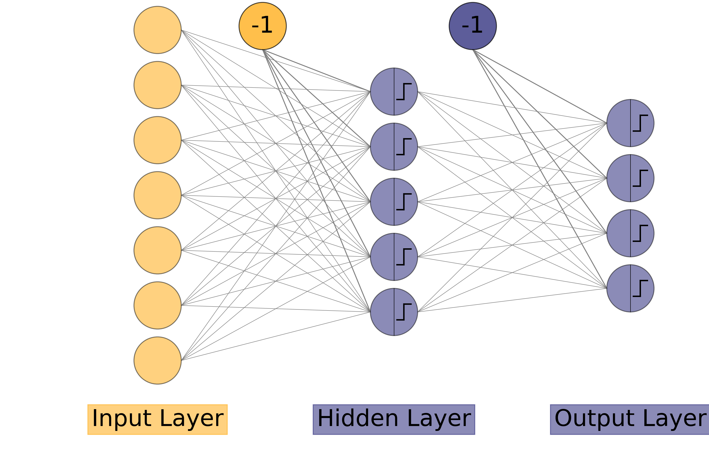

[← Multi-Layer Perceptron](index.md)

# The Multi Layer Perceptron

# 1. Introduction

As we have seen, in the Basic [[perceptron]], that a perceptron can only classify the *Linearly Separable* Data. We had two different approaches to get around this problem:

1. **The Higher Dimensions**, which was discussed briefly and will be discussed in detail later.
2. **The Multiple Layers**, which we will discuss now.

So the concept here is to add an intermediate layer of neurons between the input nodes and the output layer of neurons(as you might have noticed, we are starting to use the term *layer* quite a lot. You can make a drinking game out of it!). This additional layer will have input from the input nodes, and will have it's own weights(and biases!). Then the outputs generated by this layer will be input for the next layer and so on till the final output layer. So this network can learn more complex functions than just linear ones.

Now the question is how we train this network?

# 2. Training the MLP

## 2.1 Introduction

It is the same as with the simple perceptron. We predict the outputs on a given data. We change the weights for wrong answers, until all the outputs are correct(or until epochs run out!).

The prediction phase is quite simple. We compute the outputs of intermediate layer and use that as input for the final output layer.

But the updation of weights is what makes it a bit tricky. If an error has occured, we don't know which weights to change. The error might be in the weights of the first layer or in the final output layer. Since the updation of weights is more complex(or lengthy!) we divide the training into two parts:
1. Forward Process, where we compute the outputs for the data to spot errors. It is also used in the Prediction Phase.
2. Backward Process, or updation of weights. We will know why it is called _"Backward"_.

## 2.2 Forward Process

This process is pretty straight forward, the intermediate layer has its own weights which connect the input nodes to its neurons. The intermediate layer can have any number of neurons. We will just calculate if each neuron will fire or not in that layer. That vector will be the output of that layer and the input for next layer which will finally generate the final outputs.

It is note here that it is not necessary to have just have one intermediate layer but as many layers as we want and they will work the same as passing on their outputs as inputs for next layer until the final output is generated.

The intermediate layers are called **hidden layers**. As we had seen in the simple Perceptron that an additional input bias node was required. So while using the outputs of a hidden layer as inputs for a next layer we again add a bias node of constant value(-1,say) to the layer but while computing the outputs of any hidden layer from it's previous layer, we ignore the bias unit, as it is always constant.




Figure 1

As you can see in the above network, a bias node is from input layer to hidden layer and another bias node from the hidden layer to output layer. There is no weight from the previous layer to the bias node of any layer as it is not computed but is constant.

Let's say we have $L$ number of layers(not including the input layer but output layer is included). So $L-1$ layers are hidden layers. The input layer will have nodes as many as there are features in the data and the output layer will have as many neurons as the number of classes(or 1 if there are two classes or if we are using the network for regression). The rest of the network i.e all the hidden layers can have as many neurons as we want.

Let:
- $n_i$: the number of neurons in $i^{th}$ layer.
- $a^{(i)}_j$: the output generated by $j^{th}$ neuron in $i^{th}$ layer.
- $w^{(i)}_{jk}$: weight connecting the $j^{th}$ neuron of $(i-1)^{th}$ layer to $k^{th}$ neuron of $i^{th}$ layer.
- $g_{(i)}$ is the activation functionof $i^{th}$ layer.

*Note: We can also use the term $0^{th}$ layer for the input layer. So $n_0$ is the number of input features. $a^0_j=x_j$ is the $j^{th}$ input node. $a^0_0=x_0$ is the bias node of input layer.*

We compute the activation of $j^{th}$ neuron in $i^{th}$ layer as:

$$a^{(i)}_j = g_{(i)}\bigg(\sum_{k=0}^{n_{i-1}} a^{(i-1)}_kw^{(i)}_{kj}\bigg)  \qquad \forall \ j \in [1,n_i] \tag{1}$$

where $g_{(i)}$ is the activation of $i^{th}$ layer.


Note: We did not compute for $j=0$ i.e we did not compute $a^{(i)}_0$ as that will be the bias node and has constant value.

To make things a bit more simpler, we introduce another term, $h^{(i)}_j$, where:


$$ h^{(i)}_j = \sum_{k=0}^{n_{i-1}} a^{(i-1)}_kw^{(i)}_{kj} \tag{2} $$

So Equation 1 can be changed to:


$$ a^{(i)}_j = g_{(i)}\big(h^{(i)}_j\big) \tag{3} $$

To get the final outputs,
Repeat Equation 1 $\forall i \in [1,L]$ sequentially.

We will see it in action later in implementation.

## 2.3 Backward Process (Updation of weights)

### 2.3.1 Introduction

Now that we have generated outputs, it is time to check them against the ground truth targets and make changes in weights to correct the errors made. But the problem is we don't know which weights made the error, especially in which layer was the error.

Now even if we follow the basic rule of updating weights as in simple perceptron, we will compute error in each output neuron and update the weights using the learning rate and the inputs. But how to update weights of the layer before? We don't know the ground truth values for hidden layers. How do we compute error in these layers?

### 2.3.2 The Backpropagation Algorithm

#### 2.3.2.1 Introduction

The Backpropagation Algorithm is the core of Multi Layer Neural Networks. It works on the principle of *gradient descent* and minimizing error.

If you recall from the basic perceptron, we updated weights as:

$$ w_{ij} \leftarrow w_{ij} - \eta (y_j-t_j)x_i $$

Here we are doing the same but for each layer, but instead of using $(y_j-t_j)$ we will let the calculus decide the error in that hidden layer, as we don't know the ground truth targets for hidden layers(and that's why they are called so!) and $x_i$ was the input node for that weight, where as in layer $l$, the input comes from the layer before ($a^{(l-1)}_j$).

So we can write for each layer,$l$, we will update weights as:

$$ w^{(l)}_{jk} \leftarrow w^{(l)}_{jk} - \eta \delta^{(l)}_k a^{(l-1)}_j \tag{4} $$

where $\delta^{(l)}_k$ is the error in $k^{th}$ neuron of $l^{th}$ layer.

Please make sure it is the error in a neuron and not the total error in the network, which we will define now.

#### 2.3.2.2 The Network Error

Now to get around the problem of updating weights in hidden layers, we decide to formalize the error in the network and try to minimize it.

As in Simple Perceptron, we had used the simple difference as our error function for each output neuron which was fine but now we would like to minimize the error of the network. There are multiple ways of doing it. We will see an example for that. But, for now let's say the total error in the network is $E$.

The error of the network has to be a function of final outputs and ground truth targets, that is how we will compute error.

Actually we will have a *loss function* for each output neuron, which will be summed. Let the loss in $i^{th}$ neuron be a function $\mathcal{L}(y_i,t_i)$.

The total Error for an example will be the sum of loss functions in each final neuron. 

So,

$$ E = \sum_{i=1}^{n_{L}} \mathcal{L}(y_i,t_i) \tag{5} $$

where $y_i = a^{(L)}_i$ is the output of $i^{th}$ output neuron in the final layer and $t_i$ is the corresponding true value.

You can even go ahead and sum this error for every training example and call that the error of the network and try to minimize that but we will define this as our network error.


#### 2.3.2.3 Computing Gradients

Now to minimize this error, we will use calculus, specifically differential calculus. We can compute the gradient of the error along each weight dimension in the network and try to minimize by changing weights along the minimizing gradient.

So the gradient of the Error($E$) w.r.t a weight $w^{(l)}_{jk}$ in layer $l$ is:

$$ \frac{∂E}{∂w^{(l)}_{jk}} $$

The negative of this gradient is the direction along which the Error is minimum along this weight dimension. Now we know what direction to change the weights in and for the *amount* we need to change we will use the learning rate.

So weight update can also be defined for any weight from neuron $p$ of layer $(l-1)$ to neuron $q$ of layer $l$:


$$ w^{(l)}_{pq} \leftarrow w^{(l)}_{pq} - \eta \frac{∂E}{∂w^{(l)}_{pq}} \tag{6} $$


Comparing Equation 4 and 6,

$$ \frac{∂E}{∂w^{(l)}_{pq}} = \delta^{(l)}_q a^{(l-1)}_p \tag{7} $$

Now to compute the gradient of weights, we will use the chain rule:


$$ \frac{∂E}{∂w^{(l)}_{pq}} = \frac{∂E}{∂h^{(l)}_{q}}\frac{∂h^{(l)}_{q}}{∂w^{(l)}_{pq}} \tag{8} $$


Recalling [Equation 2](#Eq2):

$$ \begin{align} h^{(l)}_q &= \sum_{k=0}^{n_{l-1}} a^{(l-1)}_kw^{(i)}_{kq}\\ \implies \frac{∂h^{(l)}_{q}} {∂w^{(l)}_{pq}}&= a^{(l-1)}_p \end{align} \tag{9} $$

The above equation holds by the fact that it is a partial derivative and all other weights and outputs are constant and their differentiation is zero except the weight we are differentiating with.

Using Equation 9 in 8:

$$ \frac{∂E}{∂w^{(l)}_{pq}} =  \frac{∂E}{∂h^{(l)}_{q}} a^{(l-1)}_p \tag{10} $$

Comparing Equation 10 and 7:


$$ \delta^{(l)}_q =\frac{∂E}{∂h^{(l)}_{q}} \tag{11} $$


The above equation is one of the most important equations in Backpropagation algorithm. It defines the error in $q^{th}$ neuron of $l^{th}$ layer. 

#### 2.3.2.4 Computing Gradients (Final Layer)

Let's try to compute the weight updates for weights in final output layer.

Using [Equation 4](#Eq4) for the final layer:

$$
w^{(L)}_{pq} \leftarrow w^{(L)}_{pq} - \eta \delta^{(L)}_qa^{(L-1)}_p
\tag{12}$$

Now let's compute $\delta^{(L)}_q$(i.e error in $q^{th}$ neuron of final layer):

From Equation 11:

$$
\delta^{(L)}_q=\frac{∂E}{∂h^{(L)}_{q}} \tag{13}
$$


As we know the error is the sum of loss functions on each output neuron:


$$ E = \sum_{i=1}^{n_{L}} \mathcal{L}(y_i,t_i) \tag{14} $$

where $y_i = a^{(L)}_i$, the output of $i^{th}$ neuron in the final layer.

Using [Equation 3](#Eq3):


$$ E = \sum_{i=1}^{n_{L}} \mathcal{L}\big(g_{(L)}(h^{(L)}_i),t_i\big) \tag{15} $$
where $g_{(L)}$ is the activation of final layer.

Coming back to Equation 13:

$$ \begin{align} \delta^{(L)}_q&= \frac{∂}{∂h^{(L)}_{q}} \bigg( \sum_{i=1}^{n_{L}}\mathcal{L}\big(g_{(L)} (h^{(L)}_i),t_i\big) \bigg)\\ &= \sum_{i=1}^{n_{L}} \frac{∂}{∂h^{(L)}_{q}} \bigg( \mathcal{L}\big(g_{(L)} (h^{(L)}_i),t_i\big) \bigg) \tag{16} \end{align} $$


Since it is a partial derivative, all other functions except for those of $h^{(L)}_q$ are considered constant and hence differentiation is zero. i.e:

$$ \frac{∂}{∂h^{(L)}_{q}} \bigg( \mathcal{L}\big(g_{(L)}(h^{(L)}_i),t_i\big) \bigg) = \begin{cases} g_{(L)}'(h^{(L)}_i)\ \mathcal{L}' \big(g_{(L)}(h^{(L)}_i),t_i\big) & \text{if } i = q \\ 0 & \text{if } i \neq q \end{cases} \tag{17} $$


$$ \begin{align} \implies \delta^{(L)}_q&=g_{(L)}'\big(h^{(L)}_q\big)\ \mathcal{L}'\big(g_{(L)}(h^{(L)}_q),t_q\big) \\ &=g_{(L)}'\big(h^{(L)}_q\big)\ \mathcal{L}'\big(y_q,t_q\big) \tag{18} \end{align} $$


Equation 18 above calculates the error in neuron number $q$ in layer $L$(the final layer).

Using the above equation in Equation 13,

$$ w^{(L)}_{pq} \leftarrow w^{(L)}_{pq} -  \eta \Big[g_{(L)}'\big(h^{(L)}_q\big)\ \mathcal{L}'\big(y_q,t_q \big)\Big] a^{(L-1)}_p \tag{19}$$

This looks very confusing at first, but have a look at the indices and you'll get the hang of it. Besides we will have an example for a specific loss function later.

Also you might have noticed that we perform differentiation of the activation function, so our current activation function (the threshold function) is no good here as that is non-differentiable at 0. We will use some new activation functions later.

#### 2.3.2.5 Computing Gradients (Final Hidden Layer)

Now, that we have computed error in the final layer and updated weights, let's try updating weights in the final hidden layer (i.e 2nd last layer, $L-1$). We will proceed the same as we did with the final output layer before.

Again Using [Equation 4](#Eq4) for the final hidden layer:

$$ w^{(L-1)}_{pq} \leftarrow w^{(L-1)}_{pq} - \eta \delta^{(L-1)}_qa^{(L-2)}_p \tag{20}$$


Now let's compute $\delta^{(L-1)}_q$(i.e error in $q^{th}$ neuron of final hidden layer):

From [Equation 11](#Eq11):

$$ \delta^{(L-1)}_q=\frac{∂E}{∂h^{(L-1)}_{q}} \tag{21} $$

Now this is where the chain rule comes to propagate the error,

$$
\begin{align}
\delta^{(L-1)}_q&=\frac{∂E}{∂h^{(L-1)}_{q}}\\
&=\frac{∂E}{∂h^{(L)}_{i}}\frac{∂(h^{(L)}_{i})}{∂h^{(L-1)}_{q}}\\
&\ \forall\  i \in [1,n_L]
\tag{22}
\end{align}
$$

$$
\delta^{(L-1)}_q=\sum_{i=1}^{n_L}\frac{∂E}{∂h^{(L)}_{i}}\frac{∂(h^{(L)}_{i})}{∂h^{(L-1)}_{q}}
\tag{23}
$$

Using [Equation 13](#Eq13),

$$ \delta^{(L-1)}_q=\sum_{i=1}^{n_L}\delta^{(L)}_i\frac{∂(h^{(L)}_{i})}{∂h^{(L-1)}_{q}} \tag{24} $$


Now let's compute $\frac{∂(h^{(L)}_{i})}{∂h^{(L-1)}_{q}}$, using [Equation 2](#Eq2):

$$ \frac{∂(h^{(L)}_{i})}{∂h^{(L-1)}_{q}} = \frac{∂}{∂h^{(L-1)}_{q}} \Big( \sum_{k=0}^{n_{L-1}} a^{(L- 1)}_kw^{(L)}_{ki} \Big) \tag{25} $$


Using [Equation 3](#Eq3),

$$ \begin{align} \frac{∂(h^{(L)}_{i})}{∂h^{(L-1)}_{q}} &= \frac{∂}{∂h^{(L-1)}_{q}} \Big(\sum_{k=0}^{n_{L-1}} g_{(L- 1)}\big(h^{(L-1)}_k\big)w^{(L)}_{ki} \Big)\\ &=  \sum_{k=0}^{n_{L-1}} w^{(L)}_{ki} \frac{∂}{∂h^{(L-1)}_{q}} \Big(  g_{(L-1)}\big(h^{(L-1)}_k\big) \Big) \tag{26} \end{align} $$


Again it is a partial derivative, so just the functions of $h^{(L-1)}_q$ are considered as variables, all others are constant and differentiate to Zero.

$$ \frac{∂}{∂h^{(L-1)}_{q}} \Big( g_{(L-1)}\big(h^{(L-1)}_k\big) \Big) = \begin{cases} g_{(L-1)}'\big(h^{(L- 1)}_k\big) & \text{if } k = q \\ 0 & \text{if } k \neq 0 \end{cases} \tag{27} $$

$$\implies \frac{∂(h^{(L)}_{i})}{∂h^{(L-1)}_{q}} =  w^{(L)}_{qi} \  g_{(L-1)}'\big(h^{(L-1)}_q\big)\tag{28} $$

Since the Equations 25 - 28 could have worked for any layer $l$ and not just layer $L-1$, we can also generalize the above result, for any layer $l$, as:


$$ \frac{∂(h^{(l)}_{i})}{∂h^{(l-1)}_{q}} = w^{(l)}_{qi} \  g_{(l-1)}'\big(h^{(l-1)}_q\big)  \tag{29} $$


The above equation is also important as we will see, in a moment.

Using equation 29 in [Equation 24](#Eq24), we get:

$$\begin{align} \delta^{(L-1)}_q&=\sum_{i=1}^{n_L}\delta^{(L)}_iw^{(L)}_{qi} g_{(L-1)}'\big(h^{(L-1)}_q\big)\\ &= g_{(L-1)}'\big(h^{(L-1)}_q\big) \sum_{i=1}^{n_L}\delta^{(L)}_iw^{(L)}_{qi} \tag{30} \end{align} $$

Now, coming back to [Equation 20](#Eq20):

$$ w^{(L-1)}_{pq} \leftarrow w^{(L-1)}_{pq} - \eta \delta^{(L-1)}_qa^{(L-2)}_p \tag{20} $$

We can now update the weights of the final hidden layer as the error from the final layer has propagated to the final hidden layer.

#### 2.3.2.6 Summarizing the important points.

Let's list all the important results that we derived uptill this point to avoid confusion.

1. We update the weights of any layer $l$ as [Equation 4](#Eq4):

$$ w^{(l)}_{jk} \leftarrow w^{(l)}_{jk} - \eta \delta^{(l)}_k a^{(l-1)}_j \tag{4} $$

where:

- $\eta$ is the learning rate.
- $a^{(l-1)}_j$ is the output generated by $j^{th}$ neuron in the previous layer
- $\delta^{(l)}_k$ is the error generated in the $k^{th}$ neuron of $l^{th}$ layer explained below.

1. The output of $j^{th}$ neuron in the $i^{th}$ layer is given by [Equation 3](#Eq3):

$$ a^{(i)}_j = g_{(i)}\big(h^{(i)}_j\big) \tag{3} $$

where:
    * $g_{(i)}$ is the activation function of layer $i$.
    * $h^{(i)}_j$ is the summation output of the $j^{th}$ neuron of $i^{th}$ layer explained below.
    

3. The summation output has been assigned a new term as it makes calculations easier and leads to definition of the error in a neuron. The summation output in $j^{th}$ neuron of $i^{th}$ layer is as [Equation 2](#Eq2):

$$ h^{(i)}_j = \sum_{k=0}^{n_{i-1}} a^{(i-1)}_kw^{(i)}_{kj} \tag{2} $$

where:
* $a^{(i-1)}_k$ is the output from the $k^{th}$ neuron of the previous layer $(i-1)^{th}$ layer.
*  $w^{(i)}_{kj}$ is the weight joining the $k^{th}$ neuron of previous ($(i-1)^{th}$) layer to the $j^{th}$ neuron of current ($i^{th}$) layer.

1. The error in $q^{th}$ neuron in $l^{th}$ layer is defined by [Equation 11](#Eq11):

$$ \delta^{(l)}_q =\frac{∂E}{∂h^{(l)}_{q}} \tag{11} $$

where:
* $E$ is the total error of the network.
* $h^{(l)}_q$ is the summation output of $q^{th}$ neuron in $l^{th}$ layer.
 

5. The derivative of summation output of $i^{th}$ neuron in the next ($l^{th}$) layer w.r.t $q^{th}$ neuron in current ($(l-1)^{th}$) layer given in [Equation 29](#Eq29):

$$
\frac{∂(h^{(l)}_{i})}{∂h^{(l-1)}_{q}} = 
w^{(l)}_{qi}
\cdot
g_{(l-1)}'\big(h^{(l-1)}_q\big)
\tag{29}
$$

where:
* $g_{(l-1)}'\big(h^{(l-1)}_q\big)$ is the derivative of the activation function of layer $(l-1)$ at $h^{(l-1)}_q$, the summation output.

#### 2.3.2.7 Computing Gradients (Any hidden Layer)

Now, let's try to develop a generalized equation for the error in layer $l$.

We update the weights of any layer $l$ as [Equation 4](#Eq4):

$$ w^{(l)}_{jk} \leftarrow w^{(l)}_{jk} - \eta \delta^{(l)}_k a^{(l-1)}_j \tag{4} $$

where:
- $\eta$ is the learning rate.
-  $a^{(l-1)}_j$ is the output generated by $j^{th}$ neuron in the previous layer
-  $\delta^{(l)}_k$ is the error generated in the $k^{th}$ neuron of $l^{th}$ layer explained below.  

Now we just need to compute the error $\delta^{(l)}_k$:

By [Equation 11](#Eq11):

$$ \delta^{(l)}_k =\frac{∂E}{∂h^{(l)}_{k}} \tag{31} $$

where:

* $E$ is the total error of the network.
* $h^{(l)}_q$ is the summation output of $q^{th}$ neuron in $l^{th}$ layer.

$$ \delta^{(l)}_k =\frac{∂E}{∂h^{(l+1)}_{i}}\cdot\frac{∂h^{(l+1)}_{i}}{∂h^{(l)}_{k}} \qquad \forall \ i \ \in  [1,n_{l+1}] \tag{32} $$

doing it for all $i$:

$$\implies \delta^{(l)}_k = \sum_{i=1}^{n_{l+1}}\Bigg[\frac{∂E}{∂h^{(l+1)}_{i}}\cdot\frac{∂h^{(l+1)}_{i}} {∂h^{(l)}_{k}}\Bigg] \tag{33} $$

Using Equation 11,

$$\implies \delta^{(l)}_k = \sum_{i=1}^{n_{l+1}}\Bigg[ \delta^{(l+1)}_i \cdot \frac{∂h^{(l+1)}_{k}}{∂h^{(l)}_{k}} \Bigg] \tag{34} $$

Now according to [Equation 29](#Eq29):

$$ \frac{∂(h^{(l)}_{i})}{∂h^{(l-1)}_{q}} = w^{(l)}_{qi} \cdot g_{(l-1)}'\big(h^{(l-1)}_q\big) \tag{35} $$

Using above equation in Equation 34:

$$ \begin{align}\implies \delta^{(l)}_k &= \sum_{i=1}^{n_{l+1}}\Big[ \delta^{(l+1)}_i \cdot w^{(l+1)}_{ki} \cdot g_{(l)}'\big(h^{(l)}_k\big)\Big]\\ &= g_{(l)}'\big(h^{(l)}_k\big) \sum_{i=1}^{n_{l+1}}\Big[ \delta^{(l+1)}_i w^{(l+1)}_{ki} \Big] \tag{36} \end{align} $$

Equation 36 above is the general way of how we *backpropagate* the error layer to layer. This is at the core of **Backpropagation Algorithm** which works at the heart of neural networks, not just MLP. 

**Note: It is advised to compute the error in each neuron of previous layer first and then update the weights of current layer as they are used to calculate the error of previous layer.** 

#### 2.3.2.8 The Activations

As you can see in the Equation 36, that the activations we use should be differentiable at all points and the threshold activation was not differentiable at 0 and had derivative of 0 at all other points, making the error in every neuron to be zero, which isn't what we want. So we introduce a couple more activation functions. We will visualize each function and how they vary.


```python
from plotly import graph_objects as go
import numpy as np

def plot_activation(func):
    x = np.linspace(-100,100,400)
    #compute the activation
    y = func(x)
    fig = go.Figure(data=[go.Scatter(x=x,y=y,mode="lines")],
                    layout=dict(height=500,width=500,title=f"{func.__name__} activation".title()))
    fig.show()
    
```

Our original threshold function was:

$$ g(x) = \begin{cases} 1 & \text{if } x>0\\ 0 & \text{if } x \leq 0 \end{cases} \tag{37} $$

It can be coded as:


```python
def threshold(x):
    return (x>0)*1
```


```python
# plot the threshold 
plot_activation(threshold)
```


**1. The Sigmoidal Activation:**
It is an S shaped activation. This activation is given by:

$$ a = g(x) = \frac{1}{1+\exp(-\beta x)} \tag{38} $$ 

where $\beta$ is a positive parameter, preferably 1.

It's derivative is:

$$ g'(x) = g(x)\beta(1-g(x)) = \beta a(1-a) \tag{39} $$


```python
def sigmoid(x,beta=1):
    return 1/(1+np.exp(-beta*x))
```


```python
plot_activation(sigmoid)
```




Let's compare the threshold and sigmoid together


```python
from plotly.subplots import make_subplots
fig = make_subplots(rows=1,cols=2, shared_yaxes=True, subplot_titles=["Threshold Activation", "Sigmoid Activation"])
x = np.linspace(-10,10,400)
y1 = threshold(x)
fig.add_trace(go.Scatter(x=x,y=y1),row=1,col=1)
y2 = sigmoid(x)
fig.add_trace(go.Scatter(x=x,y=y2),row=1,col=2)
fig.update_layout(showlegend=False)
fig.show()
```




As we can see both the functions are almost the same, just that the sigmoid is more smooth at edges, making it differentiable. It can be used as a replacement for threshold. Although it will output values other than 0 and 1 for values close to zero.

**2. The tanh activation:**
It is the similar to sigmoid but it outputs range between -1 and 1, instead of 0 and 1. It is not used much in the MLP. It is given by:

$$ a = g(x) = tanh(x) = \frac{\exp(x) - \exp(-x)}{\exp(x) + \exp(-x)} \tag{40} $$

It's derivative is rather simple:

$$ g'(x) = 1-a^2 \tag{41} $$

It is already defined in numpy as `np.tanh` function.


```python
plot_activation(np.tanh)
```




Let's compare all the functions in one go.


```python
x = np.linspace(-10,10,100)
fig=go.Figure(data=[
                    go.Scatter(x=x,y=threshold(x),name="Threshold"),
                    go.Scatter(x=x,y=sigmoid(x),name="Sigmoid"),
                    go.Scatter(x=x,y=np.tanh(x),name="Tanh"),
                   ],
             layout=dict(width=600,height=600))
fig.show()
```





**3. The Softmax Activation**:
This activation is given by:

$$ a_i = g(x_i) = \frac{\exp(x_i)}{\sum_{k=1}^{n_l}\exp(x_k)} \tag{42} $$

As all the outputs in output nodes are independent of each other. The sigmoid layer may make more than one output neuron to fire. But sometimes we just want to classify a datapoint in just one class. That is where softmax is good. It sums up all the outputs to 1 and the maximum one is set to 1 and others to 0.

Before computing its derivative, we have two cases
1. Derivative w.r.t the summation of the node, i.e:

$$\frac{\partial (g(x_i))}{\partial x_i} $$

2. Derivative w.r.t the summation of some other node, i.e:

$$\frac{\partial (g(x_i))}{\partial x_j} $$

$$ \frac{\partial (g(x_i))}{\partial x_i} = a_i(1-a_i) \tag{43} $$

and 

$$\frac{\partial (g(x_i))}{\partial x_j} = - a_ia_j \tag{44} $$

**3. The Linear Activation**
This activation is given by:

$$g(x) = x \tag{45}$$

This activation is used for regression purposes.

### 2.3.3 The Equations in MLP 

We saw the equations in the light of general cases. Let's now see them in an example to clear out the doubts if any. The activations will depend on the type of problem we are solving. For Regression problems **we won't use any activation in the final layer** as we need real values, **but we will use sigmoid activation in hidden layers at all times** for the concept of firing and non firing of neurons. For Classification we will use sigmoid for final layer as well. We can also use softmax for the final layer, if we just need to predict one class. Let's say we are currently using sigmoid in all cases.


We haven't defined any Loss function for the final output neurons to compute [the network error](#2.3.2.2-The-Network-Error).
We can use the simple difference between the outputs and ground truth as the Loss function, but for the network error we sum all the losses(errors) in the final output neurons,

From [Equation 5](#Eq5),

$$ E = \sum_{i=1}^{n_{L}} \mathcal{L}(y_i,t_i) \tag{5} $$

So if we use just the difference, it will be positive for some neurons and negative for some which may sum to zero or a very small number, meaning small network error which isn't the case. So we need to change the sign of all errors to the same before summing up. We can use absolute values but that has differentiation problems. Instead we can use the squares of difference as our loss function.

So for neuron $i$ in the final output layer, the loss is

$$
\mathcal{L}(y_i,t_i) = \frac{1}{2}(y_i-t_i)^2
\tag{46}
$$

We have added the half at the front to make further calculations easier.

It's derivative is:

$$ \mathcal{L}'\big(y_i,t_i\big) = y_i-t_i \tag{47} $$

Now using  above equations, equation 5 becomes:

$$ E = \frac{1}{2}\sum_{i=1}^{n_{L}} (y_i-t_i)^2 \tag{48} $$

Now let's compute the error in final layer.

Recalling [Equations 18](#Eq18), 

$$\implies  \delta^{(L)}_q=g_{(L)}'(h^{(L)}_q)\ \mathcal{L}'\big(y_q,t_q\big)  \tag{18}$$

Since our activation is sigmoid and it's derivative is given in [Equation 39](#39).

$$\implies  \delta^{(L)}_q=\beta a^{(L)}_q(1-a^{(L)}_q)(y_q-t_q) \tag{49}$$

Since, $a^{(L)}_i = y_i$

$$\implies  \delta^{(L)}_q=\beta^{(L)} (y_q-t_q)y_q(1-y_q) \tag{50}$$

That is how we compute the error in the final layer.

Now let's compute in any hidden layer.

We know from [Equation 36](#Eq36),

$$\implies \delta^{(l)}_k = g_{(l)}'\big(h^{(l)}_k\big) \sum_{i=1}^{n_{l+1}}\Big[ \delta^{(l+1)}_i w^{(l+1)}_{ki} \Big] \tag{36} $$

Now since we are using sigmoid activation,


$$\implies \delta^{(l)}_k = \beta^{(l)} a^{(l)}_k(1-a^{(l)}_k) \sum_{i=1}^{n_{l+1}}\Big[ \delta^{(l+1)}_i w^{(l+1)}_{ki} \Big] \tag{51} $$

The equations will change with change in loss function as well as the activation function of each layer.

Side Note: Another great Loss function for Classification is:

$$
\mathcal{L}(y_i,t_i) = -t_i\log(y_i)
\tag{52}
$$

## 2.4 The Multi-Layer Perceptron Algorithm

### 2.4.1 The Algorithm

With the knowledge of Backpropagation Algorithm, we can now update weights. 

**We will consider the sum of squares of as our network error and sigmoid as the activation in every layer.**

1. **Initialization:**

    Initialize the weights for every neuron of every layer to small(positive and negative) random values.
 
2. **Training:**

    - ============repeat===========:
      * for each input vector:
        - **forward phase:**
            * for each layer $l$ in the network:
            
                * compute the activation of each neuron $j$ using:
                
                $$
                \begin{align}
                &h^{(l)}_j = \sum_{k=0}^{n_{l-1}}a^{(l-1)}_k
                w^{(l)}_{kj}\\
                &a^{(l)}_j = g_{(l)}\big(h^{(l)}_j\big) = \frac{1}{1+\exp\big(-\beta h^{(l)}_j\big)}
                \end{align}
                $$
                
                where $a^{0}_i = x_i$, i.e the input node
                
                and $a^{(l)}_0 = -1$, the bias node for every layer.
                
        - **backward phase:**
          1. compute the error at the output node $j$ using:
              $$
              \delta^{(L)}_j = \beta^{(L)}(y_j-t_j)y_j(1-y_j)
              $$
          2. for each layer $l$ in the network starting from the final hidden layer:
              1. compute the error in the layer $l$ using

                $$\delta^{(l)}_k =
                \beta^{(l)} a^{(l)}_k(1-a^{(l)}_k)
                \sum_{i=1}^{n_{l+1}}\Big(
                \delta^{(l+1)}_i
                w^{(l+1)}_{ki}
                \Big)
                $$
                
              2. update the every weight in the layer $(l+1)$ using:

				$$w^{(l+1)}_{pq} \leftarrow w^{(l+1)}_{pq} - \eta \delta^{(l+1)}_q a^{(l)}_p\\
                 \forall \ p \in [0,n_l] \text{  and  } q \in [1,n_{l+1}] 
                $$

  
          3. finally update every weight of first hidden layer using:
             
		    $$w^{(1)}_{pq} \leftarrow w^{(1)}_{pq} - \eta \delta^{(1)}_q a^{(0)}_p\\
                  \forall \ p \in [0,n_0] \text{  and  } q \in [1,n_{1}] 
		     $$
            
			 where $a^{(0)}_i = x_i$, the input node.
             
    * ====until learning stops or epochs run out============

**Note: In batch implementation, we should randomise the input so that we don't train on the same sequences for every iteration.**
3. **Recall**
    - Use the forward phase in training section above.              
### 2.4.2 Initialization of weights

The weights should be initialized to be small random numbers. It is because the sigmoid activation flattens at the large(positive and negative) values and the slope becomes closer zero and so it takes longer to train the network. The sigmoid starts flattening at input of 1, so that will be the max input and similarly -1 will be the minimum input.

So for a neuron,

$$ \begin{align} &-1 \leq h^{(l)}_i \leq 1\\ \implies &-1 \leq \sum_{k=0}^{n_{l-1}}a^{(l-1)}_kw^{(l)}_{ki}\leq 1\\ \end{align} \tag{53} $$

Now since we have to figure out all the weights, we will keep all the weights to be same and equal to $w^{(l)}$.

$$ \implies -1 \leq w^{(l)}\sum_{k=0}^{n_{l-1}}a^{(l-1)}_k\leq 1\\ \tag{54} $$

Note: $w^{(l)}$ is the general representation of every weight of layer $l$ and not the weight matrix of layer $l$.

We assume that all the inputs come from a stadard normal distribution *zero mean and unit variance*, i.e:

$$ \sigma^2 = \frac{1}{n_{l-1}}\sum_{i=0}^{n_{l-1}}\big(a^{(l-1)}_i - \mu^{(l-1)}\big)^2 \tag{55} $$

where $\mu^{(l)}$ and $\sigma^2$ is the mean and variance of all output values in layer $l$.

Since mean is ZERO and variance is unity,

$$ \begin{align} &\frac{1}{n_{l-1}}\sum_{i=0}^{n_{l-1}}\big(a^{(l)}_i\big)^2 = 1\\ \implies &\sum_{i=0}^{n_{l- }}\big(a^{(l)}_i\big)^2 = n_{l-1} \tag{56}   \end{align} $$

Using the above equation in Equation 54, we get:

$$\begin{align} & \implies -1 \leq w^{(l)}\sqrt{n_{l-1}}\leq 1\\ &\implies \frac{-1}{\sqrt{n_{l-1}}} \leq w^{(l)}  \leq \frac{1}{\sqrt{n_{l-1}}} \tag{57} \end{align} $$

So we know how to initialize weights. However still weights from different initialization can have different effects on the outputs. You should try to train the network on different random seeds and figure out the best one.

Also note that the above equation came from an assumption as well as approximation.

**Also, as we know that it is better to have small inputs to a sigmoid to give better results, so $\beta$ should also be small($\beta \leq 3.0$).**

## 2.5 Speeding up the code

### 2.5.1 Speeding Up the  forward process

We can compute the activations of multiple examples at once using matrix operations. 

Let's say we have $k$ number of training examples and each example has $m$ features with $n$ types of outputs.

Now we can store our inputs in a matrix where each row represents a training example and a column represents a feature.

So our training example is like:

$$X= \begin{bmatrix} x_{11} & x_{12} & x_{13} & \cdots & x_{1m} \\ x_{21} & x_{22} & x_{23} & \cdots & x_{2m} \\ x_{31} & x_{32} & x_{33} & \cdots & x_{3m} \\ \vdots & \vdots & \vdots & & \vdots \\ x_{k1} & x_{k2} & x_{k3} & \cdots & x_{km} \\ \end{bmatrix} \tag{58} $$
The matrix shape is $k \times m$.

We will use `numpy` library to store inputs. 


```python
import numpy as np
```

Let's say we want to train the Logical-XOR function. So our input should look like:

So our input should look like:

$$X= \begin{bmatrix} 0 & 0 \\ 0 & 1 \\ 1 & 0 \\ 1 & 1 \\ \end{bmatrix} $$

We can make it make it using `np.array` method:


```python
X = np.array([[0,0],
             [0,1],
             [1,0],
             [1,1]])
X
```

    array([[0, 0],
           [0, 1],
           [1, 0],
           [1, 1]])


Now our input is ready, let's figure out how to store the target values. Each input has target values to denote which neuron to fire and which not to(1s and 0s). This type of output is for classification process.

So with $k$ examples and $n$ output neurons, the target matrix should be $[t_{ij}]$ which is the target for $i^{th}$ example and $j^{th}$ neuron.

So,

$$ T=\begin{bmatrix} t_{11} & t_{12} & t_{13} & \cdots & t_{1n}\\ t_{21} & t_{22} & t_{23} & \cdots & t_{2n}\\ t_{31} & t_{32} & t_{33} & \cdots & t_{3n}\\ \vdots & \vdots & \vdots & & \vdots \\ t_{k1} & t_{k2} & t_{k3} & \cdots & t_{kn}\\ \end{bmatrix}\\ \text{where $t_{ij} \in \{0,1\}$}\tag{59} $$

For binary outputs, like in our example, we can just use one output neuron, which will fire for one output and not fire for other which means $n=1$.

It is same for regression problems just instead of output being 1 or 0, it is real valued.

So, 

$$ T_{bin/reg} = \begin{bmatrix} t_1\\ t_2\\ \vdots \\ t_k \end{bmatrix}\tag{60} $$

and in our example,

$$ T = \begin{bmatrix} 0\\ 1\\ 1\\ 0 \end{bmatrix}\tag{61} $$

We can do it in numpy in the same way:


```python
T = np.array([[0],[1],[1],[0]]);T
```

    array([[0],
           [1],
           [1],
           [0]])


Now since we have multiple layers and each have their own output(of zeroes and ones), we will have an **activation matrix** for each layer, where $[a^{(l)}_{ij}]$ is the ouput for $i^{th}$ example from $j^{th}$ neuron in $l^{th}$ layer.

Now since there will be many matrices, we will save them in a python `list`. It will be a list of numpy arrays.

$$A^{(l)} = \begin{bmatrix} a^{(l)}_{11} & a^{(l)}_{12} & a^{(l)}_{13} & \cdots & a^{(l)}_{1n_l}\\ a^{(l)}_{21} &  a^{(l)}_{22} & a^{(l)}_{23} & \cdots & a^{(l)}_{2n_l}\\ a^{(l)}_{31} & a^{(l)}_{32} & a^{(l)}_{33} & \cdots &  a^{(l)}_{3n_l}\\ \vdots & \vdots & \vdots & & \vdots \\ a^{(l)}_{k1} & a^{(l)}_{k2} & a^{(l)}_{k3} & \cdots & a^{(l)}_{kn_l}\\ \end{bmatrix} \\\tag{62} $$

This matrix will be $k \times n_l$.

Or

$$A^{(l)} = g_{(l)}\Bigg(\begin{bmatrix} h^{(l)}_{11} & h^{(l)}_{12} & h^{(l)}_{13} & \cdots & h^{(l)}_{1n_l}\\ h^{(l)}_{21} & h^{(l)}_{22} & h^{(l)}_{23} & \cdots & h^{(l)}_{2n_l}\\ h^{(l)}_{31} & h^{(l)}_{32} & h^{(l)}_{33} &  \cdots & h^{(l)}_{3n_l}\\ \vdots & \vdots & \vdots & & \vdots \\ h^{(l)}_{k1} & h^{(l)}_{k2} & h^{(l)}_{k3} & \cdots & h^{(l)}_{kn_l}\\ \end{bmatrix}\Bigg)\tag{63} $$

where 

- $g_{(l)}$ is the activation of layer $l$.
- $h^{(l)}_{pq} = \sum_{c=0}^{n_{l-1}}a^{(l-1)}_{pc}w^{(l)}_{cq}$

$$ \implies A^{(l)} = g_{(l)}\big(H^{(l)}\big)\tag{64} $$

$$A^{(l)} = g_{(l)}\Bigg( \begin{bmatrix} \sum_{c=0}^{n_{l-1}}a^{(l-1)}_{1c}w^{(l)}_{c1} &\sum_{c=0}^{n_{l- 1}}a^{(l-1)}_{1c}w^{(l)}_{c2} &\cdots &\sum_{c=0}^{n_{l-1}}a^{(l-1)}_{1c}w^{(l)}_{cn_{l}}\\\\ \sum_{c=0}^{n_{l- 1}}a^{(l-1)}_{2c}w^{(l)}_{c1} &\sum_{c=0}^{n_{l-1}}a^{(l-1)}_{2c}w^{(l)}_{c2} &\cdots &\sum_{c=0}^{n_{l-1}}a^{(l- 1)}_{2c}w^{(l)}_{cn_{l}}\\ \vdots & \vdots & & \vdots \\ \sum_{c=0}^{n_{l-1}}a^{(l-1)}_{kc}w^{(l)}_{c1} &\sum_{c=0}^{n_{l-1}}a^{(l- 1)}_{kc}w^{(l)}_{c2} &\cdots &\sum_{c=0}^{n_{l-1}}a^{(l-1)}_{kc}w^{(l)}_{cn_{l}}\\ \end{bmatrix} \Bigg)\tag{65} $$

The above matrix is a matrix multiplication of two matrices.

$$A^{(l)} = g_{(l)}\Bigg( \begin{bmatrix} a^{(l-1)}_{10} & a^{(l-1)}_{11} & \cdots & a^{(l-1)}_{1n_{l-1}}\\  a^{(l- 1)}_{20} & a^{(l-1)}_{21} & \cdots & a^{(l-1)}_{2n_{l-1}}\\  \vdots & \vdots & & \vdots\\ a^{(l-1)}_{k0} & a^{(l-1)}_{k1} & \cdots &  a^{(l-1)}_{kn_{l-1}} \end{bmatrix}  \times  \begin{bmatrix} w^{(l)}_{01} & w^{(l)}_{02} & \cdots & w^{(l)}_{0n_l}\\ w^{(l)}_{11} & w^{(l)}_{12} & \cdots & w^{(l)}_{1n_l}\\ \vdots & \vdots & & \vdots\\ w^{(l)}_{n_{l-1}1}& w^{(l)}_{n_{l-1}2} & \cdots &  w^{(l)}_{n_{l-1}n_l}\\ \end{bmatrix} \Bigg)\tag{66} $$

The left matrix looks like an **activation matrix** for the previous layer with extra bias column at the front.

We can generate a column of -1 using the `np.ones` method and then concatenate it with our matrix using `np.concatenate` to form this matrix. We can define an activation matrix with bias as of layert $l$ as:

$$ A^{(l)}_{bias}= \begin{bmatrix} a^{(l)}_{10} & a^{(l)}_{11} & \cdots & a^{(l)}_{1n_{l}}\\  a^{(l- 1)}_{20} & a^{(l)}_{21} & \cdots & a^{(l)}_{2n_{l}}\\  \vdots & \vdots & & \vdots\\ a^{(l)}_{k0} & a^{(l- 1)}_{k1} & \cdots & a^{(l)}_{kn_{l}} \end{bmatrix}\tag{67} $$

and the right matrix of Equatio 66 is the **weight matrix** of layer $l$, where $w^{(l)}_{ij}$ is the weight from $i^{th}$ node of layer $(l-1)$ to $j^{th}$ node of layer $l$.

$$ W^{(l)}= \begin{bmatrix} w^{(l)}_{01} & w^{(l)}_{02} & \cdots & w^{(l)}_{0n_l}\\ w^{(l)}_{11} & w^{(l)}_{12} &  \cdots & w^{(l)}_{1n_l}\\ \vdots & \vdots & & \vdots \\ w^{(l)}_{n_{l-1}1}& w^{(l)}_{n_{l-1}2} & \cdots & w^{(l)}_{n_{l-1}n_l}\\ \end{bmatrix}\tag{68} $$

this is a $\big((n_{l-1}+1) \times n_{l}\big)$ matrix


so we can say,

$$A^{(l)} = g_{(l)}\big(A^{(l-1)}_{bias} \times W^{(l)}\big)\tag{69}$$

and $$A^{(l)}_{bias} = \begin{bmatrix}
-1 & A^{(l)}
\end{bmatrix}\tag{70}
$$

where:
- $\times$ is the matrix multiplication
- $\begin{bmatrix} M & N \end{bmatrix}$ is the horizontal concatenation of matrix $M$ and $N$.
- $g_{(l)}$ is the activation of layer $l$.

We will use the `np.matmul` function to perform a matrix multiplication and we will use the **numpy broadcasting** to compute activations.

### 2.5.2 Speeding Up the backward process

Now that we have completed the forward process, let's remind of the backward equations.

We update weights of any layer $l$ using:

$$ w^{(l)}_{pq} \leftarrow w^{(l)}_{pq} - \eta \delta^{(l)}_qa^{(l-1)}_p\tag{71} $$

For $k$ examples, we can

$$ w^{(l)}_{pq} \leftarrow w^{(l)}_{pq} - \eta \sum_{i=1}^{k}\delta^{(l)}_{iq}a^{(l-1)}_{ip}\tag{72} $$

We can turn it into a matrix operation as:

$$W^{(l)} \leftarrow  W^{(l)} - \eta \Delta W^{(l)} \tag{73} $$

$$ \Delta W^{(l)} =  \begin{bmatrix} \Delta w^{(l)}_{01} & \Delta w^{(l)}_{02} & \cdots & \Delta w^{(l)}_{0n_l}\\ \Delta w^{(l)}_{11} & \Delta w^{(l)}_{12} & \cdots & \Delta w^{(l)}_{1n_l}\\ \vdots & \vdots & & \vdots \\ \Delta w^{(l)}_{n_{l-1}1} &  \Delta w^{(l)}_{n_{l-1}2} & \cdots & \Delta w^{(l)}_{n_{l-1}n_l} \end{bmatrix} \tag{74} $$

where $\Delta w^{(l)}_{pq} = \sum_{i=1}^{k}\delta^{(l)}_{iq}a^{(l-1)}_{ip}$

$$ \implies \Delta W^{(l)} =  \begin{bmatrix} \sum_{i=1}^{k}\delta^{(l)}_{i1}a^{(l-1)}_{i0} & \sum_{i=1}^{k} \delta^{(l)}_{i2}a^{(l-1)}_{i0} & \cdots & \sum_{i=1}^{k}\delta^{(l)}_{in_l}a^{(l-1)}_{i0}\\\\ \sum_{i=1}^{k} \delta^{(l)}_{i1}a^{(l-1)}_{i1} & \sum_{i=1}^{k}\delta^{(l)}_{i2}a^{(l-1)}_{i1} & \cdots & \sum_{i=1}^{k} \delta^{(l)}_{in_l}a^{(l-1)}_{i1}\\ \vdots & \vdots & & \vdots\\ \sum_{i=1}^{k}\delta^{(l)}_{i1}a^{(l- 1)}_{in_{l-1}} & \sum_{i=1}^{k}\delta^{(l)}_{i2}a^{(l-1)}_{in_{l-1}} & \cdots & \sum_{i=1}^{k} \delta^{(l)}_{in_l}a^{(l-1)}_{in_{l-1}} \end{bmatrix} \tag{75} $$

The matrix above looks like a matrix multiplication, let's open it

$$\implies \Delta W^{(l)} = \begin{bmatrix} a^{(l-1)}_{10} & a^{(l-1)}_{20} & \cdots & a^{(l-1)}_{k0}\\ a^{(l- 1)}_{11} & a^{(l-1)}_{21} & \cdots & a^{(l-1)}_{k1}\\ \vdots & \vdots & & \vdots \\ a^{(l-1)}_{1n_{l-1}} & a^{(l- 1)}_{2n_{l-1}} & \cdots & a^{(l-1)}_{kn_{l-1}}\\ \end{bmatrix} \times \begin{bmatrix} \delta^{(l)}_{11} &  \delta^{(l)}_{12} & \cdots & \delta^{(l)}_{1n_l}\\ \delta^{(l)}_{21} & \delta^{(l)}_{22} & \cdots &  \delta^{(l)}_{2n_l}\\ \vdots & \vdots & & \vdots \\ \delta^{(l)}_{k1} & \delta^{(l)}_{k2} & \cdots &  \delta^{(l)}_{kn_l}\\ \end{bmatrix} \tag{76} $$

where $\times$ is the matrix multiplication.

Using Equation 67,

$$\implies \Delta W^{(l)}= (A^{(l-1)}_{bias})^T \times \begin{bmatrix} \delta^{(l)}_{11} & \delta^{(l)}_{12} &  \cdots & \delta^{(l)}_{1n_l}\\ \delta^{(l)}_{21} & \delta^{(l)}_{22} & \cdots & \delta^{(l)}_{2n_l}\\ \vdots &  \vdots & & \vdots \\ \delta^{(l)}_{k1} & \delta^{(l)}_{k2} & \cdots & \delta^{(l)}_{kn_l}\\ \end{bmatrix} \Bigg) \tag{77} $$

$$ \implies W^{(l)} \leftarrow W^{(l)}- \eta \big( (A^{(l-1)}_{bias})^T \times \Delta^{(l)} \big) \tag{78} $$

where,

$$ \Delta^{(l)} =  \begin{bmatrix} \delta^{(l)}_{11} & \delta^{(l)}_{12} & \cdots & \delta^{(l)}_{1n_l} \\ \delta^{(l)}_{21} & \delta^{(l)}_{22} & \cdots & \delta^{(l)}_{2n_l} \\ \vdots & \vdots & & \vdots \\ \delta^{(l)}_{k1} & \delta^{(l)}_{k2} & \cdots & \delta^{(l)}_{kn_l} \\ \end{bmatrix}\tag{79} $$

It is called the **error matrix** of layer $l$
where $\delta^{(l)}_{ij}$ is the error in $j^{th}$ neuron of layer $l$ for $i^{th}$ training example.

The matrix is $\big(k \times n_l\big)$.

For the final output layer,

$$ \Delta^{(L)} =  \begin{bmatrix} \delta^{(L)}_{11} & \delta^{(L)}_{12} & \cdots & \delta^{(L)}_{1n_L} \\ \delta^{(L)}_{21} & \delta^{(L)}_{22} & \cdots & \delta^{(L)}_{2n_L} \\ \vdots & \vdots & 7 \vdots \\  \delta^{(L)}_{k1} & \delta^{(L)}_{k2} & \cdots & \delta^{(L)}_{kn_L} \\ \end{bmatrix}\tag{80} $$

The matrix is $\big(k \times n_L)$.

We know from [Equations 18](#18), 

$$\implies\delta^{(L)}_q=g_{(L)}'(h^{(L)}_q) \ \mathcal{L}'\big(y_q,t_q\big) \tag{18}$$

for a training example, $i$,

$$\implies  \delta^{(L)}_{iq}=g_{(L)}'(h^{(L)}_{iq}) \ \mathcal{L}'\big(y_{iq},t_{iq}\big) \tag{81}$$

and for our chosen loss function, 

$$ \mathcal{L}'\big(y_{iq},t_{iq}\big) = y_{iq} - t_{iq} $$

Let's first compute the $\Delta^{(L)}$,

Using Equation 81,

$$ \Delta^{(L)}= \begin{bmatrix} (y_{11} - t_{11}) g_{(L)}'(h^{(L)}_{11}) & (y_{12} - t_{12})  g_{(L)}'(h^{(L)}_{12}) & \cdots & (y_{1n_L} - t_{1n_L}) g_{(L)}'(h^{(L)}_{1n_L})\\\\ (y_{21} - t_{21})  g_{(L)}'(h^{(L)}_{21}) & (y_{22} - t_{22}) g_{(L)}'(h^{(L)}_{22}) & \cdots & (y_{2n_L} - t_{2n_L})  g_{(L)}'(h^{(L)}_{2n_L})\\ \vdots & \vdots & & \vdots \\ (y_{k1} - t_{k1}) g_{(L)}'(h^{(L)}_{k1}) & (y_{k2} -  t_{k2}) g_{(L)}'(h^{(L)}_{k2}) & \cdots & (y_{kn_L} - t_{kn_L}) g_{(L)}'(h^{(L)}_{kn_L})\\ \end{bmatrix}\tag{82} $$

Opening up,

$$\implies \Delta^{(L)}= \begin{bmatrix} y_{11} - t_{11} & y_{12} - t_{12} & \cdots & y_{1n_L} - t_{1n_L}\\ y_{21} - t_{21} & y_{22} - t_{22} & \cdots & y_{2n_L} - t_{2n_L}\\ \vdots & \vdots & & \vdots \\ y_{k1} - t_{k1} &  y_{k2} - t_{k2} & \cdots & y_{kn_L} - t_{kn_L}\\ \end{bmatrix} * g_{(L)}'\Bigg( \begin{bmatrix} h^{(L)}_{11}  &h^{(L)}_{12} & \cdots & h^{(L)}_{1n_L}\\ h^{(L)}_{21} &h^{(L)}_{22} & \cdots & h^{(L)}_{2n_L}\\ \vdots & \vdots  & & \vdots \\ h^{(L)}_{k1} &h^{(L)}_{k2} & \cdots & h^{(L)}_{kn_L}\\ \end{bmatrix} \Bigg)\tag{83} $$

since $y_i = a^{(L)}_i$,

$$\implies \Delta^{(L)}= \begin{bmatrix} a^{(L)}_{11} - t_{11} & a^{(L)}_{12} - t_{12} & \cdots & a^{(L)}_{1n_L} -  t_{1n_L}\\ a^{(L)}_{21} - t_{21} & a^{(L)}_{22} - t_{22} & \cdots & a^{(L)}_{2n_L} - t_{2n_L}\\ \vdots & \vdots & &  \vdots\\ a^{(L)}_{k1} - t_{k1} & a^{(L)}_{k2} - t_{k2} & \cdots & a^{(L)}_{kn_L} - t_{kn_L}\\ \end{bmatrix} * g_{(L)}' \Bigg( \begin{bmatrix} h^{(L)}_{11} &h^{(L)}_{12} & \cdots & h^{(L)}_{1n_L}\\ h^{(L)}_{21} &h^{(L)}_{22} &  \cdots & h^{(L)}_{2n_L}\\ \vdots & \vdots & & \vdots\\ h^{(L)}_{k1} &h^{(L)}_{k2} & \cdots & h^{(L)}_{kn_L}\\ \end{bmatrix} \Bigg)\tag{84} $$

$$\implies \Delta^{(L)} = (A^{(L)} - T)*g_{(L)}'(H^{(L)})\tag{85} $$

**where $*$ is the elementwise multiplication and not matrix multiplication.**

Now let's compute $\Delta^{(l)}$,

Recalling [Equation 51](#51),

$$ \delta^{(l)}_k = \beta^{(l)} a^{(l)}_k(1-a^{(l)}_k) \sum_{i=1}^{n_{l+1}}\Big[ \delta^{(l+1)}_i w^{(l+1)}_{ki} \Big] \tag{51} $$

for training example $j$,

$$ \delta^{(l)}_{jk} = \beta^{(l)} a^{(l)}_{jk}(1-a^{(l)}_{jk}) \sum_{i=1}^{n_{l+1}}\Big[ \delta^{(l+1)}_{ji} w^{(l+1)}_{ki} \Big] \tag{86} $$


Using Equation 86,

$$ \Delta^{(l)} =  \begin{bmatrix} \beta^{(l)} a^{(l)}_{11}(1-a^{(l)}_{11}) \sum_{c=1}^{n_{l+1}}\Big[ \delta^{(l+1)}_{1c} w^{(l+1)}_{1c}  \Big] & \cdots & \beta^{(l)} a^{(l)}_{1n_l}(1-a^{(l)}_{1n_l}) \sum_{c=1}^{n_{l+1}}\Big[ \delta^{(l+1)}_{1c} w^{(l+1)}_{n_lc} \Big] \\\\  \beta^{(l)} a^{(l)}_{21}(1-a^{(l)}_{21}) \sum_{c=1}^{n_{l+1}}\Big[ \delta^{(l+1)}_{2c} w^{(l+1)}_{1c} \Big] &  \cdots & \beta^{(l)} a^{(l)}_{2n_l}(1- a^{(l)}_{2n_l}) \sum_{c=1}^{n_{l+1}}\Big[ \delta^{(l+1)}_{2c} w^{(l+1)}_{n_lc} \Big] \\ \vdots  & & \vdots  \\ \beta^{(l)} a^{(l)}_{k1}(1-a^{(l)}_{k1}) \sum_{c=1}^{n_{l+1}}\Big[ \delta^{(l+1)}_{kc} w^{(l+1)}_{1c} \Big] & \cdots & \beta^{(l)} a^{(l)}_{kn_l}(1-a^{(l)}_{kn_l}) \sum_{c=1}^{n_{l+1}}\Big[ \delta^{(l+1)}_{kc} w^{(l+1)}_{n_lc} \Big] \end{bmatrix} \tag{87} $$

Using Equation 67,

$$\implies \Delta^{(l)}= \beta^{(l)} A^{(l)}*(I_1-A^{(l)})* \begin{bmatrix} \sum_{c=1}^{n_{l+1}}\Big[ \delta^{(l+1)}_{1c} w^{(l+1)}_{1c} \Big] & \cdots & \sum_{c=1}^{n_{l+1}}\Big[ \delta^{(l+1)}_{1c} w^{(l+1)}_{n_lc} \Big] \\\\ \sum_{c=1}^{n_{l+1}}\Big[ \delta^{(l+1)}_{2c} w^{(l+1)}_{1c} \Big] & \ \cdots & \sum_{c=1}^{n_{l+1}}\Big[ \delta^{(l+1)}_{2c} w^{(l+1)}_{n_lc} \Big] \\ \vdots &  & \vdots\\ \sum_{c=1}^{n_{l+1}}\Big[ \delta^{(l+1)}_{kc} w^{(l+1)}_{1c} \Big] & \cdots & \sum_{c=1}^{n_{l+1}}\Big[ \delta^{(l+1)}_{kc} w^{(l+1)}_{n_lc} \Big] \end{bmatrix} \tag{88} $$

where $I_1$ is the matrix full of 1 of the same shape as $A^{(l)}$ and $*$ represents elementwise multiplication.

the matrix on the right looks like a matrix multiplication of two matrices. Let's open it up.

$$ \Delta^{(l)}= \beta^{(l)} A^{(l)}*(I_1-A^{(l)})* \Bigg( \begin{bmatrix} \delta^{(l+1)}_{11} &  \delta^{(l+1)}_{12} & \cdots & \delta^{(l+1)}_{1n_{l+1}}\\\\  \delta^{(l+1)}_{21} & \delta^{(l+1)}_{22} & \cdots &  \delta^{(l+1)}_{2n_{l+1}}\\ \vdots & \vdots & & \vdots\\ \delta^{(l+1)}_{k1} & \delta^{(l+1)}_{k2} & \cdots &  \delta^{(l+1)}_{kn_{l+1}}\\ \end{bmatrix} \times \begin{bmatrix} w^{(l+1)}_{11}&w^{(l+1)}_{21} & \cdots &  w^{(l+1)}_{n_l1}\\\\ w^{(l+1)}_{12}&w^{(l+1)}_{22} & \cdots & w^{(l+1)}_{n_l2}\\ \vdots & \vdots & & \vdots\\ w^{(l+1)}_{1n_{l+1}}&w^{(l+1)}_{2n_{l+1}} & \cdots & w^{(l+1)}_{n_ln_{l+1}}\\ \end{bmatrix} \Bigg) \tag{89} $$

Using Equation 68 and 79,

$$ \Delta^{(l)}= \beta^{(l)} A^{(l)}*(I_1-A^{(l)})* (\Delta^{(l+1)} \times (W^{(l+1)}_{biasless})^T) \tag{79} $$

where 
- $*$ is the elementwise multiplication 
- $\times$ is the matrix multiplication.
- $W^{(l)}_{biasless}$ is the weight matrix for $l^{th}$ layer without the weights from the bias nodes of previous layer.

Side Note: We can produce a biasless weight matrix from a complete matrix by simple slicing.

## 2.6 Code


```python
class MLP:
    def init_weights(self,layer_sizes,random_state):
        #save weights in a list of matrices
        np.random.seed(random_state)
        self.weights = [np.random.rand(layer_sizes[l-1]+1,layer_sizes[l])*(2/np.sqrt(layer_sizes[l-1]))-(1/np.sqrt(layer_sizes[l-1])) for l in range(1,len(layer_sizes))]
    def sigmoid(self,x):
        return 1/(1+np.exp(-x)) # keep beta = 1
    
    def forward(self,A_0,weights=None):
        self.outputs=[]
        A_l = A_0
        self.outputs.append(A_0)
        if not weights:
            weights = self.weights
        for weight in weights:
            A_lbias = np.concatenate(((-np.ones((A_l.shape[0],1)),A_l)),axis=1) # add bias to input data
            H_l = np.matmul(A_lbias,weight) # compute the summation
            A_l = self.sigmoid(H_l) # compute the activation
            self.outputs.append(A_l)
        return A_l # return the final output
            
    def backward(self,T, learning_rate):
        A_L = self.outputs[-1]
        delta_L = (A_L-T)*(A_L*(1-A_L)) # beta = 0
        delta_l_next = delta_L
        
        for i in range(len(self.weights)-1,-1,-1):
#             print(i)
            A_l = self.outputs[i]
            #compute error for previous layer
            delta_l = A_l*(1-A_l)*(np.matmul(delta_l_next,np.transpose(self.weights[i][1:,:])))
#             A_0 A_1 A_2
#             W_1 W_2
#             0   1    2
            # add bias output to output matrix
            A_lbias = np.concatenate(((-np.ones((A_l.shape[0],1)),A_l)),axis=1)
            #update weights using the next errors
            
            
            self.weights[i] = self.weights[i]- (1/T.shape[0])*(learning_rate*(np.matmul(np.transpose(A_lbias),delta_l_next)))
            # change the next errors for next layer
            delta_l_next = delta_l
            
        
            
            
    
    def train(self,input_data,input_target, epochs,layer_sizes=(100,), 
              learning_rate=0.01,random_state=0,verbose=0, save_weights=False):
        A_0 = np.array(input_data)
        T = np.array(input_target)
        layer_sizes=list(layer_sizes)
        layer_sizes.insert(0,A_0.shape[1])
        n_outputs = np.unique(T).shape[0] if np.unique(T).shape[0] != 2 else 1
        layer_sizes.append(n_outputs)
        
        
        self.init_weights(layer_sizes, random_state=random_state)
        if save_weights:
            self.saved_weights = [self.weights.copy()]
        for e in range(epochs):
            
                
#             print("epoch",e)
            
    
            # shuffle the input so we don't train on same sequences
            idx = np.arange(0,T.shape[0])
            np.random.shuffle(idx)
            A_0=A_0[idx]
            T=T[idx]
            
            A_L = self.forward(A_0)
#             print(e)
            if e%(epochs//10) == 0 and verbose:
                print("epoch:",e)
                print(f"Error: {np.sum((A_L-T)**2)/T.shape[0]}")
                print(f"out: {A_L}")
#                 print("weights",*self.weights,sep='\n',end='\n\n')
            self.backward(T,learning_rate)
            if save_weights:
                self.saved_weights.append(self.weights.copy())
        print(f"Error: {np.sum((A_L-T)**2)/T.shape[0]}")
        
    def predict(self,input_data,weights=None):
        output = self.forward(np.array(input_data),weights)
        #since this output is a realnumber(between 0 & 1)
        # we will have a threshold to predict its class for now 0.5
        output = (output>0.5)*1
        return output
    
    def confmat(self,input_data,targets):
        '''returns the confusion matrix for binary classification'''
        outputs = self.predict(np.array(input_data))
        T = np.array(targets).reshape(outputs.shape)
        tp = ((T==1)&(outputs==1)).sum()
        tn = ((T==0)&(outputs==0)).sum()
        fp = ((T==0)&(outputs==1)).sum()
        fn = ((T==1)&(outputs==0)).sum()
        return np.array([[tp,fp],
                        [fn,tn]])
```

Let's try to train the model for XOR data.


```python
XOR_inp = np.array([[0, 0],
       [0, 1],
       [1, 0],
       [1, 1]])

XOR_target = np.array([[0],
       [1],
       [1],
       [0]])
```


```python
m = MLP()
m.train(XOR_inp,XOR_target,5001,layer_sizes=(2,),learning_rate=1, random_state=0)
```

    Error: 0.008145708816099705


Let's check the confusion matrix for this model


```python
m.confmat(XOR_inp,XOR_target)
```

    array([[2, 0],
           [0, 2]])


As we can see all examples have been correctly classified. But it took almost 5000 iterations to do so.

Let's see for AND data.


```python
AND_inp = np.array([[0,0],
                   [0,1],
                   [1,0],
                   [1,1]])
AND_target = np.array([[0],
                      [0],
                      [0],
                      [1]])

m2 = MLP()
m2.train(AND_inp,AND_target,layer_sizes=(2,),learning_rate=1,epochs=5001,random_state=27)
m2.confmat(AND_inp,AND_target)
```

    Error: 0.0004818608199957538
    array([[1, 0],
           [0, 3]])


We were able to classify this as well, but it took a lot of iterations to do so. So we can classify complex data with multilayer perceptrons, but they come with a computing cost and take a lot of iterations to classify even the linearly separable data.

Let's check the decision boundary.

```python
xx,yy=np.meshgrid(np.arange(X[:,0].min()-0.1,X[:,0].max()+0.1,(X[:,0].max()-X[:,0].min())/500),
                      np.arange(X[:,1].min()-0.1,X[:,1].max()+0.1,(X[:,1].max()-X[:,1].min())/500))
Z = m.predict(np.c_[xx.ravel(),yy.ravel()])
Z = Z.reshape(xx.shape)*1


fig = go.Figure(layout=dict(width=600,height=600,title="Decision Boundary for XOR Data",
                            xaxis_title="Input 1", yaxis_title="Input 2"))

fig.add_trace(
    go.Heatmap(
        x=xx[0],
        y=yy[:,1],
        z=Z,
        colorscale="Viridis",
        showscale=False
))
fig.add_trace(
    go.Scatter(
        x=X[:,0],y=X[:,1],mode="markers",
        marker=dict(
            size=20,
            color=T[:,0],
            colorscale="Viridis",
            line=dict(color="black",width=2))
    )
)
fig.show()

```





```python
m = MLP()
m.train(XOR_inp,XOR_target,5001,layer_sizes=(2,),learning_rate=1, random_state=0,save_weights = True)
```

    Error: 0.008145708816099705


```python
xx,yy=np.meshgrid(np.arange(X[:,0].min()-0.1,X[:,0].max()+0.1,(X[:,0].max()-X[:,0].min())/200),
                      np.arange(X[:,1].min()-0.1,X[:,1].max()+0.1,(X[:,1].max()-X[:,1].min())/200))

Z = [m.predict(np.c_[xx.ravel(),yy.ravel()],weights).reshape(xx.shape)*1 for weights in m.saved_weights[::50]]

nb_frames = 5001//50

fig = go.Figure(frames=[go.Frame(data=[go.Heatmap(x=xx[0],y=yy[:,1],z=Z[k],
            colorscale="Viridis",showscale=False),],name=str(k))
                        for k in range(nb_frames)])

fig.add_trace(go.Scatter(x=X[:,0],y=X[:,1],mode="markers",marker=dict(size=20,
                color=T[:,0],colorscale="Viridis",line=dict(color="black",width=2))))

fig.add_trace(go.Scatter(x=X[:,0],y=X[:,1],mode="markers",marker=dict(
                size=20,color=T[:,0],colorscale="Viridis",line=dict(color="black",width=2))))

fig.add_trace(go.Scatter(x=X[:,0],y=X[:,1],mode="markers",marker=dict(
                size=20,color=T[:,0],colorscale="Viridis",line=dict(color="black",width=2))))


def frame_args(duration):
    return {
            "frame": {"duration": duration},
            "mode": "immediate",
            "fromcurrent": True,
            "transition": {"duration": duration, "easing": "linear"},
        }

sliders = [
            {
                "pad": {"b": 10, "t": 60},
                "len": 0.9,
                "x": 0.1,
                "y": 0,
                "steps": [
                    {
                        "args": [[f.name], frame_args(0)],
                        "label": str(50*k),
                        "method": "animate",
                    }
                    for k, f in enumerate(fig.frames)
                ],
            }
        ]

# Layout
fig.update_layout(title='Change in Decision Boundary with Weight Update',width=600, height=600,
                  xaxis_title="Input 1", yaxis_title="Input 2",
                  scene=dict( zaxis=dict(range=[-0.1, 6.8], autorange=False), aspectratio=dict(x=1, y=1, z=1),),
         updatemenus = [
            {
                "buttons": [
                    {
                        "args": [None, frame_args(50)],
                        "label": "&#9654;", # play symbol
                        "method": "animate",
                    },
                    {
                        "args": [[None], frame_args(0)],
                        "label": "&#9724;", # pause symbol
                        "method": "animate",
                    },
                ],
                "direction": "left",
                "pad": {"r": 10, "t": 70},
                "type": "buttons",
                "x": 0.1,
                "y": 0,
            }
         ],
         sliders=sliders,
    showlegend=False
)

fig.show()

```





