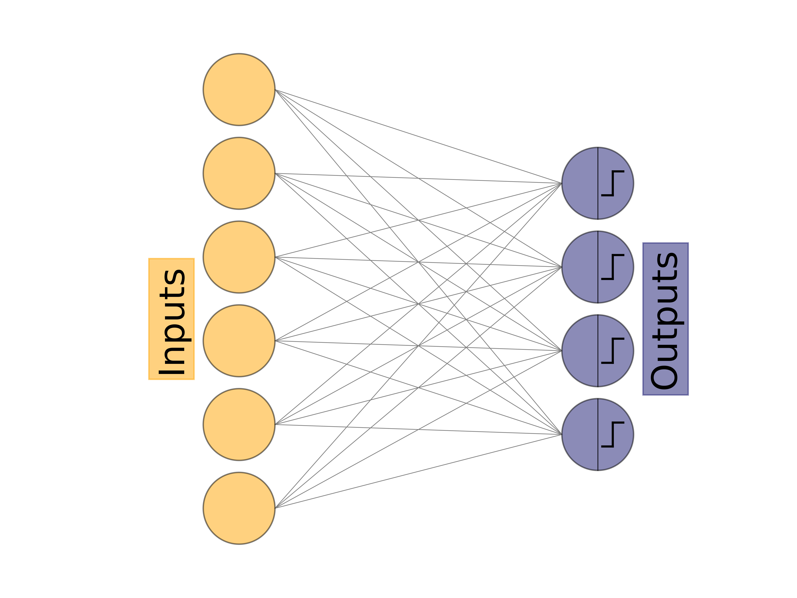
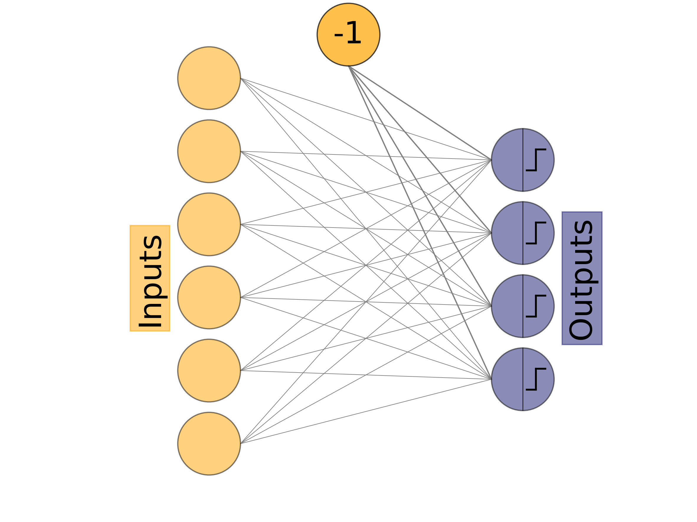
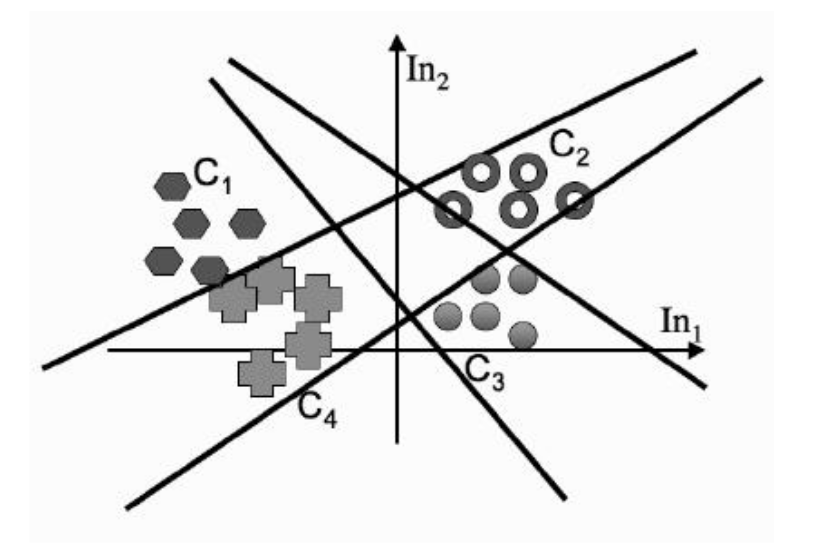

[← Multi-Layer Perceptron](index.md)

# Mathematics Behind Perceptron
## Introduction
This is actually a notebook made by me during the internet shutdown in Kashmir (since 5th Aug 2019). This notebook, and others, are heavily inspired by <a href="https://www.amazon.in/dp/1466583282/ref=cm_sw_r_cp_apa_i_TAKcEbNSD9Y57" target="_blank"> Machine Learning: An Algorithmic Perspective </a> . This notebook is essentially the notes of chapter 3 of this book. I highly recommend this book for the basic understanding of Machine Learning Algorithms. This post covers mathematics, implementation of the basic perceptron algorithm. I would suggest to practice on the code for perceptron. Although stay away from the visualization code, if that seems too complex.

# Hebb's Rule

It states that *"the changes in the strength of synaptic connections are proportional to the correlation in the firing of two connecting neurons"*

# McCulloch and Pitts Neurons

## 1. Introduction

This was a mathematical model of a neuron. It extracts the basic essentials to accurately represent the entity being studied(the neurons that make our nervous system!), removing all the extraneous details.

It is modelled as:
1. **a set of weighted inputs, \\(w_i\\),** that correspond to synapses.
2. **an adder,** that sums the input signals.
3. **an activation function**(usually a threshold function), that decides whether the neuron fires(spikes!) for the current inputs.

So,

 $$h=\sum_{i=1}^m{w_ix_i}\tag{1}$$
 
where \\(w_i\\) is the weight at the synapse for \\(i^{th}\\) input and \\(x_i\\) is the input from \\(i^{th}\\) neuron into synapse. 

Now to decide if the neuron fires or not, we need a threshold (\\(\theta\\)). If the weighted sum of the inputs(\\(h\\)) is greater than the threshold, the neuron fires(i.e output is 1).

So the activation function is:
$$\sigma=g(h)=\begin{cases} 1&\text{if }h>\theta\\ 0&\text{if }h\leq\theta\\ \end{cases} \tag{2} $$

## 2. Limitations

- The inputs to a real neuron aren't necessarily summed linearly: there may be non-linear summations.
- The real neurons do not output a single response, instead a train of spikes like a sequence of pulses is produced which encodes information.
- The neurons do not update themselves sequentially according to a computer clock but do it asynchronously.
- The weights in our model can be positive and negative, implying the presence of excitation or inhibitance property, which is also possesed by the real neurons but unlike real neurons our model change change from exciting to inhibitory after weight updates while real neurons stay the way they are(exciting or inhibitory).

# The Perceptron

## 1. Introduction

The perceptron is nothing more than a collection of [McCulloch and Pitts neurons](#mcculloch-and-pitts-neurons) together with a set of inputs and some weights to fasten the inputs to the neurons. The neurons in the Perceptron are completely independent of each other.


Figure 1: The Perceptron Network(the orange nodes are inputs, not neurons)

Each neuron has its own weights which it multiplies with its input and adds them to decide whether to fire or not depending on its own threshold. The inputs are the number of features(usually columns) our data has. The number of neurons can be varied and is usually the total unique classifying target values.


We represent a particular weight as \\(w_{ij}\\) where \\(i\\) is the input it is coming from and \\(j\\) is the neuron it is going into. So \\(w_{32}\\) is the weight that connects the input node 3 to neuron 2. In the [implementation](#2.-Implementation), we will save the weights in a two dimensional array.

The input will be stored as a vector and so the output.

## 2. Implementation

### 2.1 Introduction

In supervised learning, we already have a ground truth target.

   1. For an input vector, we apply Equation 1 for each neuron to decide if each neuron will fire or not, generating its the output vector. 
   2. For an output vector(a vector of 0s and 1s which determine if the corresponding neurons have fired or not!), we compare it to the target vector(the actual value for that input) to identify which neurons got the answer right and which did not.
   3. Those neurons with correct outputs are fine but those with wrong outputs(i.e they fire when they didn't have to or didn't when they had to), their weights need to be changed so that they fire correctly.

### 2.2 Learning the Weights

#### 2.2.1 Introduction

We'll talk more about it later, but for now let's deploy a simple learning system.

\\(m:\\) no. of input features.

\\(n:\\) no. of output neurons.

\\(x_i, \ i \in [0,m]:\\) the input vector of m features.

\\(y_i, \  i \in [0,n]:\\) the output vector of n neurons.

\\(t_i, \ i \in [0,n]:\\) the actual target vector.

Suppose \\(k^{th}\\) neuron gets the wrong answer, it has \\(m\\) weights connected to it(one for each input node). The weights we need to change is \\(w_{ik}\\) where \\(i\\) runs from \\(1\\) to \\(m\\).

Now we know which weights to change, but by how much to change them by?

Before answering that, let's figure out if a weight is too high or low(i.e do we need to increase it or decrease it?).

At the first glance, we can say that bigger weights tend a neuron to fire(as they help it get over the threshold) and smaller weights tend to not fire. So if a neuron fires when it wasn't supposed to, there are some weights which are bigger than they should be, or if doesn't fire when it should(some weights are too small!).

For that neuron we can calculate:
$$y_k-t_k \tag{3}$$
i.e the difference between the output of the nepuron and the actual truth.

If the above equation is Zero, then neuron has the correct output. However if it is positive(specifically \\(1\\)), then the neuron has fired when it shouldn't have, i.e weights are big and if it is negative(specifically \\(-1\\)), then the neuron hasn't fired when it should have, i.e weights are small. The above equation can act as a possible **error function**.

So until now we know:

the weights \\(w_{ij}\\) will be changed by \\( \Delta w_{ij}\\)

where,

 
$$\Delta w_{ij}  = \begin{cases} > 0 & \text{if } y_j - t_j <0\\ < 0 & \text{if } y_j - t_j >0\\ = 0 & \text{if } y_j - t_j =0\\ \end{cases}\\ \implies \Delta w_{ij} = - (y_j-t_j)k $$

where \\(k\\) is the constant which gives the *amount by which each weight needs to be changed*.

While this all seems right, we have missed something. What if the inputs are negative? 

If the inputs are negative, then switch values, we'll need to reduce the weights to fire and increase to not fire.

To get around that we make a change:

 
$$ \Delta w_{ij}=-k(y_j - t_j)x_i$$

if \\(x_i\\) is negative it will automatically change the direction of weight change and \\(k\\) decides how much the weight changes by. The parameter \\(k\\) is called the learning rate and is often represented by \\(\eta\\) instead of k.

so 
 
$$\Delta w_{ij}= - \eta(y_j-t_j) x_i$$

Finally we update the weights,

$$w_{ij} \leftarrow w_{ij}-\eta(y_j-t_j) x_i \tag{4}$$

We can update these for an optimum learning rate for some predefined \\(T\\) iterations. However we will later see other stopping methods.

#### 2.2.2 Learning Rate

The learning rate is an important parameter which needs to be tuned to get better accuracies. Too high value of it might change the weights more than they were needed to and a too low will take too long to train. It is often used in the range of \\( 10^{-4} < \eta < 10 \\). But feel free to check out of these bounds. Also for perceptron this parameter is way less important and can be set to anything. However for other models it is the most crucial parameter.

#### 2.2.3 Bias node


Now that we have figured out the weights, but we haven't discussed another important parameter, the threshold. What threshold to choose for what problem? That is where a Bias node comes into play.

We can show Equation 1 for a certain neuron as:

 
$$ h = w_{1j} x_1 + w_{2j}  x_2 + w_{3j}  x_3 + \cdots +w_{mj}  x_m  $$

where \\(x_k\\) is \\(k^{th}\\) input feature and \\(w_{kj}\\) is the weight from \\(k^{th}\\) input node to \\(j^{th}\\) neuron.

Now, if the threshold is \\(\theta\\), Equation 2 shows that:

 
$$ \begin{align} \sigma &= \begin{cases}1 & \text{if }w_{1j} x_1 + w_{2j} x_2 + w_{3j} x_3 + \cdots +w_{mj} x_m > \theta_j \\ 0 & \text{if }w_{1j}  x_1 + w_{2j}  x_2 + w_{3j} x_3 + \cdots +w_{mj} x_m < \theta_j \end{cases}\\ \\ &= \begin{cases} 1 & \text{if }w_{1j} x_1 + w_{2j} x_2 + w_{3j} x_3 + \cdots +w_{mj} x_m - \theta_j >0 \\ 0 & \text{if }w_{1j}  x_1 + w_{2j}  x_2 + w_{3j} x_3 + \cdots +w_{mj} x_m - \theta_j<0 \end{cases}\\ \\ &=\begin{cases} 1 & \text{if }w_{1j} x_1 + w_{2j} x_2 + w_{3j} x_3 + \cdots +w_{mj} x_m + (-1) \theta_j >0 \\ 0 & \text{if }w_{1j}  x_1 + w_{2j}  x_2 + w_{3j} x_3 + \cdots +w_{mj} x_m + (-1) \theta_j<0 \end{cases} \end{align} $$

so \\(\theta\\) can be learned as another weight, if we consider an extra input feature which is always \\(-1\\) and our new threshold is \\(0\\).(However \\(\theta_j\\) is the actual threshold which instead of defining, we let the neuron to learn like any other weight.)

The Bias Node also helps us overcome the all-zero input problem. If all the inputs in an example are Zero then no matter how the weights change, it won't change the output, but the bias node will change and make changes necessary for correct output. 

So to make it work we will also need an extra but constant input node reserved for -1.

**Note :** *Actually, it is not necessary to use -1 as the bias input. Any constant will do. People mostly use +1 but we will use -1 to make it stand out.*

The Bias Node is considered the \\(x_0\\) which is constant(-1) and the weight to it is \\(w_{0j}\\)(which is actually \\(\theta_j\\)).

So the new Structure is like:


Figure 2: Perceptron with Bias Node

### 2.3 Putting Everything Together

Now that we have all the things cleared out, it is time to put everything together.

The algorithm is separated into two parts: a **training** phase and a **recall** phase. The **recall** is essentially used after training is finished to actually use the model.

The Algorithm is as:

#### 1. **Initialization:**

* set all the weights \\(w_{ij}\\) to small random numbers(both positive and negative).

#### 2. **Training:**
* for \\(T\\) iterations or untill all outputs are correct:
    * for each input vector:
        1. compute the activation of each neuron \\(j\\) using:

         $$y=g \bigg(\sum_{i=0}^mw_{ij}x_i\bigg)=\begin{cases}1 & \text{if } \sum_{i=0}^mw_{ij}x_i > 0 \\ 0 & \text{if } \sum_{i=0}^mw_{ij}x_i \leq 0 \end{cases}$$

        where \\(x_0\\) is -1 (the bias node) and \\(m\\) is the number of features our data has.

        2. update each of the weights individually using:
            $$w_{ij} \leftarrow w_{ij} - \eta(y_j-t_j)\cdot x_i$$
            
#### 3. **Recall:**
* compute the activation of each neuron \\(j\\) using:

   $$y=g \Bigg(\sum_{i=0}^mw_{ij}x_i\Bigg)=\begin{cases}1 & \text{if } \sum_{i=0}^mw_{ij}x_i > 0 \\ 0 & \text{if } \sum_{i=0}^mw_{ij}x_i \leq 0 \end{cases}$$


### 2.4 Speeding Up the code

#### 2.4.1 Speeding Up the computation of activations

The code for it has multiple loops for training. Loops for multiplying the weights with inputs and loops while updating weights. The simple loops can take a lot of time, but many languages, like python, have libraries(numpy, tensorflow, pytorch) to perform matrix perations much quicker than simple loops. We will put these to our use to speed up the training as well as the recall process as well.

Let's say we have \\(k\\) number of training examples and each example has \\(m\\) features with \\(n\\) types of outputs.

Now instead of taking one example at a time and updating weights and doing the same for \\(T\\) iterations, we can store all our training examples in a matrix where each example is a row and each column is a feature.

So the 4th feature of 6th training example will look like \\(x_{64}\\).

So our input matrix \\(X\\) should look like:
 
$$X= \begin{bmatrix} x_{11} & x_{12} & x_{13} & \cdots & x_{1m} \\ x_{21} & x_{22} & x_{23} & \cdots & x_{2m} \\ x_{31} & x_{32} & x_{33} & \cdots & x_{3m} \\ \vdots & \vdots & \vdots & & \vdots \\ x_{k1} & x_{k2} & x_{k3} & \cdots & x_{km} \\ \end{bmatrix} \tag{5} $$

This matrix will be \\(k \times m\\).

In python we would do this using a library called `numpy`


```python
import numpy as np
```

let's say we want to train to learn the Logical-OR function.
So our input should look like:

 
$$X= \begin{bmatrix} 0 & 0 \\ 0 & 1 \\ 1 & 0 \\ 1 & 1 \\ \end{bmatrix} $$

we can make it make it using `np.array` method:


```python
X = np.array([[0,0],
             [0,1],
             [1,0],
             [1,1]])
X
```


    array([[0, 0],
           [0, 1],
           [1, 0],
           [1, 1]])


now our input is ready, let's figure out how to store the target values. Each input has target values for which neuron to fire and which not to(1s and 0s).

So with \\(k\\) examples and \\(n\\) output neurons, the target matrix should be \\([t_{ij}]\\) which is the target for \\(i^{th}\\) example and \\(j^{th}\\) neuron.

So,
$$ T=\begin{bmatrix} t_{11} & t_{12} & t_{13} & \cdots & t_{1n}\\ t_{21} & t_{22} & t_{23} & \cdots & t_{2n}\\ t_{31} & t_{32} & t_{33} & \cdots & t_{3n}\\ \vdots & \vdots & \vdots & & \vdots \\ t_{k1} & t_{k2} & t_{k3} & \cdots & t_{kn}\\ \end{bmatrix}\\ \tag{6}$$
where \\(t_{ij} \in \{0,1\}\\) 

For binary outputs, like in our example, we can just use one output neuron, which will fire for one output and not fire for other which means \\(n=1\\).

So, 
 
$$ T_{binary} = \begin{bmatrix} t_1\\ t_2\\ \vdots \\ t_k \end{bmatrix} $$

and in our example,

 
$$ T = \begin{bmatrix} 0\\ 1\\ 1\\ 1 \end{bmatrix} $$

we can do it in numpy in the same way:


```python
T = np.array([[0],[1],[1],[1]]);T
```


    array([[0],
           [1],
           [1],
           [1]])


Moving on to the outputs generated by our neurons. For \\(n\\) neurons and \\(k\\) examples, we can store that in a matrix \\([y_{ij}]\\) for \\(i^{th}\\) example and \\(j^{th}\\) neuron like:

$$Y= \begin{bmatrix} y_{11} & y_{12} & y_{13} & \cdots & y_{1n}\\ y_{21} & y_{22} & y_{23} & \cdots & y_{2n}\\ y_{31} & y_{32} & y_{33} & \cdots & y_{3n}\\ \vdots \\ y_{k1} & y_{k2} & y_{k3} & \cdots & y_{kn}\\ \end{bmatrix}\\\tag{7}$$
where \\(y_{ij} \in {0,1}\\)


So,
$$ y_{ij} = g(h_{ij})=\begin{cases} 1 & \text{if } x_{i1}w_{1j}+x_{i2}w_{2j}+\cdots + x_{im}w_{mj} + (-1)w_{0j} > 0 \\ 0 & \text{if } x_{i1}w_{1j}+x_{i2}w_{2j}+\cdots + x_{im}w_{mj} + (-1)w_{0j} \leq 0 \\ \end{cases} \tag{8} $$

if we replace all of it in the matrix,

$$Y=g\Bigg( \begin{bmatrix} h_{11} & h_{12} & h_{13} & \cdots & h_{1n}\\ h_{21} & h_{22} & h_{23} & \cdots & h_{2n}\\ h_{31} & h_{32} & h_{33} & \cdots & h_{3n}\\ \vdots \\ h_{k1} & h_{k2} & h_{k3} & \cdots & h_{kn}\\ \end{bmatrix}\Bigg) \tag{9} $$
where \\(h_{ij} =(-1)w_{0j}+\sum_{a=1}^{m}x_{ia}w_{aj}\\)

or if we keep
$$x_{j0} = -1  \  \forall j \in [1,k] \tag{10}\\$$

$$ \implies Y=g\Bigg( \begin{bmatrix} \sum_{a=0}^{m}x_{1a}w_{a1} & \sum_{a=0}^{m}x_{1a}w_{a2} & \cdots & \sum_{a=0}^{m}x_{1a}w_{an}\\ \\ \sum_{a=0}^{m}x_{2a}w_{a1} & \sum_{a=0}^{m}x_{2a}w_{a2} & \cdots & \sum_{a=0}^{m}x_{2a}w_{an}\\ \\ \sum_{a=0}^{m}x_{3a}w_{a1} & \sum_{a=0}^{m}x_{3a}w_{a2} & \cdots & \sum_{a=0}^{m}x_{3a}w_{an}\\ \vdots & \vdots &   & \vdots\\ \sum_{a=0}^{m}x_{ka}w_{a1} & \sum_{a=0}^{m}x_{ka}w_{a2}  & \cdots & \sum_{a=0}^{m}x_{ka}w_{an}\\ \end{bmatrix}\Bigg) \tag{11} $$

The above matrix looks like a multiplication of two matrices. Let's open it up:

$$Y=g\Bigg( \begin{bmatrix} x_{10} & x_{11} &  \cdots & x_{1m}\\ x_{20} & x_{21}  & \cdots & x_{2m}\\ x_{30} & x_{31} & \cdots & x_{3m}\\ \vdots & \vdots & & \vdots \\ x_{k0} & x_{k1} & \cdots & x_{km}\\ \end{bmatrix}\times \begin{bmatrix} w_{01} & w_{02}  & \cdots & w_{0n}\\ w_{11} & w_{12} &  \cdots & w_{1n}\\ w_{21} & w_{22}  & \cdots & w_{2n}\\ \vdots & \vdots & & \vdots \\ w_{m1} & w_{m2}  & \cdots & w_{mn}\\ \end{bmatrix} \Bigg) \tag{12} $$

if we look at the Left Matrix it is the input matrix (\\(X\\)) with extra column on far left and we know the far left column is always -1, so we can actually redefine the input matrix to include this extra column.

$$\implies X=\begin{bmatrix} x_{10} & x_{11} & x_{12} & \cdots & x_{1m}\\ x_{20} & x_{21} & x_{22} & \cdots & x_{2m}\\ x_{30} & x_{31} & x_{32} & \cdots & x_{3m}\\ \vdots \\ x_{k0} & x_{k1} & x_{k2} & \cdots & x_{km}\\ \end{bmatrix} \tag{13}$$

This matrix is now \\(k \times (m+1)\\).


we can generate a column of -1 using the `np.ones` method and then concatenate it with our input matrix using `np.concatenate` to form the new input matrix, like:


```python
X = np.concatenate((-np.ones((X.shape[0],1)),X),axis=1)
X
```


    array([[-1.,  0.,  0.],
           [-1.,  0.,  1.],
           [-1.,  1.,  0.],
           [-1.,  1.,  1.]])


Now that we have fixed the input matrix, let's move to the second matrix in Equation 12, the **weight matrix**.

$$ W = \begin{bmatrix} w_{01} & w_{02} & w_{03} & \cdots & w_{0n}\\ w_{11} & w_{12} & x_{13} & \cdots & w_{1n}\\ w_{21} & w_{22} & x_{23} & \cdots & w_{2n}\\ \vdots \\ w_{m1} & w_{m2} & x_{m3} & \cdots & w_{mn}\\ \end{bmatrix}\\ \tag{14}$$
where \\(w_{ij}\\) is the weight from \\(i^{th}\\) input node to \\(j^{th}\\) output neuron

This matrix is \\( (m+1) \times n\\).

with Equation 13 can be rewriten as:

$$ Y=g(X \times W)\\ \tag{15} $$
where:
1. \\(X\\) is the input matrix(Equation 13 with bias nodes.
2. \\(W\\) is the weight matrix (Equation 14).
3. \\(\times\\) represents matrix multiplication.
4. and the function \\(g\\)(Equation 8) is applied elementwise to the resultant matrix to generate outputs for every neuron for every training example.

We will use the `np.matmul` function to perform a matrix multiplication and we will use the **numpy boolean mask broadcasting** to compute activations. Since we have to repeat this step, we will make a function for this named `compute_activations`. so `Y=compute_activations(X,W)` whenever needed.


```python
def compute_activations(X,W):
    activation = np.matmul(X,W) > 0
    return activation
```

This completes the first part of the [Training Algorithm](#2.-Training:) (i.e compute activation of each neuron for each input example). Now let's move to the Second Part of the Training, Updating Weights.

#### 2.4.2 Speeding up the the updation of weights

The updation of weights is given by Equation 4, which is:

 
$$w_{ij}\leftarrow w_{ij} - \eta(y_j-t_j)\cdot x_i\tag{4}$$
where \\(w_{ij}\\) is the weight from \\(i^{th}\\) input node to \\(j^{th}\\) output neuron. 

We can vectorize this operation, instead of updating every weight using a loop, we update the whole weight matrix at once. 

 $$ W \leftarrow W -\eta \Delta W \tag{16} $$
where \\(W\\) is the weight matrix and \\( \Delta W \\) is the matrix having the corresponding \\((y_j - t_j) \cdot x_i\\) for each weight.

Now before we move on figure out how \\(\Delta W\\) should be computed, let's put a detour to see how the weight changes for different examples.

Let's say we had three examples. Each weight will be updated three times with their corresponding \\(x_i\\).

Let's denote \\(x_{ij}\\) as the \\(j^{th}\\) input feature of \\(i^{th}\\) example and \\(t_{ia}\\) as the target for \\(i^{th}\\) example and \\(a^{th}\\) output neuron. So, \\(1\leq i \leq 3\\).

Now after each example, weights will change, like:

 
$$ w_{ja} \leftarrow w_{ja} - \eta(y_{1a} - t_{1a})  x_{1j} \tag{for ex. 1}\\ $$


 
$$ w_{ja} \leftarrow w_{ja} - \eta(y_{2a} - t_{2a})  x_{2j} \tag{for ex. 2}\\ $$


 
$$ w_{ja} \leftarrow w_{ja} - \eta(y_{3a} - t_{3a})  x_{3j} \tag{for ex. 3} $$

each of the above change will occur to each weight one after the another. so these can be summed as:

 
$$ w_{ja} \leftarrow w_{ja} - \eta \{(y_{1a} - t_{1a})  x_{1j} + (y_{2a} - t_{2a})  x_{2j} + (y_{3a} - t_{3a})  x_{3j}\} \tag{17} $$


It can be generalized as, for \\(k\\) examples:

 
$$ w_{ja} \leftarrow w_{ja}- \eta \Big(\sum_{i=1}^k(y_{ia} - t_{ia}) x_{ij}\Big) \tag{18} $$

So \\(\Delta W\\) is just a matrix of the \\(\sum_{i=1}^k(y_{ia} - t_{ia}) x_{ij}\\) for every neuron and for every example.

So, for \\(k\\) examples with \\(m+1\\) input features (the first being \\(x_{i0} = -1\\)) and \\(n\\) output neurons

 
$$ \Delta W = \begin{bmatrix} \sum_{i=1}^k  x_{i0}  (y_{i1} - t_{i1})  & \sum_{i=1}^k  x_{i0}  (y_{i2} - t_{i2})  & \cdots & \sum_{i=1}^k  x_{i0}  (y_{in} - t_{in}) \\ \sum_{i=1}^k  x_{i1}  (y_{i1} - t_{i1})  & \sum_{i=1}^k  x_{i1}  (y_{i2} - t_{i2})  & \cdots & \sum_{i=1}^k  x_{i1}  (y_{in} - t_{in}) \\ \vdots\\ \sum_{i=1}^k  x_{im}  (y_{i1} - t_{i1})  & \sum_{i=1}^k  x_{im}  (y_{i2} - t_{i2})  & \cdots & \sum_{i=1}^k  x_{im} (y_{in} - t_{in}) \\ \end{bmatrix} \tag{19} $$

This matrix is \\((m+1) \times n\\) same as the weights matrix.

Take some time to write it down and look at every entry to make it clear for yourself.

Let's unpack this bad boy! So it also looks like a matrix multiplication of two matrices.

 
$$ \Delta W = \begin{bmatrix} x_{10} & x_{20} & \cdots & x_{k0}\\ x_{11} & x_{21} & \cdots & x_{k1}\\ \vdots \\ x_{1m} & x_{2m} & \cdots & x_{km}\\ \end{bmatrix} \times  \begin{bmatrix} y_{11} - t_{11} & y_{12} - t_{12} & \cdots & y_{1n} - t_{1n} \\ y_{21} - t_{21} & y_{22} - t_{22} & \cdots & y_{2n} - t_{2n} \\ \vdots \\ y_{k1} - t_{k1} & y_{k2} - t_{k2} & \cdots & y_{kn} - t_{kn} \\ \end{bmatrix} $$

The right matrix is basically the subtraction of target matrix \\(T\\) ([Equation 6]) subtracted from the output matrix \\(Y\\) ([Equation 7]).

 
$$ \implies \Delta W =  \begin{bmatrix} x_{10} & x_{20} & \cdots & x_{k0}\\ x_{11} & x_{21} & \cdots & x_{k1}\\ \vdots \\ x_{1m} & x_{2m} & \cdots & x_{km}\\ \end{bmatrix} \times \Bigg( \begin{bmatrix} y_{11} & y_{12} & \cdots & y_{1n} \\ y_{21} & y_{22} & \cdots & y_{2n} \\ \vdots \\ y_{k1} & y_{k2} & \cdots & y_{kn} \\ \end{bmatrix} -  \begin{bmatrix} t_{11} & t_{12} & \cdots & t_{1n} \\ t_{21} & t_{22} & \cdots & t_{2n} \\ \vdots \\ t_{k1} & y_{k2} & \cdots & t_{kn} \\ \end{bmatrix} \Bigg) $$

The left matrix is the transpose of the input matrix with bias values \\(X\\) (Equation 13).

 
$$ \implies \Delta W =  \begin{bmatrix} x_{10} & x_{11} & \cdots & x_{1m}\\ x_{20} & x_{21} & \cdots & x_{2m}\\ \vdots \\ x_{k0} & x_{k1} & \cdots & x_{km}\\ \end{bmatrix}^T \times \Bigg( \begin{bmatrix} y_{11} & y_{12} & \cdots & y_{1n} \\ y_{21} & y_{22} & \cdots & y_{2n} \\ \vdots \\ y_{k1} & y_{k2} & \cdots & y_{kn} \\ \end{bmatrix} -  \begin{bmatrix} t_{11} & t_{12} & \cdots & t_{1n} \\ t_{21} & t_{22} & \cdots & t_{2n} \\ \vdots \\ t_{k1} & y_{k2} & \cdots & t_{kn} \\ \end{bmatrix} \Bigg) \tag{20} $$

Finally,

 
$$ \Delta W = X^T \times (Y-T) \tag{21} $$ 

Using the above equation, Equation 16 becomes:

 
$$ W \leftarrow W - \eta \{X^T \times (Y-T)\}\\ \tag{22} $$

where:
- \\(X^T\\): is the transpose of input matrix.
- \\(Y\\): is the output matrix.
- \\(T\\):  is the target matrix.
- \\( \eta \\):  is the [learning rate](#2.2.2-Learning-Rate).
- \\(\times\\):  represents matrix multiplication.

now to compute the transpose of a matrix, we use `np.transpose` function. we can use the simple minus operator to perform subtraction in matrices. Also to multiply each element by \\(\eta\\), we use the broadcasting property. Since this step is also going to be used multiple times, we will turn it into a function, like:


```python
def update_weights(weights, input_matrix, output_matrix, target_matrix, learning_rate):
    delta_w = np.matmul(np.transpose(input_matrix),(output_matrix-target_matrix))
    weights = weights - (learning_rate*delta_w) # elementwise multiplication using broadcasting
    return weights
```

but before updating the weight matrix, we need to initialize a weight matrix with small random numbers. we can use the `np.random.rand` to generate random numbers between 0 and 1, then multiply by 0.1 (to make them small) and subtract 0.05 to get some negative weights.


```python
def initialize_weights(n_input,n_out):
    # the input shape should be including the bias inputs
    weights = np.random.rand(n_input, n_out)*0.1 - 0.05
    return weights
```

### 2.5 Final Code

now that we have finished all the functions for training as well as initialization, for recall, we can again use the `compute_activations` function.

Let's put the code together and run for an example. while training, we can print weights and output after each iteration.


```python
def compute_activations(X,W):
    activation = (np.matmul(X,W) > 0)
    return activation

def initialize_weights(n_input,n_out, random_state):
    np.random.seed(random_state)
    # the input shape should be including the bias inputs
    weights = np.random.rand(n_input, n_out)*0.1 - 0.05
    return weights

def update_weights(weights, input_matrix, output_matrix, target_matrix, learning_rate):
    delta_w = np.matmul(np.transpose(input_matrix),(output_matrix-target_matrix))
    weights = weights - (learning_rate*delta_w) # elementwise multiplication using broadcasting
    return weights

def train(input_data, target, learning_rate, epochs,random_state=0,init_weights=None, save_weights=False, verbose=False):
    # add the bias values to input_matrix
    X = np.concatenate((-np.ones((input_data.shape[0],1)),input_data),axis=1)
    #set the shapes
    n_input = X.shape[1]
    n_out = target.shape[1]
    
    #initialize the weights
    if init_weights is None:
        W = initialize_weights(n_input,n_out, random_state)
    else:
        W = init_weights
        
    if save_weights:
        weight_array=[W]
        
    for it in range(epochs):
        # compute outputs
        Y = compute_activations(X,W)
        
        if verbose:
            #print the output
            print(f"Iteration: {it}\n{W}\nOutput:\n{Y[:10,:10]}\nAccuracy: {(Y==target).sum()/X.shape[0]}")
        
        # update weights
        W = update_weights(W, X, Y, target, learning_rate)
        
        if save_weights:
            weight_array.append(W)
    if save_weights:
        return W, weight_array
    else:
        return W
        
def recall(input_data, weights):
    # add the bias values to input_matrix
    X = np.concatenate((-np.ones((input_data.shape[0],1)),input_data),axis=1)
    # compute activations
    Y = compute_activations(X,weights)
    return Y
    
```

This is all we need for a perceptron code. After a good time, you can feel the simplicity and elegancy of it.

Let's try it for an OR data. Let's see if it can learn the parameters.


```python
 prepare the data
X = np.array([[0,0],
             [0,1],
             [1,0],
             [1,1]])

T = np.array([[0],[1],[1],[1]])

train the data
weights = train(input_data=X,target=T,learning_rate=0.25,epochs=6, random_state=42,verbose=True)
```

    Iteration: 0
    [[-0.01254599]
     [ 0.04507143]
     [ 0.02319939]]
    Output:
    [[ True]
     [ True]
     [ True]
     [ True]]
    Accuracy: 0.75
    Iteration: 1
    [[0.23745401]
     [0.04507143]
     [0.02319939]]
    Output:
    [[False]
     [False]
     [False]
     [False]]
    Accuracy: 0.25
    Iteration: 2
    [[-0.51254599]
     [ 0.54507143]
     [ 0.52319939]]
    Output:
    [[ True]
     [ True]
     [ True]
     [ True]]
    Accuracy: 0.75
    Iteration: 3
    [[-0.26254599]
     [ 0.54507143]
     [ 0.52319939]]
    Output:
    [[ True]
     [ True]
     [ True]
     [ True]]
    Accuracy: 0.75
    Iteration: 4
    [[-0.01254599]
     [ 0.54507143]
     [ 0.52319939]]
    Output:
    [[ True]
     [ True]
     [ True]
     [ True]]
    Accuracy: 0.75
    Iteration: 5
    [[0.23745401]
     [0.54507143]
     [0.52319939]]
    Output:
    [[False]
     [ True]
     [ True]
     [ True]]
    Accuracy: 1.0


and with a learning rate of 0.25, it can learn the parameters for OR gate in just 6 iterations.

## 3. Visualization

Now that we have completely studied the basic perceptron. Let's visualize some things to get the better understanding.

we will use the `plotly`'s `express` and `graph_objects` for plotting.

Let's first plot our input data


```python
import plotly.express as px
import plotly.graph_objects as go
```


```python
fig = px.scatter(x=X[:,0], y=X[:,1], color=T.astype("str"), size=[8]*X.shape[0],
                 labels={"x":"Input 1","y":"Input 2","color":"Output"},
                 title="Scatter of Data Points", height=600, width=600, opacity=1)
fig.show()
```




Now let's see what the weights represent.

We know that \\(w_{ij}\\) is the weight from \\(i^{th}\\) input node to \\(j^{th}\\) output node.

Since we have only one output neuron and 2 input nodes(3 with bias node).

Our Weights compute, for each example:
\\(w_{01}(-1) + w_{11}\cdot inp1+w_{12}\cdot inp2\\) and then check if it is greater than or less than Zero.

For the boundary case, 
 
$$ w_{01}(-1) + w_{11}\cdot inp1+w_{12}\cdot inp2=0 $$

if we were to plot this threshold line with \\(inp2\\) as the y-axis and \\(inp1\\) on the x-axis, then:

 
$$ inp2=\frac{-w_{11}inp1+w_{01}}{w_{12}} $$
So,in the previous example, our final weights were:


```python
weights
```


    array([[0.23745401],
           [0.54507143],
           [0.52319939]])


```python
inp1 = np.linspace(0,0.5,100)

fig  = go.Figure(layout=dict(height=600,width=600,
                            xaxis_title="Input 1", yaxis_title="Input 2",
                            title="Decision Boundary with Scatter"))
fig.add_trace(go.Scatter(x=X[:,0:1][T==1],y=X[:,1:][T==1],name= "Output: 1",mode="markers",marker=dict(size=20)))
fig.add_trace(go.Scatter(x=X[:,0:1][T==0],y=X[:,1:][T==0],name= "Output: 1",mode="markers",marker=dict(size=20)))
fig.add_trace(go.Scatter(x=inp1,y=(-(weights[1,0]*inp1) + weights[0,0])/weights[2,0],name= "Decision Boundary",mode="lines",marker=dict(size=20)))

fig.show()
```




a more sophisticated  decision boundary


```python
xx,yy=np.meshgrid(np.arange(X[:,0].min()-0.1,X[:,0].max()+0.1,(X[:,0].max()-X[:,0].min())/500),
                      np.arange(X[:,1].min()-0.1,X[:,1].max()+0.1,(X[:,1].max()-X[:,1].min())/500))
Z = recall(np.c_[xx.ravel(),yy.ravel()],weights)
Z = Z.reshape(xx.shape)*1


fig = go.Figure(layout=dict(width=600,height=600))

fig.add_trace(
    go.Heatmap(
        x=xx[0],
        y=yy[:,1],
        z=Z,
        colorscale="Viridis",
        showscale=False
))
fig.add_trace(
    go.Scatter(
        x=X[:,0],y=X[:,1],mode="markers",
        marker=dict(
            size=20,
            color=T[:,0],
            colorscale="Viridis",
            line=dict(color="black",width=2))
    )
)
fig.show()

```





all the points above this line will cause the fire of the current neuron, and all the below won't.

Let's see the updation of weights and it's impact on the decision boundary.


we will train the model while saving the weights to plot it. We will set the learning rate to be small so that the animation is smooth and we get a good idea of what is happening. You can change it. I have also increased the number of epochs as the learning rate is small now. Also play with different `random_state` to start from initial different weights.


```python
W, weight_array = train(input_data=X,target=T,learning_rate=0.001,epochs=100,save_weights=True,random_state=364)
```

after having all the weights saved, we will plot them one after the other using the `animation.FuncAnimation` function. Change the `interval` if the animation is too slow or too fast.


```python
xx,yy=np.meshgrid(np.arange(X[:,0].min()-0.1,X[:,0].max()+0.1,(X[:,0].max()-X[:,0].min())/200),
                      np.arange(X[:,1].min()-0.1,X[:,1].max()+0.1,(X[:,1].max()-X[:,1].min())/200))

Z = [recall(np.c_[xx.ravel(),yy.ravel()],weights).reshape(xx.shape)*1 for weights in weight_array]

nb_frames = 98

fig = go.Figure(frames=[
    go.Frame(
        data=[
            go.Heatmap(
            x=xx[0],
            y=yy[:,1],
            z=Z[k],
            colorscale="Viridis",
            showscale=False
        ),
           ],
        name=str(k)
        )
    for k in range(nb_frames)])

fig.add_trace(go.Scatter(
            x=X[:,0],y=X[:,1],mode="markers",
            marker=dict(
                size=20,
                color=T[:,0],
                colorscale="Viridis",
                line=dict(color="black",width=2))
        ))

fig.add_trace(go.Scatter(
            x=X[:,0],y=X[:,1],mode="markers",
            marker=dict(
                size=20,
                color=T[:,0],
                colorscale="Viridis",
                line=dict(color="black",width=2))
        ))

fig.add_trace(go.Scatter(
            x=X[:,0],y=X[:,1],mode="markers",
            marker=dict(
                size=20,
                color=T[:,0],
                colorscale="Viridis",
                line=dict(color="black",width=2))
        ))


def frame_args(duration):
    return {
            "frame": {"duration": duration},
            "mode": "immediate",
            "fromcurrent": True,
            "transition": {"duration": duration, "easing": "linear"},
        }

sliders = [
            {
                "pad": {"b": 10, "t": 60},
                "len": 0.9,
                "x": 0.1,
                "y": 0,
                "steps": [
                    {
                        "args": [[f.name], frame_args(0)],
                        "label": str(k),
                        "method": "animate",
                    }
                    for k, f in enumerate(fig.frames)
                ],
            }
        ]

# Layout
fig.update_layout(
         title='Change in Decision Boundary with Weight Update',
         width=600,
         height=600,
         scene=dict(
                    zaxis=dict(range=[-0.1, 6.8], autorange=False),
                    aspectratio=dict(x=1, y=1, z=1),
                    ),
         updatemenus = [
            {
                "buttons": [
                    {
                        "args": [None, frame_args(50)],
                        "label": "&#9654;", # play symbol
                        "method": "animate",
                    },
                    {
                        "args": [[None], frame_args(0)],
                        "label": "&#9724;", # pause symbol
                        "method": "animate",
                    },
                ],
                "direction": "left",
                "pad": {"r": 10, "t": 70},
                "type": "buttons",
                "x": 0.1,
                "y": 0,
            }
         ],
         sliders=sliders,
    showlegend=False
)

fig.show()

```


As you can see, the decision boundary was initially in the right spot but with reversed thresholds, and with changing epochs it flipped.


## 4. Linear Separability

### 4.1 Introduction

As we saw just now, in the visualization section, a Perceptron tries to draw a line between the two classes of data. That is for 2D (or two input features). For 3D (three input features, it will draw a plane to separate out the two classes.

Now for multiclass output, there will be multiple output neuron and each will have a decision boundary that will separate out the different classes(see figure):



Figure 3: Multiclass Classification by a perceptron.

Now it is evident that the data should be linearly separable among each class for a perceptron to work properly.

### 4.2 The Perceptron Convergence Theorem

The Perceptron Convergence theorem proved by Rosenblatt in 1962, states that:

**_"given a linearly separable data, the perceptron will converge to a solution within \\(1/ \gamma^2\\) iterations, where \\(\gamma\\) is the distance between the separating hyperplane and the closest datapoint to it."_**

However there are some assumptions about it:
1. The data should be linearly separable.
2. For every input vector \\(x\\), \\( \mid  \mid x \mid  \mid \\) is bound by some constant R. In our proof we will assume \\( \mid  \mid x \mid  \mid  \leq 1\\).
3. Also the learning rate is chosen to be 1.

The point being, if the data is linearly separable, irrespective of the constant \\( \mid  \mid x \mid  \mid \\) is bound by or the value of learning rate, the perceptron will converge to the solution in finite iterations(i.e, it will find the solution).

You can see the proof of this theorem [here](/notes/perceptron-convergence-theorem)

<!-- Now to the proof,

We know that the data is linearly separable, which means there exists a set of weights which represent the the seperating hyperplane. Let's say these weights are \\(w^*\\).

Our learning algorithm tries to find some vector \\(w\\) that is parallel to \\(w^*\\) or as close as possible. To see if the vectors are parallel we use the inner product (also called the dot product) \\(w^* \cdot w \\).

So
 
$$ w^* \cdot w =  \mid  \mid w^* \mid  \mid  \   \mid  \mid w \mid  \mid cos\theta \tag{23} $$

now if two vectors are parallel the angle is \\(0 \\), and \\(\cos{0}=1 \\) and so the inner product is maximum. **If we show that after each update \\(w^* \cdot w \\) increases, we have shown that the perceptron converges.**

However we need to be a bit more careful as \\(w^* \cdot w \\) can also increase if \\(w \\) increases, we also need to check the length of \\(w \\) down't increase too much.

Keeping all that in mind, let's move on.

Suppose at the \\(i^{th} \\) iteration of the algorithm, the network sees a particular input vector \\(x \\) that has a target \\(t \\), but the output was \\(y \\). 

Now, if the output was wrong, then

 $$ (t-y)(w^{(i-1)} \cdot x) < 0 \tag{24} $$

e.g, if the target was 1 and output was 0, then,

 
$$t-y = 1$$ 

and

 
$$w^{(i-1)} \cdot x < 0$$

 
$$\implies (t-y)(w^{(i-1)} \cdot x) < 0$$

or if the target was 0 and output was 1, then,

 
$$t-y=-1$$

and

 
$$w^{(i-1)} \cdot x > 0$$

 
$$\implies (t-y)(w^{(i-1)} \cdot x) < 0$$

Now that there is error, the weights need to be updated according to Equation 4, which means:

 
$$ w^{(i)} = w^{(i-1)} - \eta (y-t)x \tag{25} $$

Side Note: *Please clear it that the above equations have been generalised as \\(w^{(i)} \\) is not a single weight, but a vector of weights to a neuron from the input nodes at \\(i^{th} \\) iteration and \\(x \\) is not a single input but the input vector(including the bias input), \\(y \\) and \\(t \\) are output and target of a single neuron and the symbol \\(\cdot \\) represents inner product of two vectors.*

Coming back to above equation, our proof assumes the learning rate of 1 and let's use \\(t-y \\) instead of \\(y-t \\)(which changed sign, ofcourse!).

 $$\implies w^{(i)} = w^{(i-1)} + (t-y)x \tag{26}$$

Now to show that \\(w^* \cdot w \\) increases with iterations, using Equation 26,

 $$ w^* \cdot w^{(i)} = w^* \cdot (w^{(i-1)} + (t-y)x)\\ =w^* \cdot w^{(i-1)} + w^* \cdot (t-y)x\\ =w^* \cdot w^{(i-1)} + (t-y)\big(w^* \cdot x\big)\\ \tag{27} $$

Taking a little detour to explain what \\(w \cdot x \\) is. For that, let's talk about the basic distance formula between a point and a line:

Let a point \\(P(x_0,y_0) \\) be \\(D \\) distance(perpendicular) far from a line \\(ax+by+c=0 \\), then:

 
$$ D = \frac{\mid ax_0+by_0+c \mid}{\sqrt{a^2+b^2}}\\ \implies \pm D\sqrt{a^2+b^2}=  ax_0 +by_0+c\\ \implies \pm D\sqrt{a^2+b^2}= C \cdot V\\ \tag{28}$$
where \\(C \\) is a vector of coefficients of line equation and \\(V \\) is a vector of points\\((x_0,y_0,1) \\)

The above equation can be generalized for higher dimensions as well.

so \\((w^* \cdot x) \\) corresponds to the distance between the example datapoint and the line(hyperplane, in general) determined by the weights vector for each neuron and the two signs in Equation 28 determines what side of the plane the datapoint is located.

and since \\(\gamma \\) is the distance between the decision plane and the datapont closest to it,

 
$$\mid  w^* \cdot x\mid \geq \gamma \tag{29}$$

The \\(\mid \ \mid \\) sign corresponds to the absolute value as we have seen the distance can be both positive and negative depending on the side of the plane, so to correct for that we use \\((t-y) \\) which will fix the sign as \\(t-y \\) is either 1 or -1 for incorrect outputs.

so,

 
$$ (t-y)w^* \cdot x \geq \gamma \tag{30}$$

Using the above equation in Equation 27:

 
$$ w^* \cdot w^{(i)} \geq w^* \cdot w^{(i-1)} + \gamma \tag{31} $$

where \\(\gamma \\) is the distance between the optimal hyperplane defined by \\(w^* \\) and the closest datapoint to it.

So we have proved that \\(w^* \cdot w^{(i)} \\) increases as iterations increase. Now we have to make sure that \\( \mid  \mid w^{(i)} \\) does not increase too much. 

Now according to above equation(Eq. 31), \\(w^* \cdot w^{(i)} \\) always increases by at least \\(\gamma \\) and so after \\(i \\) iterations 

 
$$w^* \cdot w^{(i)} \geq i\gamma\tag{32}$$

Also,
 
$$ w^* \cdot w^{(i)} \leq  \mid  \mid w^* \mid  \mid \  \mid  \mid w^{(i)} \mid  \mid  \tag{33} $$

Using Equations 32 and 33,

 
$$ i\gamma \leq w^* \cdot w^{(i)} \leq  \mid  \mid w^* \mid  \mid \  \mid  \mid w^{(i)} \mid  \mid \\ \implies i\gamma \leq  \mid  \mid w^* \mid  \mid \  \mid  \mid w^{(i)} \mid  \mid $$

Ignoring \\( \mid  \mid w^* \mid  \mid  \\) (why?):

 $$ i\gamma \leq  \mid  \mid w^{(i)} \mid  \mid  \tag{34} $$

and using Equation 26 steps is:

 
$$ \begin{align}  \mid  \mid w^{(i)} \mid  \mid ^2 &=  \mid  \mid w^{(i-1)} + (t-y)x \mid  \mid ^2\\ &=  \mid  \mid w^{(i-1)} \mid  \mid ^2 + (t-y)^2 \mid  \mid x \mid  \mid ^2+2(t-y)w^{(i-1)} \cdot x \tag{35} \end{align} $$


Now,

 
$$(t-y)^2 = 1\\   \mid  \mid x \mid  \mid  \leq 1\\  (t-y)(w^{(i-1)} \cdot x) < 0 \text{}$$

So,

 
$$ (t-y)^2 \mid  \mid x \mid  \mid ^2+2(t-y)w^{(i-1)} \cdot x \leq 1 $$

Using the above equation in Equation 35,

 
$$  \mid  \mid w^{(i)} \mid  \mid ^2 \leq  \mid  \mid w^{(i-1)} \mid  \mid ^2 + 1 \tag{36} $$

Which shows \\( \mid  \mid w^{(i)} \mid  \mid ^2 \\) does not increase by much. Actually the equality hardly holds in the above equation. It is actually always less than that(of course given, \\( \mid  \mid x \mid  \mid  \leq 1 \\)).

Now according to Equation 36, after i iterations,
 
$$ \mid  \mid w^{(i)} \mid  \mid ^2 \leq i \tag{37} $$

Using Equation 34 and the Equation 37,

 
$$ i\gamma \leq  \mid  \mid w^{(i)} \mid  \mid  \leq \sqrt{i}\\ \implies i \leq \frac{1}{\gamma^2} \tag{37}$$

So within \\(1/\gamma^2 \\) iterations, the algorithm must have converged.

We have shown that if the data is linearly separable, then the algorithm will converge, and the time it will take is a function distance between the separating hyperplane and the nearest point. This is actually called **margin**.

***Note: The perceptron stops learning as soon as it gets all the data correctly classified, and so there is no guarantee that it will find the largest margin, just that if there is a separator, it will find it.*** -->

### 4.3 Linear Inseparability Example(XOR Logic)

Let's try to learn the XOR Logic. Let's prepare the dataset.


```python
X = np.array([[0,0],
             [0,1],
             [1,0],
             [1,1]])

T = np.array([[0],[1],[1],[0]])
```

Let's first visualize the data points ourselves.


```python
fig = go.Figure(layout=dict(width=600,height=600)) 
fig.add_trace(go.Scatter(x=X[:,0],y=X[:,1], mode="markers", marker=dict(size=20,color=T.squeeze())))
fig.show()
```





There is no line we can draw to separate the two classes. Let's see how the perceptron behaves.


```python
W, weight_array = train(input_data=X,target=T,learning_rate=0.001,epochs=50,save_weights=True,random_state=364)
```


```python
xx,yy=np.meshgrid(np.arange(X[:,0].min()-0.1,X[:,0].max()+0.1,(X[:,0].max()-X[:,0].min())/200),
                      np.arange(X[:,1].min()-0.1,X[:,1].max()+0.1,(X[:,1].max()-X[:,1].min())/200))

Z = [recall(np.c_[xx.ravel(),yy.ravel()],weights).reshape(xx.shape)*1 for weights in weight_array]

nb_frames = 60

fig = go.Figure(frames=[
    go.Frame(
        data=[
            go.Heatmap(
            x=xx[0],
            y=yy[:,1],
            z=Z[k],
            colorscale="Viridis",
            showscale=False
        ),
             ],
        name=str(k) 
        )
    for k in range(nb_frames)])

fig.add_trace(go.Scatter(
            x=X[:,0],y=X[:,1],mode="markers",
            marker=dict(
                size=20,
                color=T[:,0],
                colorscale="Viridis",
                line=dict(color="black",width=2))
        ))

fig.add_trace(go.Scatter(
            x=X[:,0],y=X[:,1],mode="markers",
            marker=dict(
                size=20,
                color=T[:,0],
                colorscale="Viridis",
                line=dict(color="black",width=2))
        ))

fig.add_trace(go.Scatter(
            x=X[:,0],y=X[:,1],mode="markers",
            marker=dict(
                size=20,
                color=T[:,0],
                colorscale="Viridis",
                line=dict(color="black",width=2))
        ))


def frame_args(duration):
    return {
            "frame": {"duration": duration},
            "mode": "immediate",
            "fromcurrent": True,
            "transition": {"duration": duration, "easing": "linear"},
        }

sliders = [
            {
                "pad": {"b": 10, "t": 60},
                "len": 0.9,
                "x": 0.1,
                "y": 0,
                "steps": [
                    {
                        "args": [[f.name], frame_args(0)],
                        "label": str(k),
                        "method": "animate",
                    }
                    for k, f in enumerate(fig.frames)
                ],
            }
        ]

# Layout
fig.update_layout(
         title='Change in Decision Boundary with Weight Update',
         width=600,
         height=600,
         scene=dict(
                    zaxis=dict(range=[-0.1, 6.8], autorange=False),
                    aspectratio=dict(x=1, y=1, z=1),
                    ),
         updatemenus = [
            {
                "buttons": [
                    {
                        "args": [None, frame_args(50)],
                        "label": "&#9654;", # play symbol
                        "method": "animate",
                    },
                    {
                        "args": [[None], frame_args(0)],
                        "label": "&#9724;", # pause symbol
                        "method": "animate",
                    },
                ],
                "direction": "left",
                "pad": {"r": 10, "t": 70},
                "type": "buttons",
                "x": 0.1,
                "y": 0,
            }
         ],
         sliders=sliders,
    showlegend=False
)

fig.show()

```



as you can see, the perceptron fails to find a linear boundary and dangles between the two sides. So even a simple function like XOR cannot be learned by the perceptron. This discovery halted the neural network development for at least 20 years. There is an obvious solution though(Multiple layers, but we'll get to that at its own time!).

### 4.4 Higher dimensions is the answer?

Since we cannot draw a line in the XOR dataset to separate it, how about taking the data to a higher dimension(the 3rd dimension in our case)? We can find a plane to separate the two classes in 3D. We will add a dimension in such a way that it does not change the data when looked in the \\((x,y) \\) plane, but moves point \\((0,0) \\) along the third dimension.

The truth table can be like:

 
Input 1 | Input 2 | New dimension
--- | --- | ---
0 | 0 | 1
0 | 1 | 0
1 | 0 | 0
1 | 1 | 0

```python
X = np.array([[0,0,1],
             [0,1,0],
             [1,0,0],
             [1,1,0]])
T = np.array([[0],[1],[1],[0]])
```


```python
fig = go.Figure()
fig.add_trace(
    go.Scatter3d(x=X[:,0],y=X[:,1],z=X[:,2],mode="markers",marker=dict(size=10,color=T.squeeze(),colorscale="Viridis"))
)

fig.update_layout(
    title="Plot Title",
    
    xaxis=go.layout.XAxis(
        title=go.layout.xaxis.Title(
            text='x Axis',
            font=dict(
                family='Courier New, monospace',
                size=18,
                color='#7f7f7f'
            )
        )
    ),
    yaxis_title="y Axis Title",
    font=dict(
        family="Courier New, monospace",
        size=10,
        color="#7f7f7f"
    )
)
```




we can now easily see a plane separating the two kinds, just by lifting one point into the third dimension. Also if you rotate the figure to see the input2 and input1 as the y-axis and x-axis, you can see the exact same plot as before. 

Now let's train a model and check the accuracy.


```python
W = train(X,T,learning_rate=0.5,epochs=20,random_state=364,verbose=True)
```

    Iteration: 0
    Output:
    [[ True]
    [False]
    [False]
    [False]]
    Accuracy: 0.25
    Iteration: 1
    Output:
    [[ True]
    [ True]
    [ True]
    [ True]]
    Accuracy: 0.5
    Iteration: 2
    Output:
    [[False]
    [False]
    [False]
    [False]]
    Accuracy: 0.5
    Iteration: 3
    Output:
    [[False]
    [ True]
    [ True]
    [ True]]
    Accuracy: 0.75
    Iteration: 4
    Output:
    [[False]
    [False]
    [False]
    [False]]
    Accuracy: 0.5
    Iteration: 5
    Output:
    [[ True]
    [ True]
    [ True]
    [ True]]
    Accuracy: 0.5
    Iteration: 6
    Output:
    [[False]
    [False]
    [False]
    [False]]
    Accuracy: 0.5
    Iteration: 7
    Output:
    [[False]
    [ True]
    [ True]
    [ True]]
    Accuracy: 0.75
    Iteration: 8
    Output:
    [[False]
    [ True]
    [ True]
    [ True]]
    Accuracy: 0.75
    Iteration: 9
    Output:
    [[False]
    [False]
    [False]
    [False]]
    Accuracy: 0.5
    Iteration: 10
    Output:
    [[False]
    [ True]
    [ True]
    [ True]]
    Accuracy: 0.75
    Iteration: 11
    Output:
    [[False]
    [False]
    [False]
    [False]]
    Accuracy: 0.5
    Iteration: 12
    Output:
    [[ True]
    [ True]
    [ True]
    [ True]]
    Accuracy: 0.5
    Iteration: 13
    Output:
    [[False]
    [False]
    [False]
    [False]]
    Accuracy: 0.5
    Iteration: 14
    Output:
    [[False]
    [ True]
    [ True]
    [ True]]
    Accuracy: 0.75
    Iteration: 15
    Output:
    [[False]
    [ True]
    [ True]
    [False]]
    Accuracy: 1.0
    Iteration: 16
    Output:
    [[False]
    [ True]
    [ True]
    [False]]
    Accuracy: 1.0
    Iteration: 17
    Output:
    [[False]
    [ True]
    [ True]
    [False]]
    Accuracy: 1.0
    Iteration: 18
    Output:
    [[False]
    [ True]
    [ True]
    [False]]
    Accuracy: 1.0
    Iteration: 19
    Output:
    [[False]
    [ True]
    [ True]
    [False]]
    Accuracy: 1.0

let's plot the decision boundary for this one.


```python
weights=W
xx,yy=np.meshgrid(np.arange(X[:,0].min()-0.1,X[:,0].max()+0.1,(X[:,0].max()-X[:,0].min())/10),
                  np.arange(X[:,1].min()-0.1,X[:,1].max()+0.1,(X[:,1].max()-X[:,1].min())/10))
Z = (1*weights[0,0] - xx.ravel()*weights[1,0] - yy.ravel()*weights[2,0])/weights[3,0]
Z = Z.reshape(xx.shape)

fig = go.Figure()
fig.add_trace(
    go.Surface(x=xx[0],y=yy[:,0],z=Z,showscale=False,colorscale="Viridis",opacity=0.9))

fig.add_trace(
    go.Scatter3d(x=X[:,0],y=X[:,1],z=X[:,2],mode="markers",marker=dict(size=6,color=T.squeeze(),colorscale="Viridis"))
)
fig.show()

```





as you can see, by increasing a dimension, we were able to classify what seemed to be impossible before. Infact, it is always possible to classify two classes with a linear function, provided we project the data into correct set of dimensions. It will be explored in *kernel classifiers*, which are the basis of Support Vector Machines.

For now, we have learned how to get around the linear barrier of the perceptrons(by getting into higher dimensions and multi-layer, which will be discussed later). 

Some Notes for Data Preparation:
1. It is better to normalize the inputs as well as the target values(especiallly for regression).
2. Normalize both train and test inputs with the same mean and variance.
3. Perform a basic form *feature selection* by trying out the classifier by missing out different feature columns one at a time as see if it can increase the accuracy. If a missing out feature does improve the results, then leave it out completely and try missing out others as well.

The above method is actually a simplistic way of testing for the correlation between output and each of its features.

4. We can also consider *dimensionality reduction*, more on it later.

