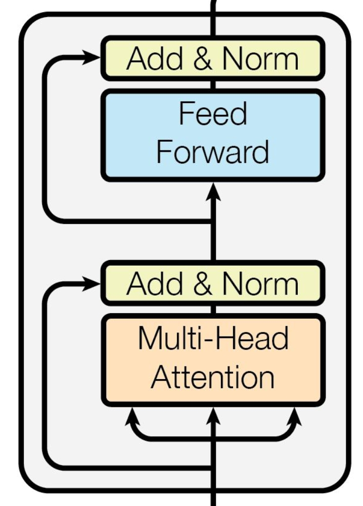
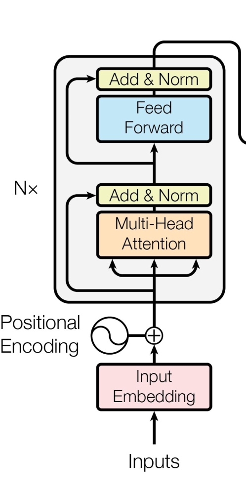
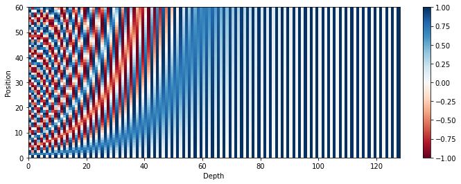
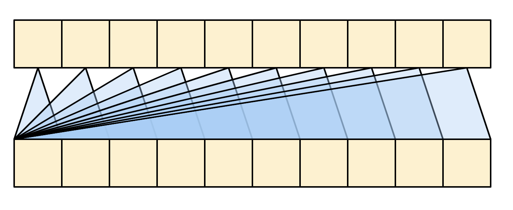
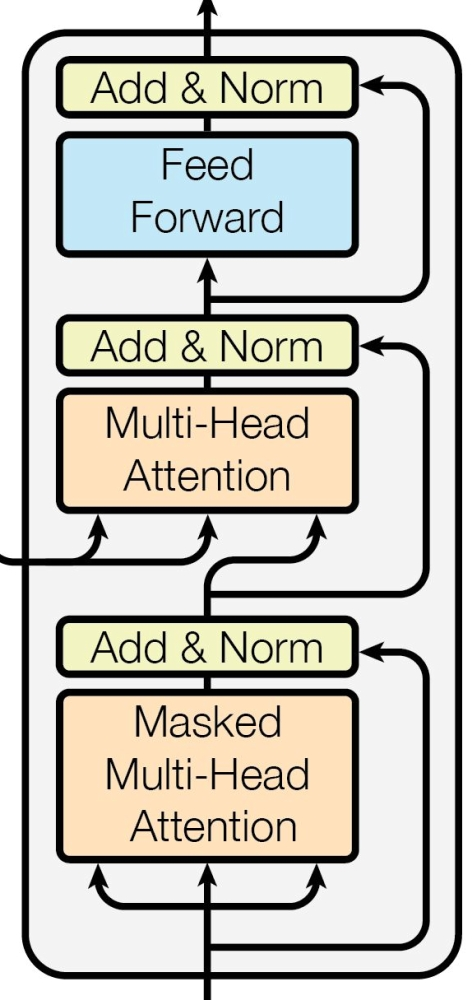
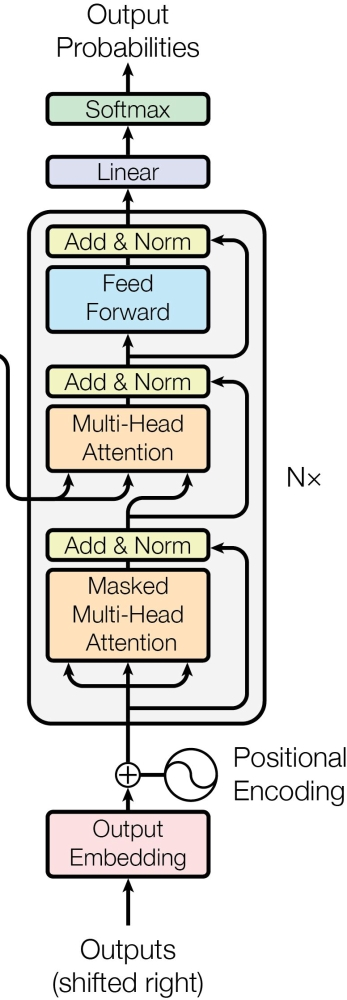
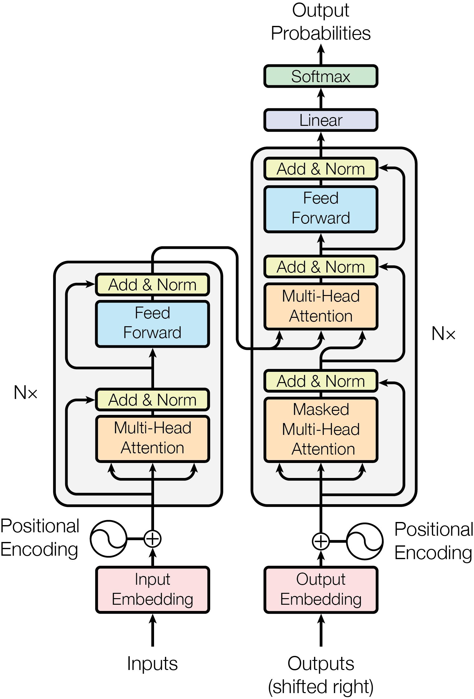

## Attention Is All You Need


```python
import torch
```


This paper introduced the first sequence to sequence architecture using only attention mechanism, called "The Transformer". 

>_To the best of our knowledge, however, the Transformer is the first transduction model relying
entirely on self-attention to compute representations of its input and output without using sequence aligned RNNs or convolution._

## What is Attention?

Attention was first proposed in [Neural Machine Translation by Jointly Learning to Align and Translate](https://arxiv.org/abs/1409.0473). It was introduced as part of recurrent networks especially in an encoder-decoder situation.

### Before Attention

Let's take the example of Neural Machine Translation, a common way to achieve it was by a recurrent encoder which encodes the text in one language into a context vector and that context vector was passed onto the decoder to autoregresively decode the text in target language.

As per Bhadanau et al.2015,
>_A potential issue with this encoder–decoder approach is that a neural network needs to be able to
compress all the necessary information of a source sentence into a fixed-length vector. This may
make it difficult for the neural network to cope with long sentences, especially those that are longer
than the sentences in the training corpus._

The problem of compression loses information which may be vital at some timestep in decoder. A new method was introduced which instead of looking at this context vector, a soft-search system would determine which timesteps in the encoder are most relevant, i.e while decoding current timestep which timestep encodings should it _attend_ most to.

Let's start formalizing it a bit,

An encoder reads the input sentence, a sequence of vectors $\mathbf{x} = \begin{pmatrix}x_1 & \cdots & x_{T_x}\end{pmatrix}$, into a vector $c$. The most common approach is to use an RNN such that

$$
\begin{align*}
h_t &= f(x_t, h_{t-1})\\
c &= q(\{h_1, h_2, \dots, h_{T_x}\})
\end{align*}
$$

where $h_t$ is a hidden state at timestep $t$ and $c$ is the context vector passed onto the decoder. $f$ and $q$ are some non-linear functions. $f$ is usually a LSTM/GRU and $q(\{h_1, h_2, \dots, h_{T_x}\}) = h_{T_x}$, i.e the last hidden state is chosen as the context vector.


The decoder is trained to predict the next timestep $y_{t'}$ given the previous outputs $\{y_1, \dots, y_{t'-1}\}$ and the context vector $c$.
>In other words, the decoder defines a probability over
the translation $\mathbf{y}$ by decomposing the joint probability into the ordered conditionals:

$$p(\mathbf{y}) = \prod_{t=1}^T p(y_t \mid \{y_1, \dots, y_{t-1}\}, c)$$

where $\mathbf{y} = \begin{pmatrix}y_1 & y_2 & \cdots & y_{T_y}\end{pmatrix}$.

With a Recurrent Network, it can be modelled as:

$$p(y_t \mid \{y_1, \dots, y_{t-1}\}, c) = g(y_{t-1}, s_t, c)$$

where $g$ is a non-linear funtion, $s_t$ is the hidden state of RNN.

### Introduction

As we can see at the decoding of each time step the same context vector is being passed, which is a compressed vector of all hidden states in encoder. At each timestep the decoder's dependency on encoder output can vary. The major idea by Bhadanau et al.2015 was to introduce a dynamic context vector which changes for each timestep depending on what context is deemed necessary by the decoder at that moment. It should be able to pull from the raw hidden states.

The probability was redefined to depend on not a context vector but on the input space for the decoder, so

$$p(y_i \mid \{y_1, \dots, y_{i-1}\}, \mathbf{x}) = g(y_{i-1}, s_i, c_i)$$

where $s_i$ is the hidden state of decoder. As we can see $c$ has been changed to $c_i$. $c$ originally was a summarization of all hidden states of encoder i.e: $c = q(\{h_1, h_2, \dots, h_{T_x}\})$.

Now $c_i$ is the weighted sum of all hidden states of encoder where the weights themselves are dynamic.

$$c_i = \sum_{j=1}^{T_x} \alpha_{ij} h_j$$

The weight $\alpha_{ij}$ is a softmaxed version of underlying scores(because weights should sum to 1).

$$\alpha_{ij} = \frac{\exp(e_{ij})}{\sum_{k=1}^{T_x} \exp(e_{ik})}$$

where $e_{ij}$, called an _alignment model_, is how well the inputs around position $j$ and the outcome at position $i$ match. The score is based on the previous decoder hidden state $s_{i-1}$ and $j$ th hidden state of encoder.

$$e_{ij} = a(s_{i-1}, h_j)$$

So while decoding we first compute all scores w.r.t to all encoder hidden states, softmax them and take the weighted average of encoder hidden states to form out context vector at that timestep.

Now depending on how $a$ is defined we can have multiple types of attentions. One simple way is to concat(or add) inputs and pass it through a feedforward network which can be trained jointly with the whole system, which is what bhadanau et al.2015 used.

By Bhadanau et at.2015:

>The probability $\alpha_{ij}$ , or its associated energy $e_{ij}$ , reflects the importance of the annotation $h_j$ with respect to the previous hidden state $s_{i−1}$ in deciding the next state $s_i$ and generating $y_i$. Intuitively, this implements a mechanism of attention in the decoder. The decoder decides parts of the source sentence to pay attention to. By letting the decoder have an attention mechanism, we relieve the encoder from the burden of having to encode all information in the source sentence into a fixedlength vector. With this new approach the information can be spread throughout the sequence of annotations, which can be selectively retrieved by the decoder accordingly.

### Scaled Dot Product Attention

The attention mechanism introduced by Bhadanau et al.2015 is called _additive_ or _concat_ attention. Another form of attention is _dot product attention_ where instead of using a feedforward network to compute an energy, a dot product is used. Dot product is also an indicator of how close two vectors can be. 

The dot product attention is defined as:

$$a(s_{i-1}, h_j) = s_{i-1}^\intercal h_j$$

Vaswani et. al2017, introduced the _scaled dot product attention_, which is defined as

$$a(s_{i-1}, h_j) = \frac{s_{i-1}^\intercal h_j}{\sqrt{n}}$$

where $n$ is the dimension of $h_j$.

The idea behind this scaling was that for very large $n$ dimenional vectors, the dot-product can be huge pushing the softmax into regions with very small gradients. So, the scaling is required.

`Question: Explain how gradients will be small?`

From Vaswani et .al2017,
>The two most commonly used attention functions are additive attention, and dot-product (multiplicative) attention. Dot-product attention is identical to our algorithm, except for the scaling factor of $\frac{1}{\sqrt{d_k}}$. Additive attention computes the compatibility function using a feed-forward network with a single hidden layer. While the two are similar in theoretical complexity, dot-product attention is much faster and more space-efficient in practice, since it can be implemented using highly optimized matrix multiplication code.

`Question: how is it faster?`

## Model Architecture

Now, with the attention mechanism introduced, the major novelty of this paper was the removal of recurrent networks. The transformer network only relied on attention mechanism to learn, arguing _attention is all you need_.

It is still an encoder-decoder system with encoder producing some features at each timestep, which are later used by decoder to autoregressively decode. But how are encodings generated of a sequence, where each timestep is not independent. Afterall, this is what recurrent networks were adding, the sense of "time" and capturing the dependency of different timesteps. 

Answer? Attention. Or more specifically, **self-attention**. Before we start going further, let's try to rephrase attention to not depend on "hidden states" or any recurrent networks.

### Keys, Queries and Values

We can see attention needs not be on hidden states of encoder and decoder. Any sequence of "annotations" can be attented by a vector. The annotations happened to be hidden states of encoder and the vector was the hidden state of decoder at that timestep.

Vaswani et. al2017 generalized it to a broader context of any sequences. Let's see how.

We want to compute the attention score of each decoder timestep. At each time step we want to find the weights relating to current timestep. It can be seen as doing a soft-search our current decoder hidden state in all the encoder hidden states, to remove the concept of "hidden states", we call our current decoder hidden state as a "query" to look up in a database of "keys", our encoder hidden states.

A single query $q_j$, of dimension $(1, d_k)$ and a matrix of all keys $K$, of dimension, $(T_k, d_k)$ we can compute (scaled dot-product)attention scores vector,$E_j$ as:

$$E_j = \frac{q_jK^\intercal}{\sqrt{d_k}}$$

which is a $(1,T_k)$ dimensional vector containing scores for each timestep which need to be softmaxed to create attention weights, $\mathbf{\alpha}_j$

If we somehow have all the queries, $Q$ in a $(T_q, d_k)$ matrix, we can compute all the attention weights for all timesteps as:

$$\alpha = \text{softmax}\left(\frac{QK^\intercal}{\sqrt{d_k}}\right)$$

where $\alpha$ is a $(T_q, T_k)$ matrix representing all weights for all Queries.

Now, once we have the attention weights, we have to do a weighted sum on the encoder hidden states again for each query. We can clearly see that can be as:

$$\begin{align*}
\text{Attention} &= \alpha K\\
                                  &=\text{softmax}(\frac{QK^\intercal}{\sqrt{d_k}})K
\end{align*}$$

Here, we sum over our keys again, but that may not be the case. To generalize it further the sequence to sum it over, we call them "values" represented by $V$ of shape  $(T_k, d_v)$. So using this new notation of keys queries and values, we can define (scaled dot-product) Attention as:

$$\text{Attention}(Q,K,V) = \text{softmax}(\frac{QK^\intercal}{\sqrt{d_k}})V$$

This is basically a database where we wanna fetch some values which are indexed by some keys and we have some queries which we will apply on keys and then fetch the corresponding values of these keys, but in a "soft" way.

As we can see, the output shape of Attention is $(T_q, d_v)$ that is we generated a new sequence.

So given a sequence of embeddings we can create a new sequence of same shape by using them as keys, queries and values. This is how we can replace the concurrent part and replace it by self-attention. Each timestep in output looks at each timestep in input to create a new input and attention weights provide the dependency across timesteps.

**Note:** In attention, optionally, one might want to apply a mask to determine which keys should be available for attention for a certain query. This masking is done before softmax. It is saved in a matrix $M$ same shape as $(T_q, T_k)$ but with zeros at places we want to be part of attention and negative infinty at places we don't want to attend to and this matrix is added to scaled dot product output.

$$\text{Attention}(Q,K,V) = \text{softmax}(\frac{QK^\intercal}{\sqrt{d_k}}+M)V$$


```python
def scaled_dot_product_attn(Q, K, V, M=None):
    d_k = K.shape[-1]
    ## all inputs are batched
    K_T = K.transpose(1, 2)
    dot_product = torch.bmm(Q, K_T)
    scaled_dot_product = dot_product/d_k
    if M is not None:
        scaled_dot_product+=M
    attn_wts = torch.nn.functional.softmax(scaled_dot_product, dim=-1)
    output = torch.bmm(attn_wts, V)
    return output
```


```python
d_k = 2
d_q = d_k
d_v = 3
T_k = 2
T_q = 4
T_v = T_k
batch = 2
K = torch.rand(batch, T_k, d_k)
Q = torch.rand(batch, T_q, d_q)
V = torch.rand(batch, T_v, d_v)

output = scaled_dot_product_attn(Q, K, V)
print(output.shape)
mask = (torch.rand(batch, T_q, T_k)<0.2)*(-1e11)
masked_output = scaled_dot_product_attn(Q, K, V, mask)
print(masked_output.shape)
```

    torch.Size([2, 4, 3])
    torch.Size([2, 4, 3])


### Multi Head Attention

This was another addition by the paper. Instead of computing attention only once, we linearly project queries, keys and values $h$ different times and perform $h$ different attentions paralelly which are later concatenated.

According to Vaswani et al.2017,
>Multi-head attention allows the model to jointly attend to information from different representation subspaces at different positions. With a single attention head, averaging inhibits this.

It is illustrated in image below:


So,

$$\text{MultiHead}(Q, K, V) = \text{Concat}(\text{head}_1,\dots, \text{head}_h)W^O$$

where

$$\text{head}_i = \text{Attention}(QW^Q_i, KW^K_i, VW^V_i)$$


where the projections are parameter matrices $W^Q_i \in \mathbb{R}^{d_{\text{model}} \times d_k}$ ,  $W^K_i \in \mathbb{R}^{d_{\text{model}} \times d_k}$, $W^V_i \in \mathbb{R}^{d_{\text{model}} \times d_v}$ and $W^O \in \mathbb{R}^{hd_v \times d_{\text{model}}}$.

It is common to have $d_k = d_v = \frac{d_{\text{model}}}{h}$. 


```python
from torch import nn

class MultiHeadAttention(nn.Module):
    def __init__(self, num_heads, d_model):
        super(MultiHeadAttention, self).__init__()
        ## instead of having h layers from d_model to d_k, we can have one layer from d_model to h*d_k
        ## h*d_k = d_model
        assert d_model%num_heads == 0, "model dim should be divisible by num_heads"
        self.num_heads = num_heads
        self.d_model = d_model
        self.k_layer = nn.Linear(d_model, d_model)
        self.q_layer = nn.Linear(d_model, d_model)
        self.v_layer = nn.Linear(d_model, d_model)
        self.o_layer = nn.Linear(d_model, d_model)
        
    
    def forward(self, q, k, v, mask=None):
        
        #q: batch, T_q, d_model
        #q_proj: batch, T_q, d_model
        bsize = q.shape[0]
        
        q_proj = self.q_layer(q)
        
        k_proj = self.k_layer(k)
        v_proj = self.v_layer(v)

        # q_proj_heads: batch,T_q, n_heads, d_q
        q_proj_heads = q_proj.view(bsize, -1,  self.num_heads, int(self.d_model/self.num_heads))
        k_proj_heads = k_proj.view(bsize, -1,  self.num_heads, int(self.d_model/self.num_heads))
        v_proj_heads = v_proj.view(bsize, -1,  self.num_heads, int(self.d_model/self.num_heads))
        
        ##put all heads in batch dim since scaled_dot_product_attn already handles batch
        # q_proj_batched: batch*n_heads, T_q, dq
        q_proj_batched = q_proj_heads.transpose(1,2).reshape(bsize*self.num_heads, -1, int(self.d_model/self.num_heads) )
        k_proj_batched = k_proj_heads.transpose(1,2).reshape(bsize*self.num_heads, -1, int(self.d_model/self.num_heads) )
        v_proj_batched = v_proj_heads.transpose(1,2).reshape(bsize*self.num_heads, -1, int(self.d_model/self.num_heads) )
        
        ##attn_out: batch*n_heads, T_q, dq
        attn_out = scaled_dot_product_attn(q_proj_batched, k_proj_batched, v_proj_batched, mask)
        ## batch, n_heads, Tq, dq
        attn_out = attn_out.view(bsize, self.num_heads, -1, int(self.d_model/self.num_heads))
        ##batch, Tq, n_heads, dq
        attn_out = attn_out.transpose(1, 2)
        ##batch, Tq, n_heads, h*dq(d_model)
        concat_out = attn_out.reshape(bsize, -1, self.d_model)
#         concat_out = torch.cat(attns_outs, dim=-1)
        mha_out = self.o_layer(concat_out)
        return mha_out      
        
        
        
```


```python
d_model = 64
n_heads = 8
batch = 2
T = 10
q = torch.rand(batch, T, d_model)
k = torch.rand(batch, T, d_model)
v = torch.rand(batch, T, d_model)

mha = MultiHeadAttention(n_heads, d_model)
mha(q,k,v).shape
```

    torch.Size([2, 10, 64])


### The Transformer Encoder

Now with the information we are ready to build the first component of the transformer. It is the replacement of the recurrent network in common sequence to sequence tasks. This encodes the input into a series of annotations or hidden states which are passed onto the decoder.

An Encoder comprises of multiple encoder layers (similar to satcking of RNNs etc). Each encoding layer consists of two major components. First **multi head self attention layer** (i.e key, query, value are all same, the previous layer's output) and mask consists of all zeros. Every timestep in input is allowed to be attended. Second is a simple, positionwise fully connected feed-forward network.

Residual Skip Connections are added around the two sublayers, followed by a Layer Normalization. Dropout is added to the output of sublayer before adding.  That is,  $\text{LayerNorm}(x + \text{Dropout}(\text{Sublayer}(x)))$, where sublayer can be an MHA or FeedForward Network.



These Encoder layers are stacked together to consume previous layers output to form an encoder. The original transformer Encoder has 6 such layers. 

The feed-forward network is usually a two layered network with a ReLU activation in between which is applied on each time-step independently. The input dimension and output dimension of feed-forward network would be $d_{\text{model}}$, but the intermediate layer can be different, this is called the feed-forward dim and denoted as $d_{ff}$. 


```python
class GlobalSelfAttention(MultiHeadAttention):
    
    def forward(self, x):
        return super().forward(x, x, x, mask=None)

class PositionWiseFeedForward(nn.Module):
    def __init__(self, d_ff, d_model):
        super(PositionWiseFeedForward, self).__init__()
        self.fc1 = nn.Linear(d_model, d_ff)
        self.fc2 = nn.Linear(d_ff, d_model)
        self.act = nn.ReLU()
    def forward(self, x):
        x = self.fc1(x)
        x = self.act(x)
        return self.fc2(x)
    
class AddNorm(nn.Module):
    def __init__(self, d_model, dropout=0.2):
        super(AddNorm, self).__init__()
        self.d_model = d_model
        self.layernorm = nn.LayerNorm(d_model)
        self.dropout = nn.Dropout(dropout)
    
    def forward(self, x, sublayer):
        return self.layernorm(x+self.dropout(sublayer))

```

With fundamental building blocks ready, let's write an Encoder Layer


```python
class EncoderLayer(nn.Module):
    def __init__(self, num_heads, d_model, d_ff, dropout=0.2):
        super(EncoderLayer, self).__init__()
        self.self_attn = GlobalSelfAttention(num_heads, d_model)
        self.ff = PositionWiseFeedForward(d_ff, d_model)
        self.addnorm1 = AddNorm(d_model, dropout)
        self.addnorm2 = AddNorm(d_model, dropout)
    
    def forward(self, x):
        ## self globall attn
        attn_out = self.self_attn(x)
        x = self.addnorm1(x, attn_out)
        ff_out = self.ff(x)
        x = self.addnorm2(x, ff_out)
        return x
        
```


```python
d_model = 64
d_ff = 256
batch = 2
T = 20
n_heads = 8

input_seq = torch.rand(batch, T, d_model)
enc = EncoderLayer(n_heads, d_model, d_ff)
enc(input_seq).shape
```

    torch.Size([2, 20, 64])


#### Positional Encoding

The Transformer encoder is a stack of these layers and some other parts. Let's look at the complete figure of encoder.



As we can see, it is comprised of $N$ encoder layers and has inputs and something called a Positional Encoding System. What is that?

Recall how we used self attention to replace the recurrence which helped in making decisions across multiple timesteps. However, the order of a sequence also matters, which recurrent networks also handled. 

In the current self attention mechanism, if we permute the input tokens randomly, the output would be same (in that permuted order), it does not take into account which token came after which one, it just utilizes the fact that these tokens have come together. 

To introduce a sense of time Positional Encodings are introduced.

By Vaswani et al.2017:
>Since our model contains no recurrence and no convolution, in order for the model to make use of the order of the sequence, we must inject some information about the relative or absolute position of the tokens in the sequence. To this end, we add "positional encodings" to the input embeddings at the bottoms of the encoder and decoder stacks. The positional encodings have the same dimension $d_{\text{model}}$ as the embeddings, so that the two can be summed.

One simple way is to learn the position encodings by the position of each token through an Embedding Layer and then add them to input embeddings. Other way proposed by this paper is using sine and cosine functions:

$$
\begin{align*}
PE_{(pos, 2i)} &= \sin{(pos/10000^{2i/d_\text{model}})}\\
PE_{(pos, 2i+1)} &= \cos{(pos/10000^{2i/d_\text{model}})}\\
\end{align*}
$$

where $pos$ is the position and $i$ is the dimension


```python
def positional_encoding(T, d_model):
    pe = torch.zeros(T, d_model)
    pos = torch.arange(0, T, dtype=torch.float).unsqueeze(1)
    div = torch.pow(10000, torch.arange(0, d_model, 2, dtype=torch.float)/d_model)
    angle = pos/div
    pe[:, ::2] = torch.sin(angle)
    pe[:, 1::2] = torch.cos(angle)
    
    return pe
```


```python
T = 60
d_model = 128
pos_e = positional_encoding(T, d_model)

import matplotlib.pyplot as plt
plt.figure(figsize=(12,4))
plt.pcolormesh(pos_e, cmap='RdBu')
plt.ylabel('Position')
plt.xlabel('Depth')
plt.colorbar()
plt.show()
```





One natural question is why this? There are multiple reasons. One it is not learnable. Values are between -1 and 1. Unique for each position. And it can extrapolate to longer sequences than present in training.

Also, mentioned in paper:
>We chose this function because we hypothesized it would allow the model to easily learn to attend by relative positions, since for any fixed offset $k$, $PE_{pos+k}$ can be represented as a linear function of $PE_{pos}$.

What does it mean $PE_{pos+k}$ to be a linear function of $PE_{pos}$? Well, it means there exists a matrix $M^{(k)}$ independent of $pos$ such that $M^{(k)}PE_{pos} = PE_{pos+k}$.

A general proof can be found here: https://blog.timodenk.com/linear-relationships-in-the-transformers-positional-encoding/

But I will provide a small proof here as well.

$PE_{pos}$ can be seen as a vector of pairs of $\sin$ and $\cos$ functions, e.g for dimensions $d$ and $pos=t$,

$$
PE_t = 
\begin{bmatrix}
\sin (t/10000^{(0/d)}) \\
\cos (t/10000^{(0/d)}) \\
\sin (t/10000^{(1/d)}) \\
\cos (t/10000^{(1/d)}) \\
\vdots
\end{bmatrix}
= 
\begin{bmatrix}
\sin (\omega_0 t) \\
\cos (\omega_0 t) \\
\sin (\omega_1 t) \\
\cos (\omega_1 t) \\
\vdots
\end{bmatrix}
$$    

where $\omega_p =\frac{1}{10000^{(p/d)}}$ is the frequency.

For every sine cosine pair of frequency $\omega_p$, there is a linear transformation $M \in \mathbb{R}^{2\times2}$, independent of $t$, for which the following is true:

$$M \begin{bmatrix}
\sin (\omega_p t) \\
\cos (\omega_p t) \\
\end{bmatrix}
=
\begin{bmatrix}
\sin (\omega_p (t+k)) \\
\cos (\omega_p (t+k)) \\
\end{bmatrix}
$$

**Proof**:
Let $M$ be a $2 \times 2$ matrix, and $v_1, v_2, v_3, v_4$ are the elements. We want to find them.

$$
\begin{bmatrix}
v_1 & v_2 \\ v_3 & v_4
\end{bmatrix}
\begin{bmatrix}
\sin (\omega_p t) \\
\cos (\omega_p t) \\
\end{bmatrix}
=
\begin{bmatrix}
\sin (\omega_p (t+k)) \\
\cos (\omega_p (t+k)) \\
\end{bmatrix}
$$

$$
\begin{bmatrix}
v_1\sin (\omega_p t) + v_2\cos (\omega_p t)\\
v_3\sin (\omega_p t) + v_4\cos (\omega_p t)\\
\end{bmatrix}
=
\begin{bmatrix}
\sin (\omega_p t) \cos(\omega_p k) + \cos(\omega_p t) \sin(\omega_p k)\\
\cos (\omega_p t) \cos(\omega_p k) - \sin(\omega_p t) \sin(\omega_p k)\\
\end{bmatrix}
$$


By solving the above equations,

$$v_1 = \cos(\omega_pk), v_2 = \sin(\omega_pk), v_3 = -\sin(\omega_pk), v_4 = \cos(\omega_pk)$$

So,

$$M = 
\begin{bmatrix}
\cos(\omega_pk) & \sin(\omega_pk) \\ -\sin(\omega_pk) & \cos(\omega_pk)
\end{bmatrix}
$$

Similarly we can find M for other pairs and those can be stacked diagonally to form the final matrix, which is independent of $t$ for a certain $k$.

Check out this awesome blog about positional encodings and some more intuition behind it: https://kazemnejad.com/blog/transformer_architecture_positional_encoding/

Finally these encodings are added to the input embeddings and then passed onto the first encoder layer, which gives us the complete encoder.

According to paper:
>In the embedding layers, we multiply those weights by $\sqrt{d_\text{model}}$.

Let's complete the code


```python
torch.tensor([1,2,3])*torch.sqrt(torch.tensor(4))
```

    tensor([2., 4., 6.])

```python
class PositionalEmbedding(nn.Module):
    def __init__(self, vocab_size, d_model):
        super(PositionalEmbedding, self).__init__()
        self.d_model = d_model
        self.emb = nn.Embedding(vocab_size, d_model)
    
    def forward(self, seq):
        timesteps = seq.shape[1]
        emb = self.emb(seq)
        emb = emb*torch.sqrt(torch.tensor(self.d_model))
        pe = positional_encoding(timesteps, self.d_model)
        x = emb+pe
        return x
```

In the paper these embedding weights are shared, but we will keep them separate them out here.

```python
class Encoder(nn.Module):
    def __init__(self, n_layers, d_model, d_ff, num_heads, vocab_size, dropout=0.2):
        super(Encoder, self).__init__()
        self.encoder_layers = nn.Sequential(*[EncoderLayer(num_heads, d_model, d_ff, dropout)])
        self.pos_emb = PositionalEmbedding(vocab_size, d_model)
        
    def forward(self, seq):
        emb = self.pos_emb(seq)
        x = self.encoder_layers(emb)
        return x
```


```python
n_layers = 6
d_model = 512
d_ff = 2048
num_heads = 8

T = 128
batch = 4
vocab_size = 122

dummy_inp = torch.randint(low=0, high=vocab_size, size=(batch, T))
enc = Encoder(n_layers, d_model, d_ff, num_heads, vocab_size)
out = enc(dummy_inp)
out.shape
```

    torch.Size([4, 128, 512])


### The Transformer Decoder

The transformer decoder is a replacement for recurrent decoder. It works in the same way fundamentally, where it predicts an output which is fed back into at the next timestep and the next token is predicted. This is called autoregressive prediction.

Recalling the original recurrent network, attention was used from hidden states of encoder to each timestep in decoder. Here, the idea is same. At each decoder layer, Queries will be fetched from decoder timesteps, and Keys and Values will be the final outputs of the Encoder.

The recurrence is replaced by the self attention, same as the encoder. The attention from the encoder is called cross attention. 

Another benefit of replacing recurrence with attention is that we can use teacher forcing and parallelize decoding. We pass the whole Target Sequence into decoder shifted right, adding `<SOS>` as the beginning of sequence and predict the unshifted sequence.

We have to be careful that a timestep does not attend into future timesteps. That is where the attention mask comes in handy. This is called Masked Self Attention or Causal Self Attention.


Figure: Causal Self attention or masked self attention


```python
class CausalSelfAttention(MultiHeadAttention):
    
    def forward(self, x):
        global mask
        seq_length = x.shape[1]
        batch_size = x.shape[0]
        num_heads = self.num_heads
        
        mask_shape = (batch_size*num_heads, seq_length, seq_length)
        mask = (1-torch.triu(torch.ones(*mask_shape), diagonal=1))*-1e9
        return super().forward(x,x,x, mask=mask)
```

Let's look at the complete Decoder Layer Architecture.



The Masked Attention was just explained. Now the cross attention, where the key and Values are from the encoder outputs and the queries are from decoder. This is the original concept of encoder-decoder attention by Bhadanau.


```python
class CrossAttention(MultiHeadAttention):
    
    def forward(self, x, encoder_output):
        return super().forward(q=x, k=encoder_output, v=encoder_output, mask=None)
```

With that we are now ready with complete Decoder Layer.


```python
class DecoderLayer(nn.Module):
    def __init__(self, num_heads, d_model, d_ff, dropout=0.2):
        super(DecoderLayer, self).__init__()
        self.self_attn = CausalSelfAttention(num_heads, d_model)
        self.cross_attn = CrossAttention(num_heads, d_model)
        self.ff = PositionWiseFeedForward(d_ff, d_model)
        self.addnorm1 = AddNorm(d_model, dropout)
        self.addnorm2 = AddNorm(d_model, dropout)
        self.addnorm3 = AddNorm(d_model, dropout)
    
    def forward(self, x, encoder_output):
        ## self globall attn
        attn_out = self.self_attn(x)
        x = self.addnorm1(x, attn_out)
        attn_out = self.cross_attn(x, encoder_output)
        x = self.addnorm2(x, attn_out)
        ff_out = self.ff(x)
        x = self.addnorm3(x, ff_out)
        return x
        
```


```python
d_model = 64
d_ff = 256
batch = 2
T = 20
n_heads = 8

input_seq = torch.rand(batch, T, d_model)
enc_out = torch.rand(batch, T, d_model)
dec = DecoderLayer(n_heads, d_model, d_ff)
dec(input_seq, enc_out).shape
```

    torch.Size([2, 20, 64])


Now the complete Decoder.



We know the drill, add positinal encodings and a few more layers at the top. We will transform final outputs to be the same dims as out vocab size.


```python
class Decoder(nn.Module):
    def __init__(self, n_layers, d_model, d_ff, num_heads, vocab_dim, dropout=0.2):
        super(Decoder, self).__init__()
        self.decoder_layers = nn.ModuleList([DecoderLayer(num_heads, d_model, d_ff, dropout)])
        self.fc = nn.Linear(d_model, vocab_dim)
        self.softmax = nn.Softmax(dim=-1)
        self.pos_emb = PositionalEmbedding(vocab_dim, d_model)
        
    def forward(self, seq, encoder_output):
        x = self.pos_emb(seq)
        for layer in self.decoder_layers:
            x = layer(x, encoder_output)
        x = self.fc(x)
        x = self.softmax(x)
        return x
```


```python
n_layers = 6
d_model = 512
d_ff = 2048
num_heads = 8
vocab_size= 64

T = 128
batch = 4
encoder_out = torch.randn(batch, T, d_model)
dummy_inp = torch.randint(0, vocab_size, (batch, T))
dec = Decoder(n_layers, d_model, d_ff, num_heads, vocab_size)
out = dec(dummy_inp, encoder_out)
out.shape
```

    torch.Size([4, 128, 64])


Let's put the transformer together now.



We will have some tokenized inputs and tokenized targets. Inputs will go into an embedding layer and then passed onto the encoder to produce some encodings. Target embeddings will be passed onto decoder along with encoder output to produce next timestep sequence.


```python
class Transformer(nn.Module):
    def __init__(self, d_model, enc_layers, dec_layers, 
                 enc_d_ff, dec_d_ff, enc_num_heads, dec_num_heads,
                 inp_vocab_dim, out_vocab_dim, dropout=0.2):
        super(Transformer, self).__init__()
        
        self.encoder = Encoder(enc_layers, d_model, enc_d_ff, enc_num_heads, inp_vocab_dim)
        self.decoder = Decoder(dec_layers, d_model, dec_d_ff, dec_num_heads, out_vocab_dim)
    
    def forward(self, inp_seq, shifted_target):
        encoder_out = self.encoder(inp_seq)
        decoder_out = self.decoder(shifted_target, encoder_out)
        return decoder_out
        
        
        
```


```python
d_model = 512
enc_layers = dec_layers = 6
enc_d_ff = dec_d_ff = 2048
enc_num_heads = dec_num_heads = 8

input_vocab_dim = 100
output_vocab_dim = 52

batch = 5
T = 128

input_seq = torch.randint(0, input_vocab_dim, (batch, T))
shifted_target_seq = torch.randint(0, output_vocab_dim, (batch, T))

transformer = Transformer(d_model, enc_layers, dec_layers, enc_d_ff, dec_d_ff, 
                            enc_num_heads, dec_num_heads, input_vocab_dim, output_vocab_dim)

transformer(input_seq, shifted_target_seq).shape

```

    torch.Size([5, 128, 52])


Resources:
1. https://lilianweng.github.io/posts/2018-06-24-attention/ Great post for different types of attentions.
2. https://www.tensorflow.org/text/tutorials/transformer Official TensorFlow post on transformer information.
3. https://nlp.seas.harvard.edu/2018/04/03/attention.html The Annotated Transformer (although i think Add and Norm, is implemented a bit differently)
4. https://mfaizan.github.io/2023/04/02/sines.html Interesting blog developing intuition of positional encoding by using, _complex numbers_, of all numbers. 
