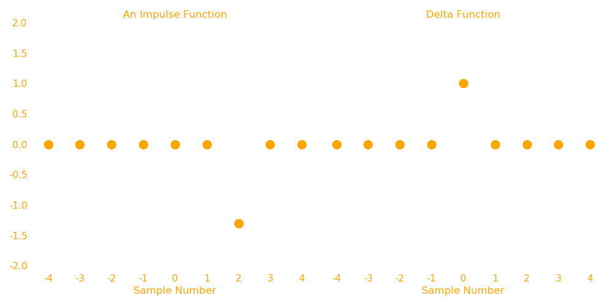
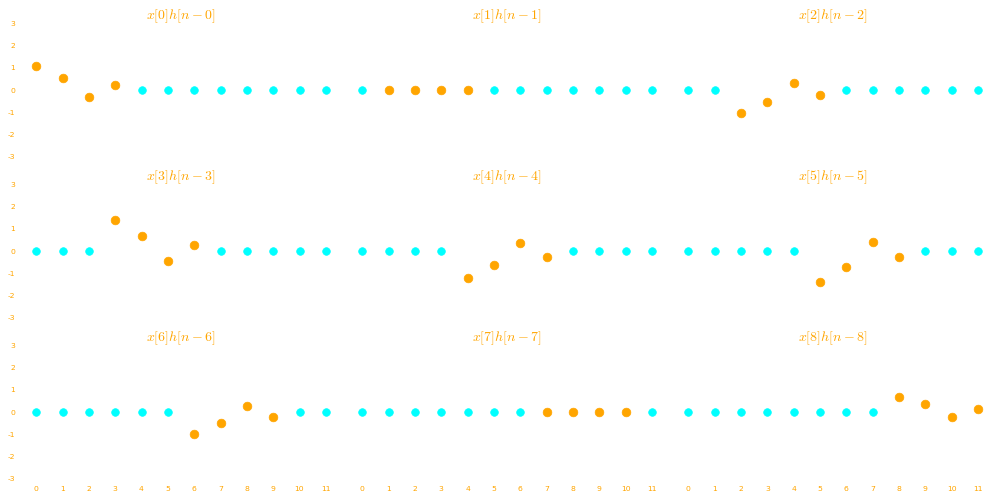
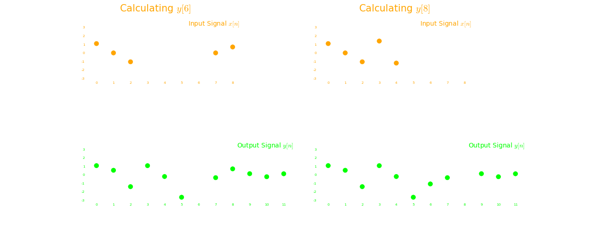
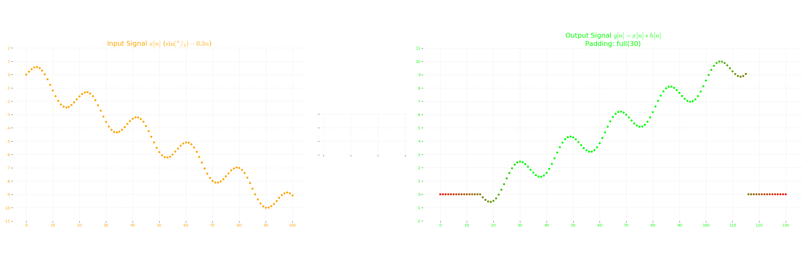
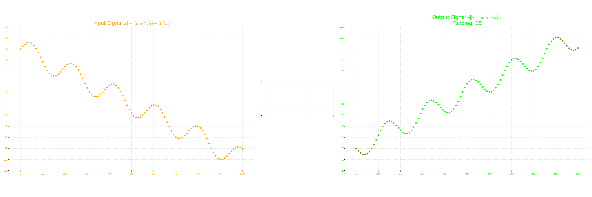
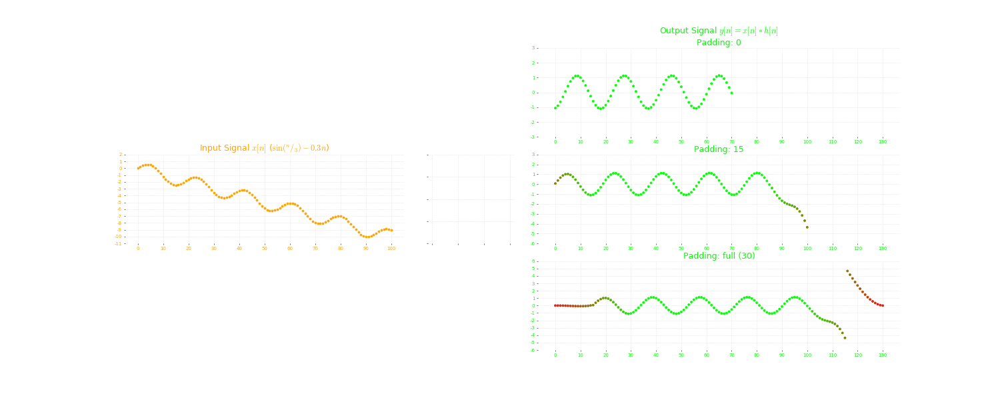
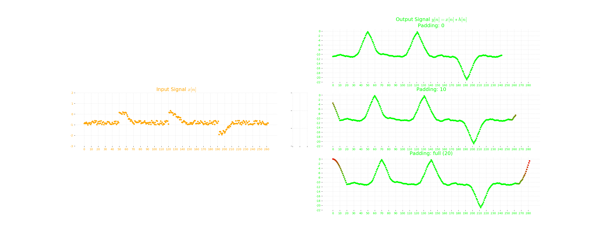

# Convolutions

* Toc
{:toc}

## Introduction

Convolution operation(denoted by $$*$$) is one of the most important, if not the most important technique in Signal Processing. It gives us the idea of how a linear invariant system converts an input signal to an output signal. From now on, we will refer to _digital_ signal as simply signal.

Let's first introduce some terminology:

1. **Input Signal$$(x[n])$$:** As the name suggests, it is a signal that acts as an input to a system.
2. **Output System$$(y[n])$$:** The output that the system generates by acting over the input signal.
3. **Impulse:** An impulse is a signal that is zero everywhere except at a single point.
4. **Delta function$$(\delta [n])$$:** It is an impulse with value unity at sample number 0 and zero at every other sample number. It is a _normalized_ impulse, also called **unit impulse**.

$$\delta [n] = \begin{cases} 1 & n=0\\ 0 & \text{otherwise}\end{cases} \tag{1}$$

5. **Impulse response$$(h[n])$$:** The output of a system when a delta function$$(\delta [n])$$ is give as input.

The impulse response of a system defines the system. Different systems will have different impulse responces.

Now, how to obtain an output from a system for an input signal? We use what is called a Decomposition technique.

**Decomposition:** Break the input signal into smaller units. Pass those units through the system to get corresponding outputs. Add those outputs to get the final output signal.

There are two main decompositions in signal processing: Fourier Decomposition and Impulse Decomposition. When impulse decomposition is done, it can be described by a mathematical operation called __convolutions__(denoted $$*$$).


We do an _impulse decomposition_, i.e we decompose our input signal in multiple impulses and then pass those impulses through the system to produce corresponding outputs. The outputs are added to generate the final output signal.

## Impulse as a delta function

Any impulse function can be represented as a _shifted and scaled_ delta function. e.g: An impulse, say $$a[n]$$ with zeroes everywhere except at sample no. 2, has a value of -1.3. This impulse can be represented as



In the abpve figure, the LHS is an impulse $$a[n]$$ of -1.3 at sample number 2 and the RHS is a standard delta $$\delta [n]$$ i.e impulse of unity at sample number 0.

Now, we can represent this impulse $$a[n]$$ as a scaled and shifted $$\delta [n]$$ as:


$$a[n] = -1.3\ \delta[n-2]$$


Similarly any impulse $$b[n]$$ which has value $$u$$ and sample number $$p$$, i.e


$$b[n] = \begin{cases}u & n=p\\0 & \text{otherwise} \end{cases}$$


then,


$$b[n] = u\ \delta[n-p] \tag{2}$$


## Output of an Impulse

Now if $$a[n]$$ is passed through a system with impulse response $$h[n]$$, what will be the output? Well $$h[n]$$ is the output when the input is $$\delta [n]$$. What could be output when input is $$-1.3 \delta[n-2]$$?


The output is shifted and scaled by the same amount as the delta function is to form the input impulse. These are the properties of _homogeneity_ and _shift invariance_.

So if we know the impulse response of any system, we know the output of any impulse.

With the information of how outputs to impulses are produced, let's revisit how do we produce output to a complete signal by Impulse Decomposition, which is mathematically equivalent to convolution of input signal and impulse response.

First we decompose the input signal into impulses which can be viewed as shifted and scaled delta functions. These shifted and scaled delta functions produced similar shifted and scaled impulse responses as outputs. These outputs are finally synthesized(added) to produce the final output.

This whole operation is called convolution of impulse response $$h[n]$$ and input signal $$x[n]$$ and is denoted as:


$$y[n] = x[n] * h[n] \tag{3}$$


> **Note:** $$*$$ is not multiplication, it is convolution. 

So, to know impulse response of a system, we know output of _any_ input signal. It is something that _defines_ the system.

This impulse response is sometimes called a _kernel_. And the output as _feature map_.

## Dimensions

Let's say our input signal has $$m$$ number of samples and the kernel has $$k$$ number of samples, then output signal(the convolution of input signal and the kernel, will be $$m+k-1$$.

**Note: When we say a signal has $$s$$ samples, it means we _know_ these $$s$$ samples. The signal actually continues from $$-\infty$$ to $$+\infty$$. We assume every signal(be that input, kernel or output) has values of zero anywhere outside of those $$s$$ samples.**

If an input signal has, say, $$200$$ samples, and a kernel is $$20$$ samples long, then we have to shift and scale the kernel for each impulse as that impulse is shifted and scaled from the delta function. Now for the first impulse of input(i.e sample 0), the kernel will be scaled but not shifted and thus will contribute to output signal from sample 0 to sample 19 (because kernel is 20 samples long). For second impulse of input (i.e sample no. 1), the kernel will shift 1 step and will be scaled as well, and thus will contribute to output signal from sample 1 to sample 20. The intersecting output contrbutions at a given sample are added. Similarly at $$m^{th}$$ impulse of input(i.e at sample no. $$m-1$$), the kernel will be shifted $$m-1$$ places (and scaled as well) and thus will contribute to output signal from  sample no. $$m-1$$ to sample no. $$m+20-1$$ i.e $$m+k-1$$. 

## Example

Let's see an example to make things more clear. Let's say we have an input of 9 samples and a kernel of 4 samples. We will store these in `numpy` arrays.


```python
import numpy as np
input_signal = np.array([1.1,0,-1.05,1.4,-1.2,-1.4,-1,0,0.7])
kernel = np.array([1,0.5,-0.3,0.2])
```

Now input is 9 samples long($$m=9$$) and kernel is 4 samples long ($$k=4$$) so output will be $$m+k-1 = 9+4-1 = 12$$ samples long.


1. Let's start with creating an output array of 12 values with each element equal to zero.
2. We will then extend our kernels to be of the same size as our outputs and then shift and scale the kernels. 
3. Finallly we will add them to our output signal.


```python
def simple_convolve(input_signal, kernel):
    """A simple way of convolving two signals.
    input_signal: numpy array containing the input signal.
    kernel: numpy array containing the kernel."""
    
    output_signal = np.zeros(len(input_signal)+len(kernel)-1)
    
    for i in range(len(input_signal)):
        
        shifted_kernel = np.hstack((np.zeros(i), kernel, np.zeros(len(output_signal)-i-len(kernel))))
        scaled_shifted_kernel = input_signal[i]*shifted_kernel
        
        #add the scaled and shifted kernel to the output
        output_signal+=scaled_shifted_kernel
    
    return output_signal
```


```python
output_signal = simple_convolve(input_signal, kernel);output_signal
```


    array([ 1.1  ,  0.55 , -1.38 ,  1.095, -0.185, -2.63 , -1.06 , -0.32 ,
            0.72 ,  0.15 , -0.21 ,  0.14 ])


```python
import matplotlib.pyplot as plt
text_color = "orange"
back_color = (33/255,33/255,33/255)
f, ax = plt.subplots(1,3, figsize=(18,4), gridspec_kw=dict(width_ratios=[3,1,3]))

for subplot, data, title in zip(ax, (input_signal, kernel, output_signal), ('Input Signal', 'Kernel', 'Output Signal')):
    subplot.plot(data, '.', markersize=20, color=text_color)
    subplot.set_title(title, color=text_color)
    subplot.set_ylim(-3,3)
    subplot.set_xticks(list(range(len(data))))
    subplot.set_xticklabels(list(map(str,range(len(data)))), color=text_color)
    subplot.set_yticklabels(list(map(str,np.arange(-3,4))), color=text_color)
    subplot.set_facecolor(back_color)
    subplot.grid(True, alpha=0.3, linestyle='--')
    subplot.set_xlabel("Sample Number", color=text_color)

f.set_facecolor(back_color)
f.set_alpha(0)
f.tight_layout()
```


The process can be shown graphically as:

<center><video src="Figures/1.conv/Anim1.mp4" width="95%" type="video/mp4" controls></video></center>

The key take away from the above graphic is this frame:



These are the contributions of each shifted and scaled kernels to the final output signal. This figure shows how each impulse from the input signal changes the kernel and then these changes are added to the final output.

> Note: The kernel is in <font color="orange">orange color</font>, the <font color="cyan">cyan color</font> is just extensions of zeros to make it the same size as that of the output signal.

## Convolution is commutative

Let's again convolve the input signal with kernel.


```python
output1 = simple_convolve(input_signal=input_signal, kernel=kernel); output1
```


    array([ 1.1  ,  0.55 , -1.38 ,  1.095, -0.185, -2.63 , -1.06 , -0.32 ,
            0.72 ,  0.15 , -0.21 ,  0.14 ])


Now let's now reverse the input_signal and the kernel.


```python
output2 = simple_convolve(input_signal=kernel, kernel=input_signal); output2
```


    array([ 1.1  ,  0.55 , -1.38 ,  1.095, -0.185, -2.63 , -1.06 , -0.32 ,
            0.72 ,  0.15 , -0.21 ,  0.14 ])


As you can see, both the outputs are same. This is an important property of convolution that is put to use, i.e:


$$a[n]*b[n] = b[n]*a[n] \tag{4}$$


The result of convolution is always same, no matter the order of the signals. This operation is commutative.

Now, what does this mean in Signal Processing?
It means we can exchange the impulse response and the input signal to generate the same output, but that does not make any sense physically as the impulse response of a system is fixed and cannot be altered. It is what _defines_ the system. So changing the impulse response means to changing the system completely.

So basically, for signal processing, it does not have any special meaning. It is simply a mathematical tool that can be leveraged to implement convolution operation.

## The formula?

Now we have implemented convolution, but what if we need to know just what the, say, 8th element of the convolved output signal is? Our current implementation will calculate that by computing the whole output signal and then giving us the output. This method is slow and if the input signal is hundreds of thousands(or even millions) of points, it will take a huge amount of time to do that, only to return one element.

So what we need is a mathematical formula of what convolution is.


$$(a*b)[n] = ?$$


This is what we need to find out. For that let's recall the important take away from the animation we saw earlier. I'll add the x axis at each figure, we will need it.


Now the output signal is the sum of all these signals. These signals are added at their corresponding samples. So the 8th element of the output signal is the sum of all 8th elements in each of these signals.

Now, after observations, you can tell that the 8th elements of most of these signals is zero (in <font color="cyan">cyan</font>). These were the extensions to make the kernel longer. And these zeros don't contribute anything to the final sum. This is how our calculation gets fast, we only only sum values from those signals, which were not extensions.

So, for element 8, only $$x[5]h[n-5], x[6]h[n-6], x[7]h[n-7] \text{ and  }x[8]h[n-8]$$ contributes (because only these signals are <font color="orange"> orange </font> at sample number 8).

So we can say,


$$y[8] = x[5]h[n-5] + x[6]h[n-6] + x[7]h[n-7] + x[8]h[n-8]; \qquad \text{for }n=8$$


Substituting $$n=8$$,


$$y[8] = x[5]h[3] + x[6]h[2] + x[7]h[1] + x[8]h[0]$$


It can be written as,

$$\begin{align} y[8] &= x[8-3]h[3] + x[8-2]h[2] + x[8-1]h[1] + x[8-0]h[0] \\ \implies y[8] &= \sum_{k=0}^{3}x[8-k]h[k] \end{align}$$


This means 4 samples of kernel are multiplied with 4 samples of input.

Let's look at output sample 6. This value comes from the sum of all the <font color="orange"> orange </font> samples at sample number 6 in the above figure.

so,


$$y[6] = x[3]h[n-3] + x[4]h[n-4] + x[5]h[n-5] + x[6]h[n-6]; \qquad \text{for }n=6$$


$$y[6] = x[3]h[3] + x[4]h[2] + x[5]h[1] + x[6]h[0]$$


Again, it can be written as:


$$\begin{align} y[6] &= x[6-3]h[3] + x[6-2]h[2] + x[6-1]h[1] + x[6-0]h[0] \\ \implies y[6] &= \sum_{k=0}^3 x[6-k]h[k]\end{align}$$


Generalizing, for a kernel of size $$n_k$$, running from $$0$$ to $$n_k-1$$


$$y[i] = (x*h)[i] = \sum_{k=0}^{n_k-1}x[i-k]h[k] \tag{5}$$


This equation is called **convolution sum**. It let's us calculate the output at any point independent of other output points. As $$k$$ runs from $$0$$ to $$n_k-1$$, each sample from the kernel, $$h[k]$$ is multiplied with corresponding input samples $$x[i-k]$$ and then summed up to form the output at sample $$i$$.



As you can see in the above figure, the kernel is flipped and multiplied with the corresponding input elements (white). These products are then summed up to form the final output(white in ouput).

## Padding

Coming back to Eq. 5, let's see how we can generate, $$y[0]$$ and $$y[11]$$.


$$y[i] = (x*h)[i] = \sum_{j=0}^{n_k-1}x[i-j]h[j] \tag{5}$$


For $$i=0$$ and $$n_k=4$$,


$$\begin{align}y[0] = (x*h)[0] &= \sum_{j=0}^{3}x[0-j]h[j] \\ &=x[0]h[0] + x[-1]h[1] + x[-2]h[2] + x[-3]h[3] \end{align}$$


For $$i=11$$ and $$n_k=4$$,


$$\begin{align}y[11] = (x*h)[11] &= \sum_{j=0}^{3}x[11-j]h[j] \\ &=x[11]h[0] + x[10]h[1] + x[9]h[2] + x[8]h[3] \end{align}$$


In both these equations, we have some inputs, which are not part of our original input signal. Our original signal has sample number 0 to 8. So what would $$x[-3]$$, $$x[2]$$, $$x[-1]$$ and $$x[9]$$, $$x[10]$$, $$x[11]$$ mean?

Actually the input signal (as well as output and kernel), all are present at all samples. It is just they are zero (i.e no signal). And they don't contribute to the convolution and hence are not saved. (Besides, we cannot save infinite numbers in a computer, can we?). But, as it turns out we need some of these zero points, for our outputs. Specifically, we need $$n_k-1$$ points on both sides of an input signal. So we just extend our signal with zeros for these samples. This is what we call **padding**. Padding is a technique where we add a bunch of zeros to a signal where the signal does not exist.

<center><video src="Figures/1.conv/Anim2.mp4" width="95%" type="video/mp4" controls></video></center>

The above animation shows how the flipped kernel moves along the input signal. At each stop it multiplies the elements of the kernel and that of the input signal which overlap with the kernel. These products are summed up to form the corresponding output sample. Look at this animation and the equation 5. Make sure you understand both. Practice a bit on paper. **Remember, the kernel is flipped.** 

The <font color="cyan">cyan</font> points in the input signal in above animation are the _padding_ of that signal. The far left and far right data points of the output signal are based on incomplete information, because some of the inputs are padded. We say that the kernel is not fully immersed in the input signal while computing these points. If the kernel is $$n_k$$ samples long, then the $$n_k-1$$ samples of the ouput signal on both sides are based on less information. The farther elements of these $$n_k-1$$ elements (on both sides) are based on lesser information than the closer ones to the center. So the extreme points in the output signal are usually not used. Another way to do this is to control the padding. If we intitially pad the the signal less than $$n_k-1$$ points on both sides, it is equivalent of ignoring the outputs that would have formed because of these points.

With that in mind, let's write the code for simple convolution using this method. We will control the padding as well.


```python
import numpy as np
```


```python
def conv(input_signal, kernel, padding=None):
    """Performs convolution of input and kernel with padding.
    
    Parameters
    ----------
    `input_signal`: iterable containing the input signal.
    
    `kernel`: iterable contatining the kernel.
    
    `padding`: int, the amount of zero padding to be done in each sides of the input signal.
               Default is `len(kernel)-1`
    """
    
    if padding is None:
        padding = len(kernel)-1 # default padding is the full padding
    
    padded_inp = np.pad(input_signal,padding)
    output_signal=[]
    
    #traverse through the input signal until kernel overlaps with the end point
    for i in range(len(padded_inp)-(len(kernel)-1)):
        # perform convolution sum.
        current_out = np.sum(padded_inp[i:i+len(kernel)]*np.array(kernel[::-1])) #kernel is flipped.
        output_signal.append(current_out)
        
    return np.array(output_signal)
        
```


```python
output3 = conv(input_signal=input_signal, kernel=kernel); output3
```


    array([ 1.1  ,  0.55 , -1.38 ,  1.095, -0.185, -2.63 , -1.06 , -0.32 ,
            0.72 ,  0.15 , -0.21 ,  0.14 ])


```python
output4 = conv(input_signal=kernel, kernel=input_signal); output4
```


    array([ 1.1  ,  0.55 , -1.38 ,  1.095, -0.185, -2.63 , -1.06 , -0.32 ,
            0.72 ,  0.15 , -0.21 ,  0.14 ])


As you can see, the commutative property still holds up.

Let's look at some examples,


```python
from math import floor, ceil
import matplotlib as mpl
mpl.rcParams["mathtext.fontset"]="cm"

input_color = "orange"
kernel_color = "white"
output_color = (0,1,0)


def plot_signals(input_signal, kernel, input_name=None, kernel_name=None, output_name=None, padding=None, fig_size=(10,5), axes=None, f=None, tight_layout=True):
    """Plots a 1 x 3 grid of input signal, kernel and output signal
    
    Parameters:
    -----------
    `input_signal`: iterable, containing the input signal.
    
    `kernel`: iterable, containing the impulse response of a system.
    
    `input_name`: [optional] str, name for the input signal. It will be displayed in parenthesis. Can include latex as well.
    
    `kernel_name`: [optional] str, name for kernel. Will be displayed in parenthesis. Can include latex as well.
    
    `padding`: [optional] int, padding to be used for convolution.
    
    `fig_size`: [optional] tuple(int, int), containing width and height of the figure.
    """
    p_flag = False #flag is set if padding is None
    if padding is None:
        p_flag = True
        padding = len(kernel)-1
    output_signal = conv(input_signal, kernel, padding)

    init_color, final_color = np.array([1,0,0]), np.array([0.1,0.9,0])
    unusable_colors = [list(final_color - (i*(final_color-init_color)/(len(kernel)-1))) for i in range(padding)]

    if axes is None:
        f, axes = plt.subplots(1,3,figsize=fig_size, facecolor=back_color, gridspec_kw=dict(width_ratios=[len(input_signal),len(kernel),len(output_signal)]))
    
    input_name = rf"Input Signal $$x[n]$$ ({input_name})" if input_name is not None else r"Input Signal $$x[n]$$"
    kernel_name = rf"Kernel $$h[n]$$ ({kernel_name})" if kernel_name is not None else r"Kernel $$h[n]$$"
    
    
    if output_name is None:
        output_name = rf"Output Signal $$y[n] = x[n] * h[n]$$"+f"\nPadding: {f'full({len(kernel)-1})' if p_flag else padding}"
    
    for ax, data, name, color,label_color in zip(axes, (input_signal, kernel, output_signal), (input_name, kernel_name, output_name), 
                                                 (input_color, kernel_color, list(reversed(unusable_colors)) +\
                                                  [output_color]*(len(output_signal)-2*padding)+unusable_colors), (input_color, kernel_color, output_color)):
        if ax is not None:
            ax.scatter(list(range(len(data))),data,s=20, c=color)
            ax.set(facecolor=back_color, alpha=0, ylim=(np.floor(min(data))-1,ceil(max(data))+1), 
                   yticks=range(floor(min(data))-1,ceil(max(data))+2,max(1,ceil((max(data)-min(data)+2)/15))), xticks=range(0,len(data)+1,10))
            
            ax.grid(True,linestyle='--',alpha=0.3)
            
            ax.set_yticklabels(list(map(str,ax.get_yticks())), color=label_color)
            ax.set_xticklabels(list(map(str,ax.get_xticks())), color=label_color)
            
            ax.set_title(name, color=label_color, size=18)
            
            for spine in ax.spines.values():
                spine.set_visible(False)
    
    if tight_layout:
        f.tight_layout()
    
    return f,axes

```

Let's use a new input signal. A sine with a negative ramp.


```python
x = np.arange(101)/3
input_signal = np.sin(x)-0.3*(x)
```

Let's try to invert this signal using a known inverter kernel.


```python
inverter = np.zeros(31)
inverter[15] = -1
```


```python
plot_signals(input_signal, inverter, fig_size=(30,4), input_name=r"$$\sin {\left({}^n/_3\right)} - 0.3 n$$", kernel_name="Inverter");
```



Look at the output. The signal has been inverted but not at the end points. This is because while computing these points, the kernel was not fully immersed into input signal because of the padding. These extreme output points are not usable and hence are to be ignored. Another way is to not compute them at all, i.e reduce the padding. Our current kernel is 31 samples long, and so the padding will be 30 samples on each side. Let's try padding of just 15 samples.


```python
plot_signals(input_signal, inverter, fig_size=(30,4), padding = 15, 
             input_name=r"$$\sin {\left({}^n/_3\right)} - 0.3 n$$", kernel_name="Inverter");
```



Much better. But remember there are still extreme points which are based on less information. It is just they are based on _comparatively_ more information than the ones before them. If we want only those points which are based on complete information, then we have to set the padding to be zero. The redder samples are based on lesser information.


```python
plot_signals(input_signal, inverter, fig_size=(30,4), padding = 0, 
             input_name=r"$$\sin {\left({}^n/_3\right)} - 0.3 n$$", kernel_name="Inverter");
```


Notice the difference in sizes of output signal for each padding. We had mentioned earlier that if an input signal is $$m$$ samples long and a kernel is $$k$$ sampes long then the output signal will be $$m+k-1$$ signals long. This is actually true for full padding.

For padding $$p$$,


$$o =  m + 2p - k + 1 \tag{6}$$


For full padding, $$p=k-1$$,


$$\begin{align}o_{full} &= m + 2(k-1) -k +1 \\ &= m + k -1 \end{align}$$


There is another padding, called _same_ padding. It keeps the input and output size the same.

For same padding, $$o=m$$,


$$ m = m + 2p - k +1 \\ \implies p_{same} = \frac{k-1}{2} \tag{7}$$


Let's try another kernel. A known high pass filter. Since our input signal consists of a sine function and a linear function, we would like to just keep the higher frequency part(i.e the sine part). The linear part should be removed.


```python
highpass_filter = np.linspace(-0.23,0.23,31)**2-(0.23**2)
highpass_filter[15]=1
```


```python
def plot_all(input_signal, kernel, paddings=[0,15,None], input_name=None, kernel_name=None, fig_size=(10,5)):
    from matplotlib.gridspec import GridSpec    
    
    axes = []
    gs = GridSpec(len(paddings), 3,wspace=0.1, width_ratios=[len(input_signal),len(kernel),len(input_signal)+len(kernel)-1])
    
    f = plt.figure(figsize=fig_size, facecolor=back_color)
    input_ax = f.add_subplot(gs[(len(paddings)//2),0])
    kernel_ax = f.add_subplot(gs[(len(paddings)//2),1])
    
    plot_signals(input_signal, kernel,input_name=input_name, kernel_name=kernel_name, padding=None,axes=[input_ax,kernel_ax], f=f, tight_layout=False)
    
    out_ax = f.add_subplot(gs[0,2])
    plot_signals(input_signal, kernel, padding=paddings[0],axes=[None,None,out_ax], f=f, tight_layout=False)
    for index in range(1,len(paddings)):
        out_ax = f.add_subplot(gs[index,2], sharex=out_ax)
        out_name = f"Padding: {paddings[index] if paddings[index] is not None else f'full ({len(kernel)-1})'}"
        plot_signals(input_signal, kernel, padding=paddings[index],axes=[None,None,out_ax], f=f, output_name=out_name, tight_layout=False)
    

```


```python
plot_all(input_signal, highpass_filter, input_name=r"$$\sin {\left({}^n/_3\right)} - 0.3 n$$", paddings=[0,(len(highpass_filter)-1)//2, None], #zero, same and full
         kernel_name="High Pass Filter", fig_size=(30,12))
```


## Properties of Convolution

### 1. Delta Function $$\delta [n]$$

- It is the identity function for convolution. Just like $$0$$ is for addition ($$a+0=a$$) or like $$1$$ is for multiplication ($$a \times 1 = a$$), similarly:


$$ x[n] * \delta[n] = x[n] \tag{7}$$


- If the delta function is scaled, then the output is also scaled:


$$x[n] * k\delta [n] = kx[n] \tag{8}$$


So it can be used as an amplifier or as an attenuator. We can even invert a signal like we did above by setting $$k=-1$$ and can do much more with this simple property.

- If the delta function is shifted by an amount, the output function is also shifted by the same amount:


$$x[n] * \delta[n+d] = x[n+d] \tag{9}$$


### 2. Commutative Property

It does not matter which signal is convolved with which signal, (or which signal is slided over which signal, provided padding is appropriate), the result will be the same.


$$a[n] * b[n] = b[n] * a[n] \tag{10}$$


This property doesn't mean anything in the signal processing physically. It is just a convenient tool for mathematics and certain implementations.

### 3. Associative Property


$$ (a[n] * b[n]) * c[n] = a[n] * (b[n] * c[n]) \tag{11}$$


It provides idea how cascaded systems work. Suppose, we have two kernels, $$h_1[n]$$ and $$h_2[n]$$, and we apply them respectively:


$$y[n] = (x[n]*h_1[n])*h_2[n]$$


Now by associative property,


$$y[n] = x[n] * (h_1[n]*h_2[n])$$


Let's say $$h_1[n]* h_2[n] = H[n]$$, then:


$$y[n] = x[n] * H[n]$$


So if we are convolving a signal with $$n$$ kernels one after another, we can equivalently convolve the signal with the convolution of all these kernels with each other. It means a cascaded system can be replaced by a single system. The impulse response is the convolution of all the impulse responses of individual systems.

### 4. Distributive Property


$$ a[n] * b[n] + a[n] * c[n] = a[n] * (b[n] + c[n]) \tag{12}$$


It provides idea of how parallel systems work. If $$n$$ systems share the common input and their outputs are finally added (or subtracted), we can repalce it with a single system with impulse response being the addition (or subtraction) of individual impulse responses  of the systems.

## Correlation

Correlation is another operation that is somewhat similar to convolution. Correlation uses two signals and produces an output called the _cross correlation_ of the two input signals. If a signal is correlated with itself, the output is called _autocorrelation_.

The main difference between calculating the output of correlation from that of convolution is that the **kernel is not flipped**.

If convolution, $$y[n]$$, of $$a[n]$$ and $$b[n]$$ is:


$$y[n] = a[n] * b[n]$$


then the correlation, $$c[n]$$, of $$a[n]$$ and $$b[n]$$ is:


$$c[n] = a[n] * b[-n]$$


The formula for correlation will be:


$$c[i] = \sum_{j=0}^{n_k-1}a[i+j]b[j] \tag{13}$$


for a kernel that runs from sample number $$0$$ to $$n_k-1$$.

Correlation, unlike convolution, is not commutative. The order matters. We cannot interchange the signals and expect the same cross-correlation. The second signal, which is moved along the first signal is called a target signal, $$t[n]$$. It is called so because correlation is a technique of _pattern recognition_. The amplitude of the output signal at any point is a measure of how much the input signal resembles the target signal at that point.

It means a peak in the cross-correlation will mean a high resemblance, while a negative peak means the opposite.

Let's see a quick example of it.


```python
pattern = np.sin(np.linspace(np.pi/2,np.pi,21))
signal = np.hstack((np.zeros(50),pattern,np.zeros(50), pattern, np.zeros(50), -pattern,np.zeros(50)))
noise = np.random.random(len(signal))*0.2*2-1
signal = signal + noise # add some noise
```


```python
f = plot_all(input_signal=signal, kernel=pattern[::-1], # we send in the reversed kernel because it is correlation
            paddings=[0, (len(pattern)-1)//2, None], fig_size=(30,12))
```



The above plot shows how different paddings for correlation can have spikes at different points for the same pattern, ex: in zero padding, the peak is at the corresponding sample number when the pattern _starts_. In _same_ padding, the peak occurs at the same sample number as the _middle_ of the pattern. In full padding, the peak occurs at the sample number when the pattern _ends_. Notice the negative peak for an opposite pattern.

Also, the kernel(pattern) is reversed, as we sent it that way, so that the convolution function will reverse it again making it a _correlation_.

In correlation a target signal goes along the input signal, multiplying the corresponding elements and summing them up. Now if the target signal happens to _coincide_ with that portion of the input signal, it will only generate positive values which will sum up to a bigger number than the surrounding points. Convolution does the same, except it flips the kernel first, so in a way, convolution is matching the _reverse of the kernel_ in the input signal.

>**Note: Convolution and Correlation seem very similar, but they are very different operations when it comes to the Signal Processing. Convolution is related to how linear systems produce outputs while correlation is used for pattern matching in signals. It is just that their math is very similar.**

I think this is a good stopping point. Although we only covered one dimensional signals, this gave us a good idea into how and what convolution as well as correlation is and does. We will next start how we can convolve in higher dimensional spatial signal, like pictures and other data. Since ConvNets are mostly used on image data, we will introduce those concepts in the next one along with the basic idea of how convolutions work.

## References

* Steven W. Smith. [_The Scientist and Engineer's Guide to Digital Signal Processing._](https://www.amazon.com/Scientist-Engineers-Digital-Signal-Processing/dp/0966017633)
* I. Goodfellow, Y. Bengio and A. Courville. [_Deep Learning._](https://www.amazon.com/Deep-Learning-Adaptive-Computation-Machine/dp/0262035618/ref=sr_1_1?ie=UTF8&qid=1472485235&sr=8-1&keywords=deep+learning+book)
* [https://lpsa.swarthmore.edu/Convolution/Convolution.html](https://lpsa.swarthmore.edu/Convolution/Convolution.html)